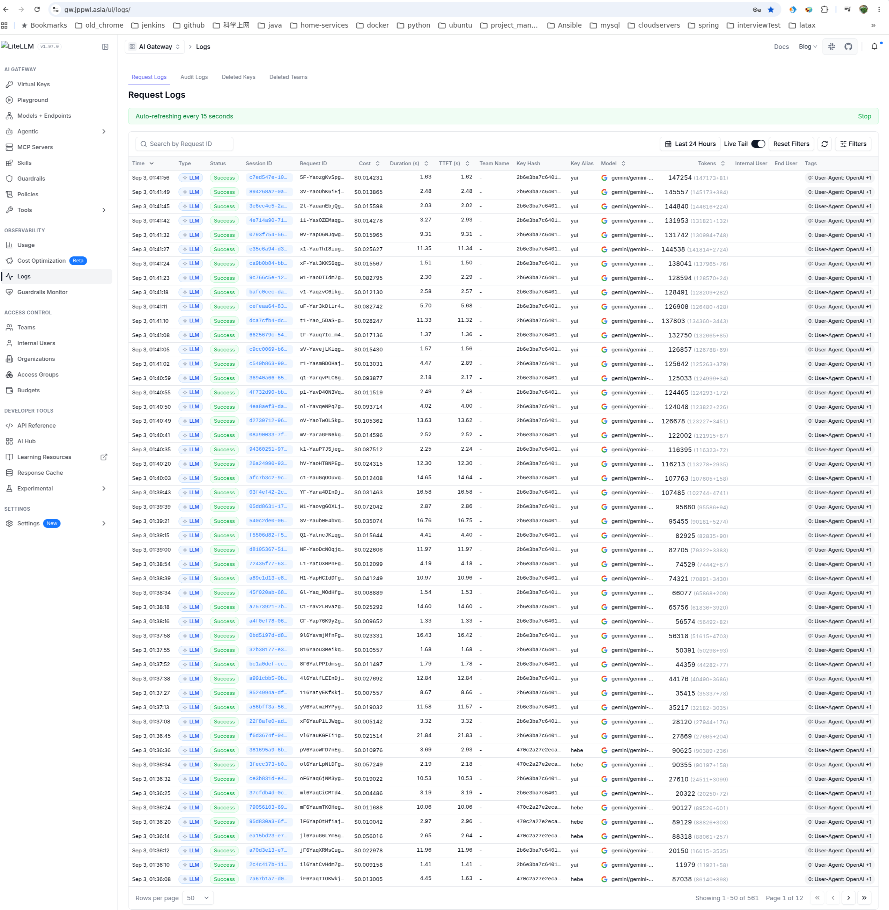

# Enterprise Multi-LLM Gateway & Observability Platform

A production-grade, self-hosted LLM API Gateway and observability service built on **LiteLLM Proxy**, **FastAPI**, **PostgreSQL/MySQL**, **Redis**, and **Kubernetes (K3s)**.

The platform provides unified OpenAI-compatible routing across multi-cloud model providers (OpenAI, Google Vertex AI / Gemini, Anthropic Claude), automated sub-second failover, Redis-backed sliding-window rate limiting, exact response caching, asynchronous token/cost auditing, and centralized Admin UI observability.



---

## Key Capabilities

### 1. Unified Model Routing & Multi-Tier Failover
- **OpenAI-Compatible Standard Interface**: Exposes standard `/v1/chat/completions`, `/v1/models`, and `/health` endpoints. Downstream applications and AI agents connect using standard OpenAI client libraries with zero vendor lock-in.
- **Dynamic Failover Policies**: Automatic retry and fallback routing across candidate models on HTTP `429 (Rate Limit)`, `500`, `502`, or `503` errors with configurable cooldown intervals and retry thresholds.

### 2. Fine-Grained Token Metering & Cost Observability
- **Micro-Dollar Accuracy**: Asynchronously parses prompt tokens, completion tokens, latency (TTFT), and calculated USD cost per request.
- **Dual-Database Architecture**:
  - **Control Plane**: PostgreSQL for LiteLLM Admin UI session state, Virtual Key provisioning, Team quotas, and budget management.
  - **Data Plane / Custom Logging**: Dedicated MySQL/PostgreSQL logging pipeline via SQLAlchemy 2.0 Core async hooks for non-blocking telemetry persistence and currency conversion (FX rates).

### 3. High-Performance Caching & Rate Limiting
- **Redis Semantic & Exact Cache**: Hashes prompt payloads to serve repeat queries directly from in-memory cache, reducing inference cost and API latency.
- **Sliding-Window Rate Limiting**: Enforces RPM (Requests Per Minute) and TPM (Tokens Per Minute) quotas per Virtual Key to prevent quota starvation.

### 4. GitOps & Cloud-Native Delivery
- **Declarative Kubernetes Deployment**: Packaged for K3s / Kubernetes via ArgoCD, Kustomize, and External Secrets Operator (ESO) syncing credentials securely from cloud secret vaults.
- **Edge Routing & Ingress**: Integrated with Kong Gateway and Cloudflare SSL termination for secure public and private endpoint exposure.

---

## System Architecture

```
                                +----------------------------------+
                                |  AI Agents / Downstream Clients  |
                                +----------------------------------+
                                                 |
                                                 | HTTPS (OpenAI API / Virtual Key)
                                                 v
                                +----------------------------------+
                                |      Cloudflare Edge / SSL       |
                                +----------------------------------+
                                                 |
                                                 v
                                +----------------------------------+
                                |      Kong Ingress Gateway        |
                                +----------------------------------+
                                                 |
                                                 v
             +--------------------------------------------------------------------+
             | K3s / Kubernetes Cluster                                           |
             |                                                                    |
             |   +------------------------------------------------------------+   |
             |   | LiteLLM Gateway Service (Port 4000)                        |   |
             |   | - Multi-Model Router & Failover Engine                     |   |
             |   | - Async Telemetry & Logging Hook (SQLAlchemy 2.0)          |   |
             |   | - Admin UI Management Interface                            |   |
             |   +------------------------------------------------------------+   |
             |               |                        |                |          |
             +---------------|------------------------|----------------|----------+
                             |                        |                |
                +------------+           +------------+           +----+--------+
                v                        v                        v             v
      +------------------+     +------------------+     +------------+   +------------+
      | PostgreSQL DB    |     | MySQL / Logging  |     | Redis 7+   |   | Upstream   |
      | (Control Plane:  |     | (Data Plane:     |     | (Cache &   |   | LLM APIs   |
      | Keys & Budgets)  |     | Request Audits)  |     | Rate Limit)|   | (Gemini/   |
      +------------------+     +------------------+     +------------+   | OpenAI/    |
                                                                         | Claude)    |
                                                                         +------------+
```

---

## Repository Structure

```
my-litellm-service/
├── app/                        # Application backend modules & logging hooks
│   ├── core/                   # Config, network connectivity, FX conversion
│   │   ├── config.py           # Environment and settings parser
│   │   ├── connectivity.py     # Health checks and endpoint probing
│   │   ├── fx_rate.py          # Multi-tier currency exchange caching
│   │   └── logging_hook.py     # Async request audit and telemetry hook
│   └── db/                     # Database engine and SQLAlchemy table schemas
│       ├── engine.py           # Connection pools and session factories
│       └── tables.py           # Relational schema definitions
├── docs/                       # Technical architecture & operational runbooks
│   ├── assets/                 # Architecture diagrams and dashboard screenshots
│   ├── plans/                  # Phased engineering blueprints and implementation specs
│   ├── ARCHITECTURE.md         # Detailed system design, data flows, and routing
│   ├── HIGH_LEVEL_IMPLEMENTATION_PLAN.md # Roadmap and milestone definitions
│   ├── k3s-argocd-secret-management.md  # GitOps secrets and ESO vault integration
│   ├── k3s-kong-public-access-options.md # Ingress routing and gateway comparisons
│   ├── litellm-cloudflare-domain-and-ssl-architecture.md # DNS, proxying, and SSL
│   ├── litellm-dual-db-decoupling-and-admin-ui-practice.md # Dual-DB architectural pattern
│   ├── litellm-failover-retry-and-multi-tier-routing.md # Failover mechanics and SLA tuning
│   ├── litellm-mysql-api-logging-and-daily-fx-practice.md # Telemetry persistence specs
│   ├── litellm-oci-arm-k3s-argocd-deployment-practice.md # ARM64 K3s cluster deployment
│   ├── litellm-redis-cache-usage.md     # Redis cache validation and benchmark
│   └── litellm-startup-troubleshooting.md # Operational runbook and debugging guide
├── scripts/                    # Automation and validation scripts
│   ├── init_db.py              # Schema migration and table provisioning
│   ├── smoke_proxy.py          # End-to-end API smoke test runner
│   └── verify_db_logging.py    # Database logging verification harness
├── tests/                      # Automated test suite
├── config.yaml                 # LiteLLM routing matrix, models, and fallback rules
├── Dockerfile                  # Multi-stage production container build
├── pyproject.toml              # Python dependency definitions and tool settings
└── uv.lock                     # Deterministic dependency lockfile
```

---

## Technical Specifications

| Component | Technology | Role |
| :--- | :--- | :--- |
| **API Gateway Core** | LiteLLM Proxy (`v1.97+`) | OpenAI-compatible proxy, multi-model routing, load balancing |
| **Backend & Hooks** | Python 3.11+, SQLAlchemy 2.0 Core | Async request interceptor, token extraction, spend calculation |
| **Control Plane DB** | PostgreSQL 15+ | Prisma schema backend, Virtual Keys, Admin UI session state |
| **Data Plane DB** | MySQL 8.0+ / PostgreSQL | Long-term request logs, latency metrics, FX audit trails |
| **Cache & Limiter** | Redis 7+ | Prompt exact caching, sliding-window rate limit counters |
| **Runtime & Cluster** | Kubernetes (K3s), Docker | Containerized service deployment on Linux / ARM64 |
| **Continuous Delivery**| ArgoCD, GitOps, Kustomize | Declarative configuration and zero-drift deployment |
| **Ingress & Security** | Kong Gateway, Cloudflare SSL | Edge routing, TLS termination, FQDN whitelisting |

---

## Documentation Index

The `docs/` directory contains complete architecture specifications, implementation plans, and production runbooks:

- **[System Architecture (docs/ARCHITECTURE.md)](docs/ARCHITECTURE.md)**: Network topology, request lifecycle, and component interactions.
- **[High-Level Implementation Plan (docs/HIGH_LEVEL_IMPLEMENTATION_PLAN.md)](docs/HIGH_LEVEL_IMPLEMENTATION_PLAN.md)**: Product specifications and milestones.
- **[Dual-Database Decoupling Architecture (docs/litellm-dual-db-decoupling-and-admin-ui-practice.md)](docs/litellm-dual-db-decoupling-and-admin-ui-practice.md)**: Resolving Prisma constraints by separating Control Plane from Data Plane.
- **[Multi-Tier Routing & Failover (docs/litellm-failover-retry-and-multi-tier-routing.md)](docs/litellm-failover-retry-and-multi-tier-routing.md)**: Cooldown mechanics, retry algorithms, and fallback configurations.
- **[MySQL API Logging & FX Practice (docs/litellm-mysql-api-logging-and-daily-fx-practice.md)](docs/litellm-mysql-api-logging-and-daily-fx-practice.md)**: Non-blocking telemetry capture and currency conversion caching.
- **[K3s & ArgoCD GitOps Deployment (docs/litellm-oci-arm-k3s-argocd-deployment-practice.md)](docs/litellm-oci-arm-k3s-argocd-deployment-practice.md)**: Kubernetes deployment on ARM64 nodes with External Secrets Operator.
- **[Redis Caching Architecture (docs/litellm-redis-cache-usage.md)](docs/litellm-redis-cache-usage.md)**: In-memory cache design, key hashing, and latency reduction.
- **[Cloudflare & SSL Configuration (docs/litellm-cloudflare-domain-and-ssl-architecture.md)](docs/litellm-cloudflare-domain-and-ssl-architecture.md)**: Ingress routing, SSL modes, and proxy timeout optimization.
- **[Operational Troubleshooting Runbook (docs/litellm-startup-troubleshooting.md)](docs/litellm-startup-troubleshooting.md)**: Common failure modes, dependency conflict resolutions, and probe diagnostics.

---

## Local Development & Quick Start

### 1. Prerequisites
- Python 3.11+
- [uv](https://github.com/astral-sh/uv) package manager
- Running PostgreSQL / MySQL and Redis instances

### 2. Environment Setup
```bash
# Clone the repository
git clone https://github.com/nvd11/my-litellm-service.git
cd my-litellm-service

# Install dependencies using uv
uv sync

# Configure environment variables
cp .env.example .env
# Edit .env with your database credentials and upstream API keys
```

### 3. Initialize Database Tables
```bash
uv run python scripts/init_db.py
```

### 4. Start LiteLLM Gateway
```bash
uv run litellm --config config.yaml --port 4000
```

### 5. Verify Service & Telemetry
```bash
# Execute smoke test suite
uv run python scripts/smoke_proxy.py

# Verify database audit logging
uv run python scripts/verify_db_logging.py
```
