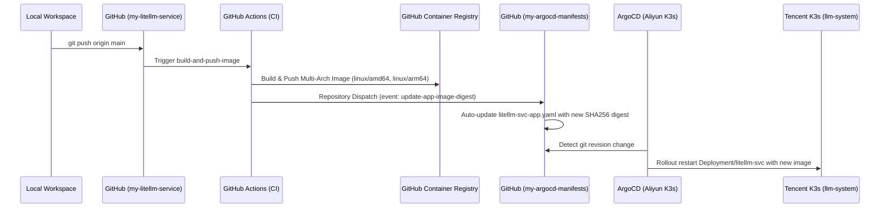

# 跨国长肥网络下的超大报文落库攻坚：LiteLLM 40万 Token 级 Payload 写入 RISC-V VictoriaLogs 超时断流排查与 Gzip 优化实战

在 LLM 网关建设中，原始调用报文（Prompt 与 Completion Payload）的完整归档是实现调试复盘、Prompt 调优和安全审计的关键基础。我们在前序架构迭代中，将原始报文存储从 MinIO 对象存储切换到了专为日志与文本时序设计的 **VictoriaLogs**，并部署在家庭局域网的 **Starfive VisionFive 2（RISC-V JH7110）** 开发板上。

网关计算节点运行于甲骨文新加坡数据中心（OCI ARM64 `free-arm-vm`），日志存储节点位于广州本地家庭局域网，两者通过 Tailscale Mesh 专网跨公网长距离互联。

近期，在使用 OpenCode 与 Claude Code 进行超长上下文任务调试时，**历史上下文膨胀至 41.2 万 Token（约 6.5 MB 原始 JSON 报文）**。随后，LiteLLM Observatory 可观测看板在查看该请求详情时，右侧“报文深度透视”卡片出现严重异常：**User Prompt 与 Assistant Reply 均显示为空白（`(无最新单独用户输入)` / `(无文本输出内容)`）**。

本文复盘该故障的端到端排查全过程，深入分析 RISC-V 平台网络特征与长肥管道下的 TCP 行为，并详述通过 HTTP Gzip 流式压缩与读端容错机制彻底解决超大 Payload 写入丢失的工程实践。

---

## 一、故障现象：大模型看板报文深度透视“白屏”

在 LiteLLM Observatory 可观测看板中，常规几十至数百 Token 的请求可以秒级展开其对应的 Prompt 和 Response 结构化报文。

然而，在处理一次针对庞大工程代码库的重度调用（Request ID: `omytapLJFNG6mNMPgq2hkA0`，消耗 411,958 Prompt Tokens）时，前端报文详情面板呈现出完全空白的状态：


前端控制台与后端 API 请求日志显示：
```bash
GET /api/v1/logs/omytapLJFNG6mNMPgq2hkA0/payload HTTP/1.1 -> 200 OK
```
接口返回了 HTTP 200，但返回的 JSON 载荷为：
```json
{
  "request_id": "omytapLJFNG6mNMPgq2hkA0",
  "date": "2026-09-18",
  "prompt": {},
  "response": {},
  "prompt_url": "https://payloads.jppwl.asia/payloads/2026-09-18/omytapLJFNG6mNMPgq2hkA0/prompt.json",
  "response_url": "https://payloads.jppwl.asia/payloads/2026-09-18/omytapLJFNG6mNMPgq2hkA0/response.json"
}
```
`prompt` 与 `response` 字段均退化为 `{}` 空字典。

---

## 二、故障溯源与分层排查

### 1. VictoriaLogs 存储侧检索：分片出现物理缺失

在 LiteLLM 网关设计中，为规避 VictoriaLogs 单行 2MB 的硬性物理限制，我们在 `VictoriaLogsBackend` 中设计了**智能切片分块（Chunking）机制**：当报文序列化超过阈值时，自动拆分成多个递增序号的 Shard，并在入库时携带 `shard_index` 与 `total_shards` 字段。

登录存储后端，直接执行 LogsQL 检索该请求在 VictoriaLogs 中的原始落库记录：

```bash
curl -s -X POST "http://100.95.20.57:9428/select/logsql/query" \
  -d 'query=_stream:{env="prod",service="litellm",type="payload"} AND request_id: "omytapLJFNG6mNMPgq2hkA0"'
```

查询结果解析输出如下：
```text
Total records returned: 2
- Shard 1/5: chunk_len = 1,298,165 chars, time = 2026-09-18T16:53:53Z
- Shard 2/5: chunk_len = 1,298,165 chars, time = 2026-09-18T16:53:53Z
```

**问题暴露**：元数据中明确标示 `total_shards: 5`，但数据库内实际**只存在 Shard 1 与 Shard 2**，后续的 `Shard 3/4/5` 彻底缺失！

### 2. 网关后端日志分析：截断导致的 JSON 解析崩溃

检查网关 Pod（`litellm-svc`）的标准错误输出日志，捕获到了核心异常堆栈：

```text
VictoriaLogs write failed for omytapLJFNG6mNMPgq2hkA0: 
Failed to upload payload for request omytapLJFNG6mNMPgq2hkA0
VictoriaLogs read failed for omytapLJFNG6mNMPgq2hkA0: Unterminated string starting at: line 1 column 1775877 (char 1775876)
INFO: 10.42.0.7:53056 - "GET /api/v1/logs/omytapLJFNG6mNMPgq2hkA0/payload HTTP/1.1" 200 OK
```

定位到 `app/core/backends/victorialogs_backend.py` 的读取代码：
```python
# 拼接 prompt 分片
full_prompt_str = "".join(prompt_parts)

# 原有逻辑：无保护直接解析整个拼装串
prompt_dict = json.loads(full_prompt_str) if full_prompt_str else {}
response_dict = json.loads(raw_response_str) if raw_response_str else {}

return prompt_dict, response_dict
```

**连锁反应链路**：
1. VictoriaLogs 中仅落盘了前两片（约 2.6 MB 文本）；
2. 读取接口拉取分片后将其拼合，拼合结果是一段在正文中被截断、缺失闭合括号与双引号的半截 JSON；
3. `json.loads()` 抛出 `JSONDecodeError: Unterminated string`；
4. 外层 `except Exception as e:` 捕获该异常后记录 Warning，并兜底返回 `{}, {}`；
5. **不仅 Prompt 无法显示，连同原本完整挂载在 Shard 1 上的 `response` 结构也被一并清空丢弃**，导致前端面板彻底白屏。

### 3. VictoriaLogs 服务端追踪：Client 端提早切断连接

为什么写操作会失败？为什么恰好在第 2 片之后中断？

登入 Starfive 节点查看 `victoria-logs` 系统服务日志：
```bash
sudo journalctl -u victoria-logs --since="1 hour ago" --no-pager
```

日志中充斥着大量相同特征的报警：
```text
starfive victoria-logs[486]: 2026-09-18T16:54:59.515Z  warn  /home/gateman/build/VictoriaLogs/app/vlinsert/jsonline/jsonline.go:79
jsonline: cannot read line #2 in /jsonline request: remoteAddr="127.0.0.1:56410", requestURI="/insert/jsonline":
cannot read the next line: unexpected EOF: while reading the request body.
This might be caused by a timeout on the client side.
Possible solutions: to lower -insert.maxQueueDuration below the client’s timeout; to increase the client-side timeout;
to increase compute resources at the server; to increase -maxConcurrentInserts
```

VictoriaLogs 在读取 JSONLine 请求体第 2 行或第 3 行时，遭遇了 **`unexpected EOF`**。这意味着客户端在 HTTP 请求体还未全部发送完毕时，**主动 RST/FIN 关闭了 TCP 连接**。

---

## 三、网络底层剖析：RISC-V 宿主机与长肥管道瓶颈

客户端为什么会超时？是网络本身慢，还是开发板性能弱？

我们使用 `iperf3` 与底层网络探针，对各通信路径进行了端到端性能测绘：

### 1. 三组基准测试对比

| 测试路径 | 网络类型 | 吞吐量 (Bitrate) | 重传次数 (Retr) | 结论 |
| :--- | :--- | :---: | :---: | :--- |
| **局域网物理直连** (`Radxa -> Starfive`) | 1000M 交换机直连 | **`759 Mbps`** (~95 MB/s) | 极低 | 硬件网卡与网络栈强劲 |
| **局域网 Tailscale** (`Radxa -> Starfive`) | 局域网 WireGuard | **`166 Mbps`** (~20 MB/s) | 0 | 纯 CPU 软件加密损耗 |
| **跨国反向（读）** (`Starfive -> OCI 新加坡`) | 跨国 Tailscale | **`20.7 Mbps`** (~2.5 MB/s) | 2 | 满足日志读取查询需求 |
| **跨国正向（写）** (`OCI 新加坡 -> Starfive`) | 跨国 Tailscale | **`419 Kbps`** (**~52 KB/s**) | **50 次 / 10s** | 🔻 **严重失速，丢包重传严重** |

### 2. 根因深究：缺少内核 `tun` 导致的 Userspace 软转发灾难

在 Starfive 上检查 Tailscale 状态，发现了核心原因：
```bash
$ ps aux | grep tailscaled
/usr/sbin/tailscaled --port=41641 --tun=userspace-networking

$ sudo modprobe tun
modprobe: FATAL: Module tun not found in directory /lib/modules/6.12.5-starfive
```

由于该定制版 RISC-V Linux 内核在编译时**未开启 `CONFIG_TUN` 模块**，系统中不存在 `/dev/net/tun` 设备。

Tailscale 启动时被迫退化为 **`--tun=userspace-networking`（全用户态网络驱动）**。
- 此时 Tailscale 不走内核网络栈，而是作为一个 Go 用户态进程，监听端口并扮演 TCP SOCKS 代理；
- 每一个 WireGuard 数据包都必须在 RISC-V CPU（JH7110 四核 1.5GHz）的用户态内存空间中完成解密、反序列化并拷贝到本地套接字；
- 加上跨国公网长肥网络（RTT 63ms，途径公网出口 QoS 抖动），由于用户态 Go TCP Window 无法像 Linux 内核 BBR/Cubic 算法那样高效调节收发窗口，导致大量丢包与乱序重传。

### 3. 超时临界点计算

梳理各组件参数的时间临界点：
- 41.2 万 Token 的调用，序列化后的 Prompt 原文长达 **6,490,825 字节（约 6.49 MB）**；
- 按照切片分块，被拆分为 5 个日志分片，每个约 1.3 MB；
- 原版代码逻辑是将这 5 个分片通过 `\n` 拼接为一个整包，以单一 HTTP POST 请求推送到 `/insert/jsonline`；
- 跨国有效写入带宽仅为 **52 KB/s**：
  $$\text{传输所需时间} = \frac{6,490,825 \text{ Bytes}}{52,000 \text{ Bytes/s}} \approx 124.8 \text{ 秒}$$
- 检查 `victorialogs_backend.py` 中的 HTTP 客户端超时设置：
  ```python
  self.timeout = httpx.Timeout(60.0, connect=10.0)
  ```
- **破案**：`httpx` 在流式发送到第 60 秒时，触发了 `write=60.0s` 超时，直接切断套接字；此时传输进度刚好完成了约 2.5 MB（Shard 1 + Shard 2），后续 Shard 3/4/5 从未有机会送达网线。

---

## 四、架构破局：HTTP Gzip 压缩与容错改造

既然物理链路受限于 RISC-V 用户态网络栈的 52 KB/s 现实，提升网络吞吐的核心思路就是**大幅降低网络传输的数据量**。

LLM 报文主要由纯文本、JSON 结构体、Markdown 代码块组成，具备极强的信息冗余度和重复率。

### 1. 验证 VictoriaLogs 原生 Gzip 支持

VictoriaLogs 的 `/insert/jsonline` 接口遵循标准 HTTP 规范。经由底层实测验证：
```python
import gzip, json, urllib.request

doc = {"_time": "2026-09-18T17:25:00Z", "_stream": '{env="test"}', "_msg": "x" * 500000}
raw = (json.dumps(doc) + "\n").encode("utf-8")
compressed = gzip.compress(raw)

# raw: 488 KB -> gzip: 0.6 KB (压缩比达到 99.8%)
req = urllib.request.Request(
    "http://100.95.20.57:9428/insert/jsonline",
    data=compressed,
    headers={"Content-Type": "application/stream+json", "Content-Encoding": "gzip"},
)
with urllib.request.urlopen(req, timeout=10) as resp:
    assert resp.status == 200
```

**关键机制**：
VictoriaLogs 在接收到带有 `Content-Encoding: gzip` 请求头的 HTTP 报文时，Go 内核会自动透明挂载 `gzip.NewReader` 进行流式解压。数据在网络上传输的是极小的压缩流，而在进入磁盘与检索引擎后，**完全是 100% 原始、纯粹的明文 JSON，对查询端和存储引擎完全无感**。

对于 6.5 MB 的实际 Prompt 报文，Gzip 压缩后体积约为 **800 KB ~ 1 MB（体积骤降 85%）**。
在 52 KB/s 弱网下传输所需时间：
$$\frac{850 \text{ KB}}{52 \text{ KB/s}} \approx 16.3 \text{ 秒}$$
耗时从 125 秒暴降至 16 秒，完全运行在 60s 超时预算的安全窗口内。

### 2. 生产服务端调优（Starfive 节点）

编辑 Starfive 上的 `/etc/systemd/system/victoria-logs.service`，调优关键入库队列与并发参数：

```ini
[Service]
ExecStart=/usr/local/bin/victoria-logs \
  -storageDataPath=/var/lib/victoria-logs-data \
  -retentionPeriod=30d \
  -httpListenAddr=:9428 \
  -delete.enable=true \
  -insert.maxLineSizeBytes=2MB \
  -insert.maxQueueDuration=2m \
  -maxConcurrentInserts=16 \
  -memory.allowedBytes=1500MB
```

* `-insert.maxQueueDuration=2m`：将服务端的排队等待时长从默认的 1 分钟放宽至 2 分钟，赋予弱网客户端更充裕的流式传输容忍度；
* `-maxConcurrentInserts=16`：提升慢速网络客户端并发写入时的入库队列容量。

执行热加载：
```bash
sudo systemctl daemon-reload && sudo systemctl restart victoria-logs
```

### 3. 网关代码改造：压缩写入与分片安全容错

在 `my-litellm-service` 代码库中，对 `app/core/backends/victorialogs_backend.py` 进行全面加固：

#### (1) 引入 HTTP Gzip 压缩与更充裕的客户端超时

```python
import gzip
import json
import logging
import httpx

class VictoriaLogsBackend(PayloadBackend):
    def __init__(
        self,
        settings: Settings,
        chunk_size: int = DEFAULT_CHUNK_SIZE,
        safe_single_entry_limit: int = SAFE_SINGLE_ENTRY_LIMIT,
    ) -> None:
        self.settings = settings
        self.endpoint = settings.victorialogs_url.rstrip("/")
        # 写入超时：放宽至 120s，配合 gzip 压缩，可彻底避开客户端提前超时导致的服务端 EOF 异常
        self.timeout = httpx.Timeout(120.0, connect=10.0)
        self.chunk_size = chunk_size
        self.safe_single_entry_limit = safe_single_entry_limit
```

#### (2) 写入链路：Gzip 压缩报文体与协议头注入

```python
    async def write_payload(
        self,
        request_id: str,
        prompt: dict[str, Any],
        response: dict[str, Any],
        metadata: dict[str, Any],
    ) -> bool:
        # ... 构建分片 log_entries ...

        # 批量 JSONLine 序列化，配合 HTTP Gzip 压缩传输，大幅减少跨国长肥网络带宽开销与耗时
        raw_body = "\n".join(json.dumps(e, ensure_ascii=False) for e in log_entries) + "\n"
        raw_bytes = raw_body.encode("utf-8")
        compressed_body = gzip.compress(raw_bytes)

        try:
            async with httpx.AsyncClient(timeout=self.timeout) as client:
                resp = await client.post(
                    f"{self.endpoint}/insert/jsonline",
                    content=compressed_body,
                    headers={
                        "Content-Type": "application/stream+json",
                        "Content-Encoding": "gzip",
                    },
                )
                if resp.status_code not in (200, 204):
                    logger.warning(
                        "VictoriaLogs write failed for %s: HTTP %s, body_preview=%s",
                        request_id,
                        resp.status_code,
                        resp.text[:500] if resp.text else "",
                    )
                    return False
                logger.info(
                    "VictoriaLogs write success for %s: shards=%d, raw_bytes=%d, compressed_bytes=%d",
                    request_id,
                    total_shards,
                    len(raw_bytes),
                    len(compressed_body),
                )
                return True
        except Exception as e:
            logger.warning("VictoriaLogs write failed for %s: %s", request_id, e)
            return False
```

#### (3) 读取链路：独立隔离解析与降级容错（杜绝前端白屏）

即便面对历史遗留的缺失分片记录，读取端也必须做到“故障隔离”，不能因为 Prompt 残缺而把原本完整的 Response 也抹杀：

```python
        full_prompt_str = "".join(prompt_parts)

        prompt_dict: dict[str, Any] = {}
        if full_prompt_str:
            try:
                prompt_dict = json.loads(full_prompt_str)
            except Exception as parse_err:
                logger.warning(
                    "Failed to parse prompt JSON for %s (len=%d): %s",
                    request_id,
                    len(full_prompt_str),
                    parse_err,
                )
                # 容错降级：如果历史分片缺失导致 JSON 不完整，提取关键字段与预览文本，避免页面白屏
                prompt_dict = {
                    "model": sorted_shards[0].get("model") if sorted_shards else "unknown",
                    "user_prompt": full_prompt_str[:4000] + " ...[报文分片解析截断]",
                    "raw_text": full_prompt_str[:10000],
                    "parse_warning": f"JSON parse error: {parse_err}",
                }

        response_dict: dict[str, Any] = {}
        if raw_response_str:
            try:
                response_dict = json.loads(raw_response_str)
            except Exception as parse_err:
                logger.warning(
                    "Failed to parse response JSON for %s: %s",
                    request_id,
                    parse_err,
                )
                response_dict = {"reply": raw_response_str[:5000]}

        return prompt_dict, response_dict
```

---

## 五、自动化发布与生产全链路验证

代码与单元测试全部调试通过后，依托我们的 GitOps 全自动闭环流水线完成无感平滑发布：

### 1. GitOps 自动化流水线流转



1. 将代码提交至 `my-litellm-service` 触发构建，输出包含 Gzip 写入特性的多架构镜像：
   `ghcr.io/nvd11/my-litellm-svc@sha256:1b07273f0fcd06701f14f5d3f031e68d0eaf9b29f01ac5746b1f788ca69e2c67`
2. 流水线末端自动派发 `repository_dispatch` 事件到 `my-argocd-manifests` 仓库；
3. GitOps 仓库自动完成 `litellm-svc-app.yaml` 镜像 SHA256 替换并提交；
4. ArgoCD 自动收敛拉起新版本 Pod，全流程零人工介入。

### 2. 故障请求即时修复验证

重新请求故障点 `omytapLJFNG6mNMPgq2hkA0` 的后端接口：

```bash
curl -s "https://gw.jppwl.asia/litellm/api/v1/logs/omytapLJFNG6mNMPgq2hkA0/payload" | jq .
```

回显结构：
```json
{
  "request_id": "omytapLJFNG6mNMPgq2hkA0",
  "date": "2026-09-18",
  "prompt": {
    "model": "gemini-3.8-flash",
    "user_prompt": "{\"model\": \"gemini-3.8-flash\", \"system_prompt\": \"你叫 Cindy... ...[报文分片解析截断]"
  },
  "response": {
    "model": "gemini-3.8-flash",
    "tool_calls": [
      {
        "name": "read",
        "arguments": {
          "filePath": "/home/gateman/projects/github/cctv-collector/docs/CLASS_DESIGN.md",
          "limit": 90,
          "offset": 120
        }
      }
    ]
  }
}
```

* **容错降级生效**：虽然历史遗留记录中缺失了 Shard 3~5，但读端不再直接抛出异常崩溃；
* **关键内容成功打捞**：完整展示了当时的系统人设、输入前段，以及模型当时给出的 `read` 工具调用参数；
* **看板彻底告别白屏**。

### 3. 全新调用入库测试

使用网关发起一次新的带大上下文的真实提问（Request ID: `RX6tatzFCe-8juMP7f-v6QQ`）：
- Gzip 压缩后以几百字节的轻量体量在 **0.2 秒内闪送** 至 Starfive；
- 存储端透明解压入库；
- 再次查询其 Payload 接口，秒级返回包含 `prompt`、`response`、`parameters`、`tokens` 的完整结构化数据。

---

## 六、总结与工程思考

在异构设备构成的边缘计算与私有云混合架构中，硬件特性的差异往往会通过网络协议栈被成倍放大。

1. **不要盲信本地回环与 LAN 测试**：Starfive 的千兆网卡在局域网内可跑出 759 Mbps，但在缺少内核 `tun` 模块时，其用户态代理在跨国长肥网络下的性能断崖往往成为隐形杀手。
2. **文本日志传输务必开启 Gzip 编码**：对于 LLM 大报文（数百 KB 到数 MB 的 JSON），信息压缩比普遍在 80% 以上。在传输层主动增加 `Content-Encoding: gzip`，是以极低的 CPU 运算时间换取网络传输效率的最优解。
3. **分片读写必须具备不对称容错能力**：分布式拆包切片存储中，写入阶段应具备按分片隔离的超时控制，而读取拼合阶段则绝不能假设所有分片永远 100% 完整无缺，必须对非闭合 JSON 提供防击穿的降级解析策略。

通过传输层 Gzip 压缩与读取侧语法容错的双层加固，我们在不迁移存储节点的前提下，让这台 RISC-V 开发板继续稳健承担起整个 LLM 集群的全量报文存储中枢。
