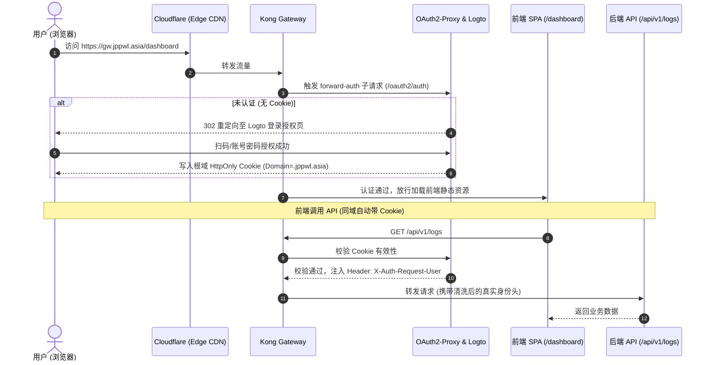
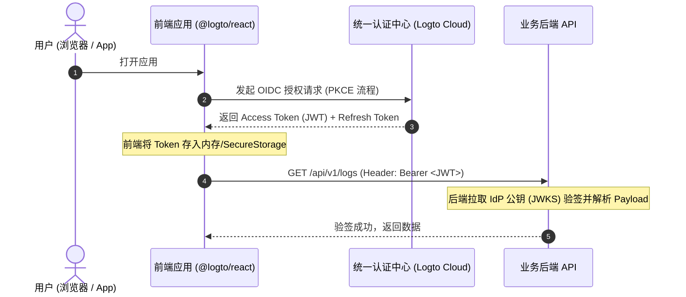
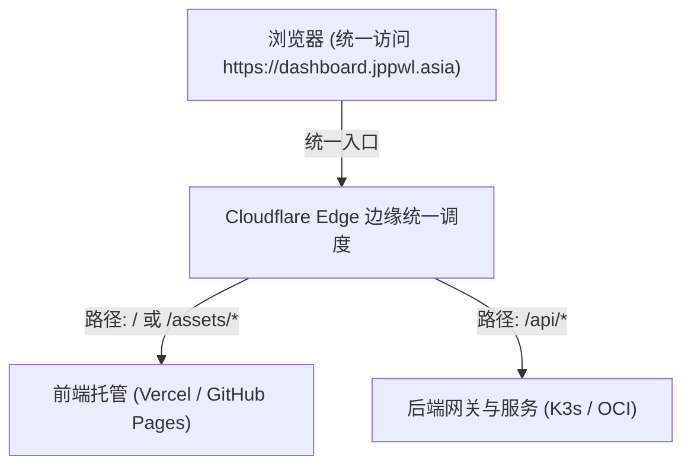

# 深入现代 Web 鉴权架构：网关统一代理 (Forward-Auth) vs 前端持有 JWT 的终极选型与边缘同域实践

## 1. 引言与核心分歧

在设计现代微服务、前后端分离系统以及内部运维控制台（如大模型可观测性看板）时，架构师面临的首要安全决策就是**前后端之间的身份认证与鉴权流派**。

业界目前演进出了两大主流流派：
- **流派一：网关级统一代理与 Cookie 穿透（Gateway Forward-Auth / Token Exchange）**
- **流派二：前端持有 Token 与后端无状态验签（Bearer JWT / OIDC PKCE）**

很多团队在没有理清业务边界时，盲目跟风引入复杂的前端 OIDC SDK 和 JWT 验签链条，导致前端状态膨胀、跨域配置繁琐；而在需要开放生态 API 时，又受制于 Cookie 限制。

本文将从工程底层原理、适用场景、边界限制，以及如何利用 Cloudflare 边缘反代实现“虚拟同域”等方面，对这两大流派进行全景拆解。

---

## 2. 流派一：网关级统一代理模式 (Kong Forward-Auth)

### 2.1 工作原理与时序拓扑

在网关级代理模式下，前端和业务后端**完全不参与复杂的 OAuth 授权码交换与 Token 刷新逻辑**，所有的身份拦截、校验和放行全部由集群边缘网关（如 Kong Gateway + OAuth2-Proxy）在最外层终结。



### 2.2 核心优势
1. **前端代码“零鉴权”侵入**：React / Vue 前端不需要安装任何 OAuth SDK，发请求直接用原生的 `fetch('/api/...')`，浏览器自动携带同域 Cookie，完全省去了 `localStorage` 存 Token、防 XSS 攻击以及定时静默刷新 Token 的繁琐状态机。
2. **真正的全站无感单点登录（SSO）**：Cookie 作用域设为根域名（如 `Domain=.jppwl.asia`）。只要用户在系统内的任一服务（如 DbGate、MinIO）登录过，访问看板直接秒开。
3. **彻底消除跨域（Zero CORS）**：在同域名下通信，不存在任何预检 `OPTIONS` 请求与 `Access-Control-Allow-Origin` 配置损耗。
4. **边缘绝对防御**：未认证的黑客流量在 Kong 网关最外层直接被拦截并重定向，连后端的端口和代码逻辑都碰不到。

---

## 3. 流派二：前端持有 JWT 模式 (Bearer Token)

### 3.1 工作原理与时序拓扑

前端 SPA 单页面应用引入身份提供商（IdP，如 Logto / Auth0）的 SDK，走标准的 OAuth 2.0 PKCE 授权码流程获取 Access Token（JWT），并在随后的每个 API 请求头中携带 `Authorization: Bearer <Token>`。后端通过公钥（JWKS）对 JWT 签名、有效期及载荷进行本地无状态校验。



---

## 4. 深度对比：既然流派一体验极佳，为何流派二仍是全球公认标准？

如果网关 Forward-Auth 体验如此丝滑，为什么各大公有云和开放平台依然以流派二为主？因为流派一存在**三大物理级限制**，而这些正是流派二的用武之地：

### 4.1 限制一：Cookie 的同根域铁律（跨域无法共享）
- **物理机制**：浏览器安全模型严格限制 Cookie **绝不能跨根域写入或读取**。例如，Cookie 作用在 `.jppwl.asia`，如果前端托管在 `https://my-dashboard.vercel.app`，浏览器发请求时根本无法把 Cookie 发往不同的域名。
- **流派二的表现**：JWT 只是一个标准的字符串，存在 HTTP Request Header 里，**不受任何域名和同源策略的物理限制，跨几百个完全不同的域名都能通用**。

### 4.2 限制二：非浏览器客户端（原生 App、小程序、CLI 脚本）
- **物理机制**：流派一严重依赖**浏览器的 302 自动重定向机制与系统的 Cookie Jar 管理器**。
- **场景**：如果是 iOS/Android 原生客户端、微信小程序、或者是终端 Python/Go 自动化运维脚本：
  - 它们不是完整的浏览器内核，收到网关返回的 302 登录 HTML 时，无法自然弹窗引导登录；
  - 移动端系统没有天然的 Cookie 自动管理机制。
- **流派二的表现**：原生 App 通过系统 Webview 拿到一次 JWT 后存入钥匙串（Keychain），之后的所有网络请求通过拦截器统一带上 Bearer Header，架构极为标准化。

### 4.3 限制三：细粒度权限控制与微服务零信任调用（Scopes & Claims）
- **物理机制**：流派一通常只能传递“用户是谁（User ID）”，网关放行代表“粗粒度信任”；
- **流派二的表现**：JWT 本身具备**自包含载荷（Self-contained Claims）**：
  ```json
  {
    "sub": "user_nvd11",
    "scopes": ["observability:read", "metrics:export"],
    "tenant_id": "hsbc_rcdp",
    "exp": 1788459999
  }
  ```
  后端微服务在拿到 Token 后，无需查询数据库或鉴权中心，直接解密即可判断该用户是否拥有特定操作的权限，并且可以在微服务链路（Service-to-Service）中安全透传。

---

## 5. 进阶技巧：利用 Cloudflare 边缘反代打破“跨域限制”，强行落地流派一

很多时候，前后端物理上部署在不同服务商（例如：前端托管在 Vercel / GitHub Pages，后端部署在自建 K3s 集群）。按照传统认知，这必须使用流派二（处理复杂的 CORS 和 Token）。

但借助 **Cloudflare 边缘统一入口（Origin Rules / Worker 反代）**，可以把物理上分离的跨域前后端，在边缘层聚合成“逻辑上的绝对同域”，从而**无缝享受流派一的零前端代码与无感 SSO 红利**！



### 落地配置示例（Cloudflare Worker 边缘聚合）：

```javascript
export default {
  async fetch(request) {
    const url = new URL(request.url);

    // 1. 如果是 API 数据接口，无感路由到后端真实集群
    if (url.pathname.startsWith("/api/")) {
      const backendOrigin = "https://k3s-gateway.jppwl.asia";
      const targetUrl = backendOrigin + url.pathname + url.search;
      return fetch(targetUrl, request);
    }

    // 2. 其余静态页面与资源请求，无感路由到前端静态托管
    const frontendOrigin = "https://my-dashboard.vercel.app";
    const targetUrl = frontendOrigin + url.pathname;
    return fetch(targetUrl, request);
  }
};
```

**收益**：
- 浏览器自始至终认为自己在和 `dashboard.jppwl.asia` 通信；
- 完美规避 CORS 跨域限制，Cookie 自动传递；
- 前端保留纯净的静态页面特性，后端完全被 Kong + Logto 统一防护。

---

## 6. 选型总结与决策矩阵

| 场景与需求 | 推荐选型 | 核心考量 |
| :--- | :--- | :--- |
| **私有运维看板 / 内部管理系统**<br>(如 LiteLLM 可观测性看板) | **🏆 流派一 (Kong Forward-Auth)** | 极简、零前端鉴权代码、全站无感 SSO、大厂内网最佳实践 |
| **公网对外开放开放平台 / 第三方 API 生态** | **🏆 流派二 (Bearer JWT)** | 跨域不受限、自包含 Scopes 权限控制 |
| **原生移动端 App / 微信小程序** | **🏆 流派二 (Bearer JWT)** | 脱离浏览器 Cookie 机制，标准 OAuth PKCE 流程 |
| **前后端物理分离但属于同一团队** | **🌟 流派一 + Cloudflare 边缘同域** | 利用边缘代理抹平物理域名差异，享受零跨域与 Cookie 免密红利 |

在我们的 LiteLLM Observatory 看板落地中，坚定选用 **流派一（Kong 网关统一代理）** 作为主交互通道，同时在后端兼容 Master Key 头部验证以支持自动化脚本，达成开发效率与系统安全的最优平衡。
