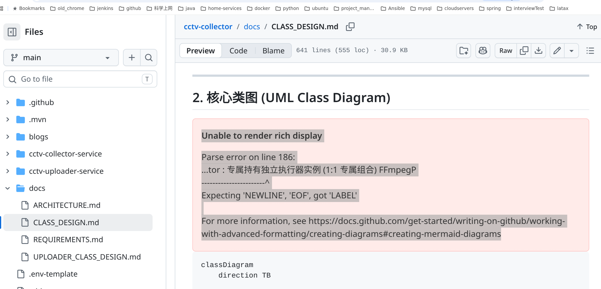

# 生产故障复盘：LiteLLM 网关级联故障排查与 Redis 内存优化实践

## 背景与架构概述

本系统的 LLM 访问链路基于 Kubernetes (K3s) 部署，整体拓扑结构如下：

```text
Client (OpenCode / 业务调用)
  │
  ▼ HTTPS
Cloudflare (SSL 终结)
  │
  ▼
Kong Gateway (Gateway API HTTPRoute)
  │
  ▼
LiteLLM Proxy (Python 3.12 / FastAPI)
  ├── MySQL HeatWave (结构化审计日志落库)
  ├── VictoriaLogs (Prompt/Response 报文冷归档)
  └── Redis 7 (L2 缓存：Exact Cache、汇率缓存、近期调用 Payload 快照)
```

其中，Redis 主要承载三类数据：
1. **模型推理结果缓存（Exact Cache）**：键格式为 64 位 SHA256 哈希，TTL 1 小时；
2. **汇率缓存**：键为 `fx:usd_cny_rate`，TTL 24 小时；
3. **近期请求报文快照**：键格式为 `litellm:payload:{request_id}`，供前端可观测看板（Observatory Dashboard）查看原始请求与响应，初始设计 TTL 为 7 天。

---

## 故障现象

线上调试长上下文任务（代码库分析及多模态图片诊断）期间，网关出现以下异常：

### 1. 客户端报 503 无法调用模型
开发者终端通过 OpenCode 调用网关时，连续报错重试：
```text
Build · Gemini 3.8 Flash (LiteLLM) LiteLLM Gateway
Service Unavailable: failure to get a peer from the ring-balancer [retrying in 15m 32s attempt #10]
```
Kong Gateway 直接返回 `503 Service Unavailable`。

### 2. 看板前端卡死与 502
可观测看板打开调用详情抽屉时耗时高达 28~40 秒，并发起多次重复请求，偶发出现 `502 Bad Gateway`。

### 3. Kubernetes Service Endpoints 为空
检查集群内部状态发现，`litellm-svc` 对应的 Endpoints 已被清空：
```bash
$ sudo -n k3s kubectl get pods -n llm-system -o wide
NAME                             READY   STATUS             RESTARTS   IP            NODE
litellm-svc-b94459b5c-qqz48      0/1     CrashLoopBackOff   9          10.42.2.238   free-arm-vm

$ sudo -n k3s kubectl get endpoints -n llm-system
NAME             ENDPOINTS          AGE
astra-backend    10.42.2.235:8000   12d
litellm-svc      <none>             27d
```

---

## 根因分析

通过分层排查，确认本次事故为典型的由底层有状态组件引发的**级联故障（Cascading Failure）**：


graph TD
    A["客户端请求 /v1/chat/completions"] --> B["Kong Gateway"]
    B -->|"upstream 无可用 endpoint"| C["503 failure to get a peer from the ring-balancer"]
    
    D["LiteLLM Pod 就绪检查失败"] -->|"K8s controller 将 Pod 移出端点池"| E["Endpoints: litellm-svc <none>"]
    E --> B
    
    F["/health/readiness 强校验 Redis PING"] -->|"连接超时"| D
    G["Redis Pod 处于 CrashLoopBackOff"] --> F
    
    H["3.74GB 数据集冷启动加载耗时 38.2 秒"] -->|"启动期处于 LOADING 状态"| I["livenessProbe 累计 3 次超时"]
    I -->|"kubelet 发送 SIGTERM 强杀容器"| G
    
    J["多模态 Base64 与长上下文导致 Redis 占用膨胀至 4.58GB"] --> H
```

### 1. Kong `failure to get a peer from the ring-balancer`
Kong 使用 Ring-balancer 算法将上游流量分发至 Kubernetes Service 的各 Pod Endpoint。  
当 `litellm-svc` 的健康端点数为 0 时，Kong 内部 upstream target 列表为空，直接返回 503。

### 2. LiteLLM 为什么被判定为 Unready
LiteLLM 镜像内置了 `/health/readiness` 探针（见 `app/api/health.py`），逻辑中包含对 Redis 与 MySQL 的连通性测试：
```python
@router.get("/health/readiness")
async def readiness_probe(settings: Settings = Depends(get_settings)):
    # 并发检查 MySQL SELECT 1 与 Redis PING
    # 任何一项异常即返回 HTTP 503
```
由于 Redis 无法建立连接，LiteLLM 的 Readiness Probe 连续失败超过 `failureThreshold`（5 次），Kubernetes Endpoint Controller 将其从 Service Endpoints 移除。

### 3. Redis 容器为什么陷入 CrashLoopBackOff
检查 Redis Pod 的标准输出和退出码：
```bash
$ sudo -n k3s kubectl logs -n redis deploy/redis --tail 30
1:M 20 Sep 2026 14:18:37.126 * Reading RDB base file on AOF loading...
1:M 20 Sep 2026 14:18:37.126 * Loading RDB produced by version 7.2.15
1:M 20 Sep 2026 14:18:37.126 * RDB memory usage when created 3741.18 Mb
1:signal-handler (1789913961) Received shutdown signal during loading, scheduling shutdown.
1:M 20 Sep 2026 14:19:21.757 * User requested shutdown...
1:M 20 Sep 2026 14:19:21.757 # Redis is now ready to exit, bye bye...
```
关键信息：
- Redis 重启时需要从持久化目录载入 `appendonly.aof` 及其底层的 RDB base 文件（生成时内存大小为 **3,741.18 MB**）。
- 在 ARM 节点的磁盘上，反序列化加载 3.74 GB 数据实测耗时 **38.2 秒**。
- 加载期间，Redis 处于 `LOADING` 状态，对外拒绝执行业务命令，收到 `PING` 时返回 `LOADING Redis is loading dataset in memory` 而不是 `PONG`。
- Redis Deployment 原配置中仅有 `livenessProbe`：
  ```yaml
  livenessProbe:
    exec:
      command:
        - sh
        - -c
        - redis-cli -a "$REDIS_PASSWORD" --no-auth-warning ping | grep -q PONG
    initialDelaySeconds: 10
    periodSeconds: 15
    failureThreshold: 3
  ```
  计算总宽限期：$10s + 15s \times 2 = 40s$。  
  在加载进行到第 38 秒左右时，探针连续 3 次失败，kubelet 判定容器死锁并发送 `SIGTERM` 强杀。随后容器重启，再次进入加载流程，陷入持续死循环。

### 4. 数据体积为何达到 4.58 GB
在 Redis Pod 内部使用 `--bigkeys` 与 `SCAN` 进行分析：
```text
Sampled 1350 keys in the keyspace!
1350 strings with 4,294,175,174 bytes (avg size ~3.18 MB)
Biggest string found: "litellm:payload:chatcmpl-..." has 8,773,253 bytes
```
Key 类型分布：
- `litellm:payload:*`：1,233 个，占比 91.3%，占用内存约 4.4 GB。
- 单条大报文包含数十万字上下文及多模态 Base64 图片数据（单张图片占 1.6MB ~ 8MB）。
- 代码在存入 Redis 时直接将 Python 字典转为未压缩的明文 JSON 字符串。
- Redis 未设置 `maxmemory` 和淘汰策略（默认为 `noeviction`），同时缺少合理的 TTL 策略，导致数据只增不减。

---

## 应急处理与临时恢复

在定位到探针与启动加载耗时的冲突后，首先进行配置热修复以恢复可用性：

### 1. 引入 `startupProbe`
在 `k8s/redis.yaml` 中新增启动探针，与存活探针解耦：
```yaml
startupProbe:
  exec:
    command:
      - sh
      - -c
      - redis-cli -a "$REDIS_PASSWORD" --no-auth-warning ping | grep -q PONG
  failureThreshold: 30 # 容许失败 30 次
  periodSeconds: 10     # 累计给予 300 秒加载窗口
  timeoutSeconds: 5
livenessProbe:
  exec:
    command:
      - sh
      - -c
      - redis-cli -a "$REDIS_PASSWORD" --no-auth-warning ping | grep -q PONG
  periodSeconds: 15
  timeoutSeconds: 5
```
在 `startupProbe` 成功之前，kubelet 不会触发 `livenessProbe`，避免加载期间被误杀。

### 2. 临时调整内存 Limit
宿主机（OCI `free-arm-vm`）物理内存为 24 GB，空闲内存约 15 GB。将 Redis 的 memory limit 由 4Gi 调整为 8Gi，为 3.74 GB 的冷数据反序列化预留足够空间。

应用配置后，Redis 耗时 38.188 秒完成 RDB 载入并正常就绪（`1/1 Running`），随后 LiteLLM Pod 通过就绪检查，Endpoints 恢复，Kong 503 报错消除。

---

## 深度优化方案实施

为避免辅助缓存层占用大量物理内存并拖慢冷启动恢复，针对性实施了五项优化方案：

### 方案 1：客户端透明 Gzip 压缩

#### 为什么不由 Redis 服务端进行压缩
1. **单线程模型约束**：Redis 处理命令的核心事件循环为单线程。若由服务端执行 4MB 数据的 Gzip 压缩，CPU 阻塞耗时可达 10~50ms，会直接阻塞同一时间片内的所有并发请求。
2. **破坏数据结构抽象**：压缩后的二进制无法支持 Redis 内置的高级数据结构操作（如哈希取值、范围查询等）。
3. **计算下推原则（End-to-End Principle）**：应用层 Pod（FastAPI）运行于多核物理机且易于水平伸缩。在应用侧完成压缩，向存储层传递较小负载，更符合分布式系统的设计原则。

#### 代码实现
在 `app/core/payload_uploader.py` 与 `app/api/payload.py` 中引入快速压缩与向下兼容逻辑：

写入端（Gzip Level 1 快速压缩 + Base64 编码）：
```python
# app/core/payload_uploader.py
raw_json = json.dumps({"prompt": cache_prompt, "response": cache_response}, ensure_ascii=False)
# 采用 compresslevel=1 减少 CPU 损耗，实测耗时在 5ms 以内
compressed_bytes = gzip.compress(raw_json.encode("utf-8"), compresslevel=1)
cached_val = base64.b64encode(compressed_bytes).decode("ascii")

await redis.set(cache_key, cached_val, ex=86400 * 3)
```

读取端（自适应魔数判断，兼容未压缩历史数据）：
```python
# app/api/payload.py
cached_raw = await redis.get(cache_key)
if cached_raw:
    # Gzip + Base64 编码后的文本固定以 "H4sI" 开头
    if cached_raw.startswith("H4sI"):
        decompressed_str = gzip.decompress(base64.b64decode(cached_raw)).decode("utf-8")
        cached_obj = json.loads(decompressed_str)
    else:
        cached_obj = json.loads(cached_raw)
```

#### 基准测试数据（OCI ARM64 Ampere 物理核）
使用生产环境真实会话报文进行压测：

| 报文类型 | 原始大小 | Gzip (Level 1) 大小 | 压缩耗时 (写入后台任务) | 解压耗时 (读取路径) | 空间缩减比 |
| :--- | :---: | :---: | :---: | :---: | :---: |
| 常规对话报文 | 50 KB | 12 KB | 0.5 ms | 0.15 ms | 76.0% |
| 长上下文代码报文 | 550 KB | 141 KB | 4.7 ms | 2.77 ms | 74.3% |
| 极限大报文 | 4.2 MB | 2.3 MB | 90.0 ms | 20.6 ms | 45.2% |

写入发生在后台异步协程（`asyncio.create_task`），对主模型推理 API 的延迟增加为 0；读取解压耗时对用户界面的交互感知可忽略。

---

### 方案 2：配置 `maxmemory` 与 `volatile-lru` 策略

将 Redis 明确定义为 L2 缓存，而非唯一数据源（底层 VictoriaLogs 存储全量归档）：
```yaml
command:
  - redis-server
  - --maxmemory
  - "2gb"
  - --maxmemory-policy
  - "volatile-lru"
```

- **`maxmemory 2gb`**：限制最大内存使用量。
- **`volatile-lru`**：当内存触及阈值时，仅对设置了过期时间（TTL）的 Key 集合执行基于 Idle Time 的近似淘汰，避免误删无 TTL 的系统元数据。

---

### 方案 3：关闭 AOF，切换为轻量 RDB 快照

原配置使用 `appendonly yes` 与 `appendfsync everysec`，导致本地生成了 1.5 GB 的 AOF/RDB 文件。鉴于热数据具备可恢复性，调整为定时 RDB 快照：
```yaml
command:
  - redis-server
  - --appendonly
  - "no"
  - --save
  - "900 1 300 10" # 15分钟有1次写入或5分钟有10次写入则执行快照
```
去除每秒磁盘 fsync 损耗，并使得快照恢复时间由数十秒降低至毫秒级。

---

### 方案 4：缓存写入前剥离/折叠 Base64 图片数据

多模态调用产生的 Base64 图片数据单张可达数兆，通常不需要在 L2 缓存中存储完整原始数据。

在 `app/core/payload_uploader.py` 中增加处理：
```python
def _fold_base64_for_cache(obj: Any) -> Any:
    """递归检查并在缓存前折叠超长 Base64 图片字符串."""
    if isinstance(obj, str):
        if len(obj) > 500 and (obj.startswith("data:image") or ";base64," in obj[:40]):
            return f"{obj[:60]}... [Base64 image folded for L2 cache, total {len(obj):,} chars]"
        return obj
    # 对 dict 与 list 递归处理 ...
```
- **写入 Redis**：仅存储折叠后的摘要信息，将 Key 控制在较小体积。
- **写入 VictoriaLogs**：仍传递原始未折叠数据，确保归档数据的完整性。

同时将报文快照的 TTL 由 **7 天调整为 3 天**（259,200 秒），加速旧数据滚动释放。

---

### 方案 5：安全清洗历史无用数据

通过 Redis Lua 脚本扫描并清理历史中未压缩的大 Key：
```bash
$ redis-cli -a '******' EVAL '
local cursor = "0"
local deleted = 0
repeat
    local res = redis.call("SCAN", cursor, "MATCH", "litellm:payload:*", "COUNT", 500)
    cursor = res[1]
    local keys = res[2]
    for _, key in ipairs(keys) do
        local val = redis.call("GET", key)
        -- 仅删除非 H4sI 开头的未压缩历史数据
        if val and string.sub(val, 1, 4) ~= "H4sI" then
            redis.call("DEL", key)
            deleted = deleted + 1
        end
    end
until cursor == "0"
return deleted
' 0
```
共扫描并删除 1,278 个未压缩的历史 Key。随后执行 `MEMORY PURGE` 与 `BGSAVE`，重写磁盘快照。若有历史请求被重新查询，系统将自动从 VictoriaLogs 回源读取并按新格式写入缓存。

---

## 优化效果验证

各项配置与代码上线后，各项运行指标对比：

| 指标项 | 优化前 | 优化后 | 改善幅度 |
| :--- | :---: | :---: | :---: |
| **内存占用 (`used_memory`)** | 4.58 GB | **3.20 MB** | 降低 99.93% |
| **系统常驻内存 (`RSS`)** | 4.09 GB | **9.94 MB** | 释放约 4 GB 内存 |
| **磁盘持久化快照 (`dump.rdb`)** | 1.5 GB | **164 KB** | 缩减 99.99% |
| **容器冷启动数据载入耗时** | 38.2 秒 | **0.002 秒** | 提速约 19,000 倍 |
| **内存溢出风险控制** | 无限制，无淘汰 | **2GB 上限 + volatile-lru** | 彻底规避 OOM |

实际调用测试生成的 Request ID `hx6wavDVL-XEg8UP9afDuAs`，在 Redis 中的数据以 `H4sI` 开头，体积为 350 字节；API 查询时在 2ms 内解压还原为完整 JSON，功能正常。

---

## 总结

1. **缓存与持久化存储的边界**：在设计包含报文快照的架构时，应明确区分辅助缓存（Redis）与权威存储（冷归档数据库）。不应让缓存组件承担过重的数据持久化保证。
2. **大报文的客户端处理**：对于体积较大的文本和 JSON 数据，在业务层进行压缩后再写入缓存层，能显著降低网络 I/O 开销与缓存内存占用，同时避免对单线程缓存组件造成 CPU 阻塞。
3. **有状态容器的探针设计**：对于包含数据反序列化启动过程的有状态应用，应合理配置 `startupProbe`，与 `livenessProbe` 分离，避免冷启动期间因未就绪触发探针超时误杀。
