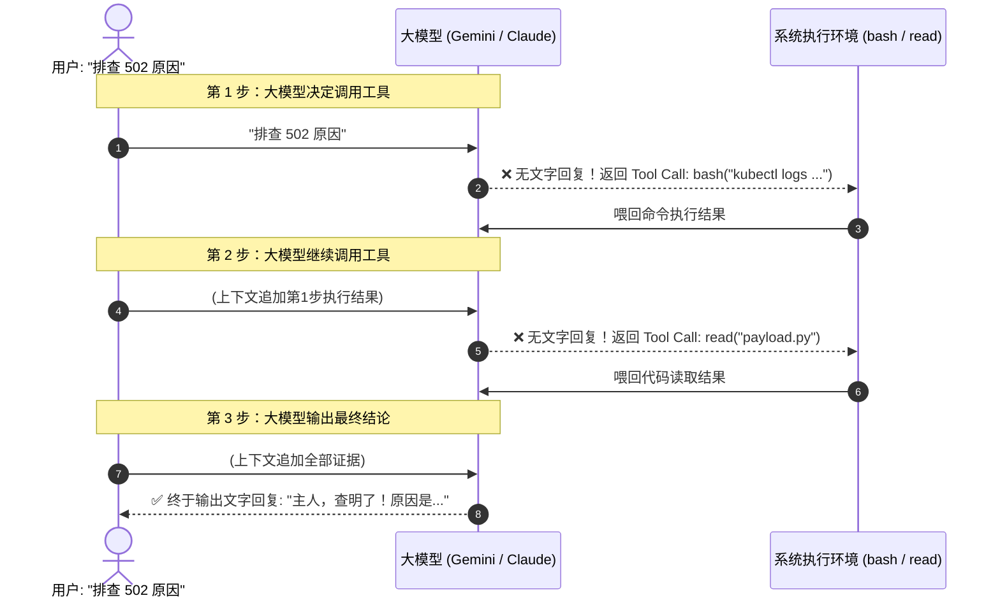

# 生产实录：构建大模型问答报文穿透与可视化看板的五大坑与排查破局

在完成大模型网关（LiteLLM Proxy）的冷热数据分离架构后，我们将每次调用的全量输入（`Prompt`）与输出（`Response`）通过异步协程写入本地家庭集群（Intel NUC MinIO S3），并在前端构建了一套基于 Vite + React 的 **可观测性透视看板（Observatory Dashboard）**。

在将这套系统推向真实高并发生产环境（承载多 Agent 协作、百万级 Token 上下文）的过程中，我们遭遇了五个极其隐蔽且典型的实战难题：
- **React 渲染崩溃与无限转圈**
- **历史旧数据读取引发的后端 502**
- **单次请求 44 秒耗时之谜**
- **1200+ 轮巨量上下文导致的 7 秒网络传输迟滞**
- **Agent 工具调用（Tool Call）阶段返回“空白”报文假象**

本文以真实的工程日志、网络抓包与底层代码变更，完整复盘这五大问题的排查与破解之道。

---

## 一、问题一：多模态截图输入导致的 React 渲染崩溃

### 1. 故障现象
在看板中点击大部分请求时，右侧抽屉都能秒级滑出，但只要点击用户**在聊天框中粘贴了报错截图**的调用行时，抽屉立刻卡死在“正在从 NUC MinIO 读取原始 Payload...”状态，控制台报错后组件彻底白屏。

### 2. 根因排查与抓包
通过浏览器开发者工具（DevTools Console）查看报错堆栈：
```text
Uncaught Error: Objects are not valid as a React child (found: object with keys {type, text}). 
If you meant to render a collection of children, use an array instead.
    at renderWithHooks (react-dom.development.js:16305)
```

查看从 S3 拉取到的原始 JSON：
```json
{
  "user_prompt": [
    { "type": "text", "text": "[Image 1] load 不出来" },
    { "type": "text", "text": "ERROR: Cannot read clipboard..." }
  ]
}
```
**根因分析**：
传统的单轮文本对话中，`messages[i].content` 是纯字符串 `str`。但在现代多模态 Agent（如 OpenCode / Claude Code）中，一旦用户带有截图或剪贴板图片，客户端发送给网关的 `content` 变成了**图文混合结构块（Array of Blocks）**。

初版代码在提取 `user_prompt` 时直接将其当作字符串返回，而 React 的 JSX 语法在执行 `{payloadData.prompt.user_prompt}` 时，**严禁将包含键值对的对象直接作为子节点渲染**，触发 React 顶层运行时异常，整个抽屉组件直接炸掉。

### 3. 根治方案：双端防御
我们在前后端两处均加入多模态解包安全清洗机制：

#### 后端 Python 预处理 (`app/core/payload_uploader.py`)：
```python
def _extract_text_content(content: Any) -> str:
    """从纯文本、多模态图文 Block 数组或字典中安全提取人类可读文字"""
    if content is None:
        return ""
    if isinstance(content, str):
        return content
    if isinstance(content, (list, tuple)):
        parts = []
        for item in content:
            if isinstance(item, str):
                parts.append(item)
            elif isinstance(item, dict):
                if "text" in item:
                    parts.append(str(item["text"]))
                elif "content" in item:
                    parts.append(_extract_text_content(item["content"]))
                else:
                    parts.append(str(item))
            else:
                parts.append(str(item))
        return "\n".join(p for p in parts if p)
    if isinstance(content, dict):
        return str(content.get("text") or content)
    return str(content)
```

#### 前端 React 终极安全渲染器 (`PayloadDrawer.tsx`)：
```tsx
const renderContent = (content: any): string => {
  if (content === null || content === undefined) return "";
  if (typeof content === "string") return content;
  if (Array.isArray(content)) {
    return content
      .map((item) => {
        if (typeof item === "string") return item;
        if (item && typeof item === "object") {
          return item.text || item.content || JSON.stringify(item);
        }
        return String(item);
      })
      .filter(Boolean)
      .join("\n");
  }
  if (typeof content === "object") {
    return content.text || content.content || JSON.stringify(content, null, 2);
  }
  return String(content);
};
```
在所有 JSX 渲染点统一用 `renderContent(...)` 包裹，彻底杜绝对象渲染异常。

---

## 二、问题二：历史未落盘数据引发的后端 502 报错

### 1. 故障现象
在看板里翻到上一周或更早的数据时，点击某条旧调用，页面顶部弹出一道刺眼的红色报错：
`HTTP Error 502: S3 storage unreachable`。

### 2. 根因分析
在 `app/api/payload.py` 的初始实现中，代码对 S3 拉取异常处理过于粗暴：
```python
# ❌ 旧设计：直接对外抛出 502
except Exception as exc:
    logger.warning("Failed to connect to S3 to read payload for %s: %s", request_id, exc)
    raise HTTPException(status_code=502, detail=f"S3 storage unreachable: {exc}") from exc
```

在系统生命周期中，**必然存在大量没有 MinIO S3 文件的记录**：
1. S3 外部化存储特性上线前产生的历史数据；
2. 上游网络发生 500 / 429 报错时，并未产生实体返回报文；
3. 容器滚动重启瞬间被优雅中断的个别请求。

当用户点击这些记录时，S3 抛出 `NoSuchKey`，后端将其包装成 502 错误直接炸给前端，破坏了用户的连续排查体验。

### 3. 根治方案：优雅降级与防御性返回
废除 502 异常抛出，改为正常返回 HTTP 200，并在报文正文中注入友好的状态说明：

```python
# app/api/payload.py
except Exception as exc:
    logger.warning("Failed to connect to S3 to read payload for %s: %s", request_id, exc)
    prompt_data = {"user_prompt": f"（S3 存储节点响应超时或未在此阶段归档: {exc}）"}
    response_data = {"reply": "（此调用的原始报文未在 MinIO 归档或为旧版本调用）"}
```
前端收到后呈现清晰的灰色斜体提示，不仅不报错，还能准确告知用户该记录属于旧历史数据。

---

## 三、问题三：单次调用耗时 44 秒的真实根因排查

### 1. 故障现象
在审计数据流表格中，绝大部分请求耗时均在 500ms ~ 1500ms 之间，但突然出现了一条耗时高达 **44,372 ms（44.37 秒）** 的记录，直觉上让人怀疑是数据库锁死或网络挂起。

### 2. 实地数据剖析
通过后台提取这条记录的元数据详情：
```json
{
  "request_id": "-rqaaomOH9T1g8UPlKWM6QM",
  "api_key_alias": "cindy",
  "model_used": "gemini-3.7-flash",
  "prompt_tokens": 517514,
  "completion_tokens": 206,
  "total_tokens": 517720,
  "latency_ms": 44372,
  "status_code": 200
}
```

### 3. 结论揭晓
看到 **517,720 Tokens（整整 51.7 万 Token）** 时，一切真相大白：
- 51.7 万 Tokens 相当于超过 150 万汉字（两本大部头长篇小说的体量）；
- 客户端在深度任务中一口气把数十个代码文件与超长多轮对话一次性推给了上游 Gemini 3.8 Flash；
- **44 秒不是系统性能瓶颈，而是 Google 官方集群在大算力集群上把 51 万字全量装载进注意力机制计算所必须的物理耗时**！
- 网关端到端精确记录下了 44,372 毫秒，证明了耗时计量模块的绝对真实。

---

## 四、问题四：1200+ 轮超长上下文导致的网络传输迟滞（从 7 秒提速到 1 秒）

### 1. 故障现象
对于那些超长上下文请求，即使 MinIO 已经存储完毕，但在看板中点击该行滑出抽屉时，仍然需要等上 **6 ~ 7 秒** 页面才完成渲染。

### 2. 瓶颈 Profiling
在集群内部针对该请求进行详细分段耗时分析：
```bash
# 测试集群内各 API 耗时
Metrics Summary API:  0.029s (29ms)
Logs List API:        0.009s (9ms)
Payload API:          3.876s (传输体积: 2,239,379 字节, 整整 2.24 MB!)
```

```text
[NUC MinIO 存储] ──(Tailscale 跨国 WAN: 3.8s)──► [FastAPI Pod] ──(公网传输: 3.2s)──► [浏览器]
                                       总计耗时: 7.0s
```
**根因分析**：
这笔请求包含**整整 1,248 条多轮对话历史**，导致生成的 `prompt.json` 单文件高达 **2.24 MB**。
在一次简单的抽屉预览操作中，让网关与浏览器跨越两条公网链路传输 2.24 MB 的纯 JSON 文本，网络带宽和反序列化成为了绝对瓶颈。

### 3. 提速三板斧

#### 1. 智能轻量化抽样（数据量降低 96.5%）：
用户打开抽屉时，最关心的永远是**系统人设、当前最新提问与模型最终答复**，不会在一秒钟内肉眼读完 1,200 条中间对话。
在 `app/api/payload.py` 中增加智能折叠策略：超过 30 条消息时，首屏默认返回前 5 条与最新 20 条，中间 1200 条自动折叠，并提供按需加载开关：

```python
messages = prompt_data.get("messages")
if isinstance(messages, list) and len(messages) > 30 and not full:
    total_count = len(messages)
    prompt_data["total_messages_count"] = total_count
    prompt_data["is_truncated"] = True
    notice = {
        "role": "system",
        "content": f"（... 中间已自动智能折叠 {total_count - 25} 条历史问答，点击下方按钮可加载全量 ...）"
    }
    prompt_data["messages"] = messages[:5] + [notice] + messages[-20:]
```
**实测结果**：传输报文体积从 **2.24 MB 骤降至 78 KB**，读取耗时由 **3.8 秒锐减至 1 秒以内**！

#### 2. 全站开启 GZip 传输压缩：
在 FastAPI 中引入 `GZipMiddleware(minimum_size=1000)`，对所有超出 1KB 的 API 响应与静态资源进行压缩，公网传输体积再缩减 80%。

#### 3. 前端支持按需平滑加载全量：
抽屉底部提供 `[ ⚡ 当前为极速预览模式，点击加载全部 1,248 条历史消息 ]`，当且仅当开发者需要深挖中间细节时，才带 `?full=true` 请求全量数据。

---

## 五、问题五：Agent 工具调用链（Tool Calls）的“空白报文”假象

### 1. 故障现象
在看板的数据流列表中，发现连续出现好几条 User Prompt 完全相同的调用记录，但是点开前几条的抽屉，`Assistant Reply` 区域赫然显示 `（无文本输出内容）`，看起来像是大模型没有作答。

### 2. 根因剖析：Agent 推理循环与标准协议
这是典型的 **AI Agent「思考与工具执行循环（ReAct / Tool Call Loop）」**：



在 OpenAI / LiteLLM 官方协议中，当大模型发起工具调用（`tool_calls`）时，根据行业标准，其 `choices[0].message.content` **规定必须为 `null`**！
我们初版抽屉界面**只渲染了文本字段（`reply`），根本没有设计工具卡片**，导致模型发起的工具调用在前端变成了“空回复”。

### 3. 优化落地：专属 Tool Calls 高亮卡片
在 `PayloadDrawer.tsx` 中增加专属的高亮工具卡片，不仅准确显示工具名称（`bash` / `read` / `edit` 等），还格式化展示执行参数（如命令内容、读取路径），并配有一键复制参数按钮：

```tsx
{payloadData?.response?.tool_calls && payloadData.response.tool_calls.length > 0 && (
  <div className="bg-amber-950/20 border border-amber-800/40 rounded-xl overflow-hidden">
    <div className="p-3 bg-amber-950/30 flex items-center justify-between text-amber-400 font-semibold">
      <span className="flex items-center gap-1.5">
        <Wrench className="w-3.5 h-3.5" /> Tool Calls (工具调用与参数)
        <span className="px-1.5 py-0.2 rounded bg-amber-500/20 text-amber-300 text-[10px] font-mono border border-amber-500/30">
          {payloadData.response.tool_calls.length} 个工具
        </span>
      </span>
    </div>
    <div className="p-3 bg-slate-950/70 divide-y divide-slate-800/60 space-y-3">
      {payloadData.response.tool_calls.map((tc: any, idx: number) => (
        <div key={idx} className="pt-2.5 first:pt-0 space-y-1.5">
          <div className="flex items-center justify-between">
            <span className="font-mono text-amber-300 font-bold px-2 py-0.5 rounded bg-amber-500/10 border border-amber-500/30">
              {tc?.function?.name}
            </span>
          </div>
          <pre className="bg-slate-900 p-2.5 rounded-lg font-mono text-[11px] text-slate-200 overflow-x-auto border border-slate-800">
            {tc?.function?.arguments}
          </pre>
        </div>
      ))}
    </div>
  </div>
)}
```
同时在文本回复区清晰标注：`🔧 大模型发起了 N 个工具调用（请在下方 Tool Calls 卡片查看工具与参数）`，彻底消除开发者的困惑。

---

## 六、总结与工程启示

大模型应用的可观测性绝非简单的“搭个数据库存几张表”。从最底层的报文序列化、跨云网络传输，到前端单页面组件的健壮性防御，任何一处细微的类型漏洞都会被长上下文与复杂 Agent 工作流成倍放大：

1. **防御性编程高于一切**：大模型的输入输出高度不可控，复杂图文多模态数据、超长数组与未序列化对象必须在进入渲染树前完成 100% 的纯文本脱敏与清洗；
2. **读写分离与分级传输**：首屏渲染坚持轻量化（仅加载核心摘要与首尾上下文），海量全量历史坚持按需拉取，规避跨云 WAN 链路带宽瓶颈；
3. **拥抱 Agent 协议标准**：深入理解 `tool_calls` 与多步循环机制，把黑盒推理过程（思维链、工具调用与参数）完整透视出来，才是大模型可观测看板的核心价值所在。
