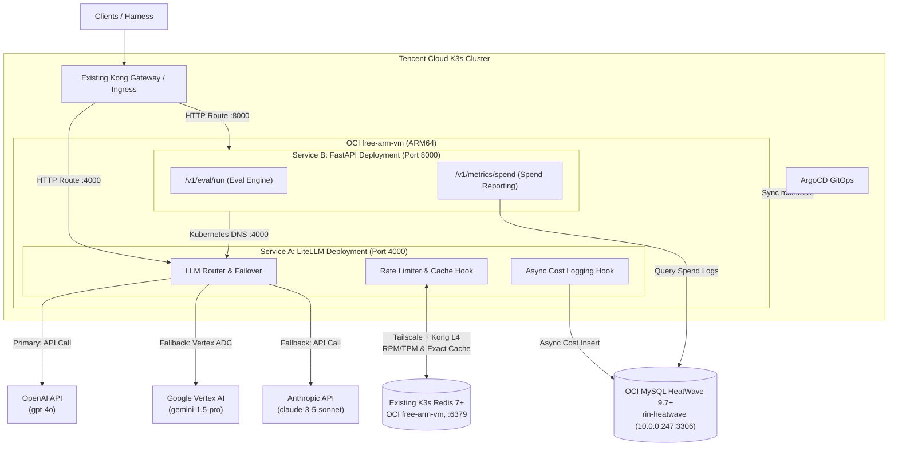
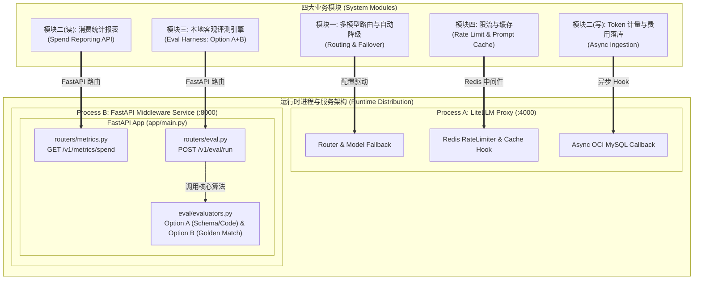
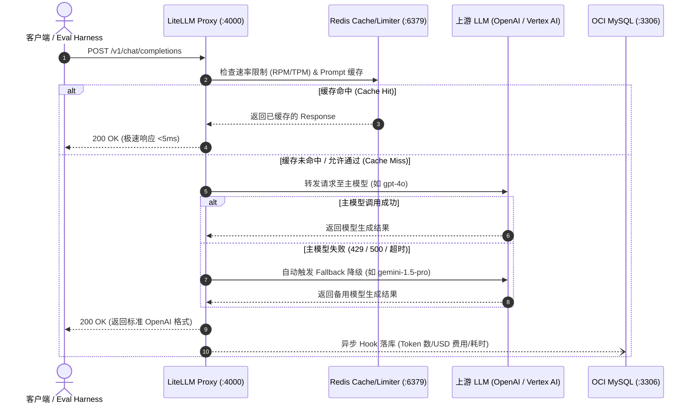

# 技术架构与数据流设计 (Technical Architecture & Data Flow)

本文档补充说明 `my-litellm-service` 的底层架构设计、服务间通信流程、四大核心模块职责映射、FastAPI 目录结构，以及 K3s + ArgoCD + Kong 部署架构与容灾切换逻辑。

---

## 1. 系统网络与进程部署拓扑 (Network & Process Topology)



---

## 2. 四大核心模块与进程职责映射 (Module Responsibilities)



| 模块 | 模块名称 | 承载进程 | 核心职责与实现机制 |
| :--- | :--- | :--- | :--- |
| **模块一** | 多模型路由与自动降级 (Routing & Failover) | **Process A: LiteLLM Proxy** | `config.yaml` 声明 OpenAI / Vertex AI Gemini / Anthropic 模型列表与自动 Fallback 降级规则。 |
| **模块二 (写)** | 开销审计与 Token 计量 (Data Ingestion) | **Process A: LiteLLM Proxy** | 请求完成后异步 Callback 触发，无感写入 OCI MySQL `llm_request_logs` 表。 |
| **模块二 (读)** | 开销审计与报表 API (Reporting) | **Process B: FastAPI** | 暴露 `GET /v1/metrics/spend` 接口，查询并汇总数据库中的模型耗费与请求报表。 |
| **模块三** | 本地客观评测引擎 (Eval Harness) | **Process B: FastAPI** | 暴露 `POST /v1/eval/run` 接口，使用 `asyncio` 并发测试多模型，执行 Option A (断言) 与 Option B (黄金匹配) 校验。 |
| **模块四** | 限流与缓存 (Rate Limit & Cache) | **Service A: LiteLLM Deployment** | 连接现有 K3s Redis 7+（Redis Pod 固定于 OCI `free-arm-vm`，通过 Kong L4 访问），处理 RPM/TPM 速率拦截与 Exact Prompt 哈希缓存；项目不部署本地 Redis。 |

---

## 3. FastAPI (Process B) 目录代码结构 (Directory Layout)

```
app/
├── main.py                  # FastAPI 主程序入口 (注册各种 APIRouter)
├── core/
│   ├── config.py            # 读取 .env 环境变量
│   └── database.py          # OCI MySQL (aiomysql) 与 Redis 异步连接池
├── eval/                    # 模块三：评测引擎内部逻辑
│   ├── evaluators.py        # Option A (Schema/断言) & Option B (Golden 比对) 算法
│   └── service.py           # asyncio 并发向 LiteLLM 发送测试请求
├── routers/
│   ├── eval.py              # 模块三路由: POST /v1/eval/run
│   └── metrics.py           # 模块二路由: GET /v1/metrics/spend
└── models/
    └── schemas.py           # Pydantic 数据请求与响应校验模型
```

---

## 4. 请求处理与数据流 (Request Processing Flow)



当客户端或评估工具向服务发起请求时，整体数据流向如下：

1. **请求接入 (Ingress)**：
   * 客户端向 FastAPI (`:8000/v1/eval/run`) 或直接向 LiteLLM Proxy (`:4000/v1/chat/completions`) 发送符合 OpenAI 规范的 JSON 请求。
2. **限流与缓存拦截 (Rate Limiting & Caching Check)**：
   * LiteLLM Proxy 通过 Tailscale 与 Kong L4 连接现有 **K3s Redis**，检查该 API Key 的当前分钟调用计数（RPM / TPM）。若超限则直接返回 `429 Too Many Requests`。
   * 若启用了 Response Cache，匹配 Redis 中相同的 Prompt hash；若命中则直接返回缓存结果。
3. **模型路由与自动重试 (Routing & Fallback)**：
   * LiteLLM 根据配置路由到指定的底层 API（如 OpenAI `gpt-4o` 或 Vertex AI `gemini-1.5-pro`）。
   * 若目标 API 发生异常或超时，代理根据 `config.yaml` 自动重试备用模型。
4. **日志与计费落库 (Async Cost Logging)**：
   * 请求完成后，LiteLLM 异步提取响应中的 Token 数量与耗时，计算 USD 费用，并将日志保存至 **OCI MySQL HeatWave** 数据表 `llm_request_logs`。
5. **响应返回 (Response)**：
   * 将标准的 OpenAI 格式响应数据返回给客户端。

---

## 5. K3s + ArgoCD + Kong 部署策略

Service A 和 Service B 使用两个独立的 Kubernetes `Deployment`，分别运行在
独立 Pod 中，但继续共用本仓库的代码、`pyproject.toml`、`uv.lock` 和依赖体系。
容器内部不创建两个 venv；镜像只构建一套 Python 3.12 运行环境，通过不同入口
程序和端口区分两个服务：

```text
同一个 Python 3.12 镜像/依赖环境
├── litellm --config config.yaml --port 4000  -> Service A
└── uvicorn app.main:app --port 8000         -> Service B
```

推荐资源布局：

```text
deploy/k8s/
├── namespace.yaml
├── configmap.yaml
├── secret.example.yaml
├── litellm-deployment.yaml
├── litellm-service.yaml       # ClusterIP :4000
├── fastapi-deployment.yaml
├── fastapi-service.yaml       # ClusterIP :8000
└── ingress.yaml               # 由现有 Kong 处理入口
```

两个 Deployment 初期可通过 `nodeSelector` 固定到 OCI `free-arm-vm`，但必须设置
合理的 `resources.requests`、`resources.limits`，避免与 Redis、Kong 争抢节点资源。
不使用 `hostNetwork`，也不在应用 Pod 中绑定节点端口。

ArgoCD 的 Application 负责指定目标 K3s 集群、命名空间和 manifest 路径；Kubernetes
manifest 负责镜像、端口、探针、资源限制和节点调度。建议沿用两层 GitOps 职责：

- 本仓库：应用源码、Dockerfile、LiteLLM 配置和 `deploy/k8s/` workload manifests。
- `my-argocd-manifests`：ArgoCD Application 注册文件，只负责把本仓库同步到目标集群。

Service B 通过集群内 DNS 调用 LiteLLM：

```text
http://litellm-proxy.llm-system.svc.cluster.local:4000
```

外部流量统一经过现有 Kong Gateway；不新增第二个 Kong。LiteLLM 和 FastAPI 是否
对外暴露，由 Kong 的 HTTPRoute/Ingress 规则决定；Redis 继续使用现有 Kong L4
TCP 转发，不在本项目内重新部署 Redis。

---
*End of Architectural Specification.*
