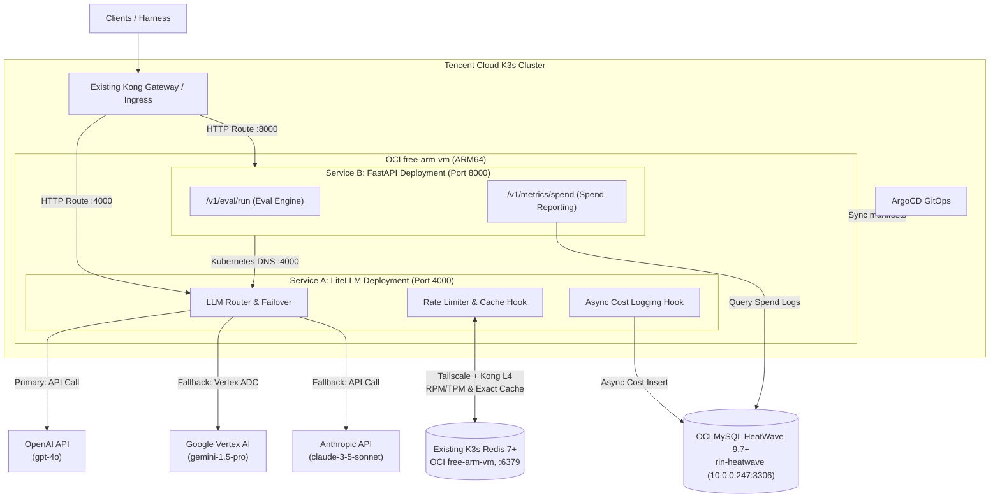
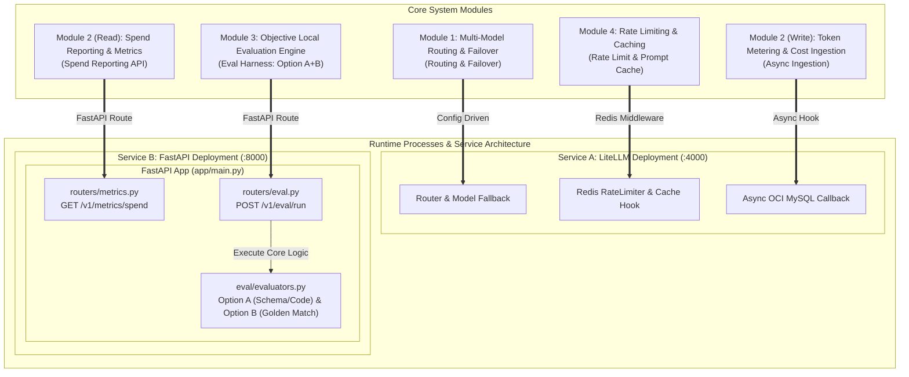
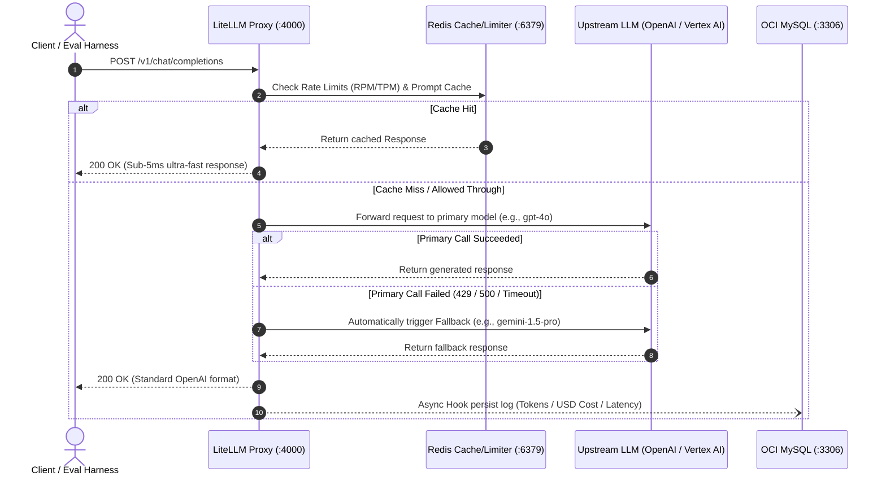

# Technical Architecture & Data Flow Design

This document details the underlying architectural design, inter-service communication flows, responsibility mappings across the four core modules, the FastAPI directory layout, and the K3s + ArgoCD + Kong deployment topology and failover logic for `my-litellm-service`.

---

## 1. Network & Process Topology



---

## 2. Core Module & Process Responsibilities



| Module | Module Name | Host Process | Core Responsibility & Mechanism |
| :--- | :--- | :--- | :--- |
| **Module 1** | Multi-Model Routing & Failover | **Service A: LiteLLM Deployment** | Declarative configuration in `config.yaml` defining OpenAI / Vertex AI Gemini / Anthropic model lists and automated fallback rules. |
| **Module 2 (Write)** | Cost Auditing & Token Metering (Ingestion) | **Service A: LiteLLM Deployment** | Triggered asynchronously post-request via custom callbacks, non-blockingly writing logs into the OCI MySQL `llm_request_logs` table. |
| **Module 2 (Read)** | Cost Auditing & Spend Reporting API | **Service B: FastAPI Deployment** | Exposes the `GET /v1/metrics/spend` endpoint to aggregate and query model spend and request statistics from the database. |
| **Module 3** | Local Objective Evaluation Engine (Eval Harness) | **Service B: FastAPI Deployment** | Exposes the `POST /v1/eval/run` endpoint using `asyncio` for concurrent multi-model benchmarking against Option A (assertions) and Option B (golden matches). |
| **Module 4** | Rate Limiting & Caching | **Service A: LiteLLM Deployment** | Connects to the existing K3s Redis 7+ instance (pinned to the OCI `free-arm-vm` and reachable via Kong L4) for RPM/TPM throttling and exact prompt hash caching without deploying a local Redis. |

---

## 3. Monorepo & Deployment Layout

The project follows a **One Repository, Two Deployments** architecture: LiteLLM Gateway and FastAPI Application run as two separate Kubernetes Deployments while sharing the same Git repository, `pyproject.toml`, `uv.lock`, Docker image, and Python 3.12 runtime environment.

```text
my-litellm-service/
├── README.md
├── pyproject.toml                 # Unified dependencies and project configuration
├── uv.lock                        # Locked dependencies file
├── .env.example                   # Template for non-sensitive configuration
├── .gitignore
├── config.yaml                    # Service A: LiteLLM routing/fallback/cache config
├── Dockerfile                     # Unified multi-stage container build for both deployments
│
├── app/
│   ├── __init__.py
│   ├── main.py                    # Service B: FastAPI application entry point
│   ├── core/
│   │   ├── __init__.py
│   │   ├── config.py              # Environment variable parsing and validation
│   │   ├── database.py            # OCI MySQL async connection pool
│   │   └── redis.py               # Redis async connection pool
│   ├── callbacks/
│   │   ├── __init__.py
│   │   └── cost_logger.py         # Service A: Async cost logging hook
│   ├── eval/
│   │   ├── __init__.py
│   │   ├── evaluators.py          # Option A/B evaluation algorithms
│   │   └── service.py             # Concurrent LiteLLM dispatch engine
│   ├── models/
│   │   ├── __init__.py
│   │   └── schemas.py             # FastAPI Pydantic request/response schemas
│   └── routers/
│       ├── __init__.py
│       ├── eval.py                # POST /v1/eval/run
│       ├── metrics.py             # GET /v1/metrics/spend
│       └── health.py              # FastAPI health check
│
├── scripts/
│   ├── __init__.py
│   ├── check_phase1.py            # MySQL/Redis connectivity verification
│   ├── smoke_proxy.py             # LiteLLM proxy smoke testing
│   └── init_db.sql                # Phase 2: MySQL DDL schema
│
├── tests/
│   ├── test_config.py
│   ├── test_connectivity.py
│   ├── test_evaluators.py
│   └── test_api.py
│
├── deploy/
│   └── k8s/
│       ├── namespace.yaml
│       ├── configmap.yaml
│       ├── secret.example.yaml
│       ├── litellm-deployment.yaml
│       ├── litellm-service.yaml
│       ├── fastapi-deployment.yaml
│       ├── fastapi-service.yaml
│       └── ingress.yaml            # Ingress managed via existing Kong
│
└── docs/
    ├── ARCHITECTURE.md
    ├── HIGH_LEVEL_IMPLEMENTATION_PLAN.md
    └── plans/
```

### 3.1 FastAPI (Service B) Code Layout

```
app/
├── main.py                  # FastAPI entry point (registers APIRouters)
├── core/
│   ├── config.py            # Loads .env and environment settings
│   └── database.py          # OCI MySQL (aiomysql) and Redis connection pools
├── eval/                    # Module 3: Evaluation engine internal logic
│   ├── evaluators.py        # Option A (Schema/assertion) & Option B (Golden match) logic
│   └── service.py           # asyncio concurrent request dispatcher to LiteLLM
├── routers/
│   ├── eval.py              # Module 3 router: POST /v1/eval/run
│   └── metrics.py           # Module 2 router: GET /v1/metrics/spend
└── models/
    └── schemas.py           # Pydantic data validation schemas
```

`app/callbacks/` belongs to the extension logic of LiteLLM Service A; `app/eval/`, `app/routers/`, and `app/main.py` belong to FastAPI Service B. The two services do not require isolated virtual environments or separate code repositories.

---

## 4. Request Processing & Data Flow



When a client or benchmarking harness makes a request to the service, the end-to-end data flow operates as follows:

1. **Ingress**:
   * The client sends an OpenAI-compatible JSON request either to FastAPI (`:8000/v1/eval/run`) or directly to LiteLLM Proxy (`:4000/v1/chat/completions`).
2. **Rate Limiting & Caching Check**:
   * LiteLLM Proxy connects to the existing **K3s Redis** over Tailscale and Kong L4, verifying the per-minute calling counter (RPM / TPM) for the given API Key. If limits are exceeded, it immediately returns `429 Too Many Requests`.
   * If Response Caching is enabled, it hashes the prompt to locate matching Redis keys; on a cache hit, the cached response is returned immediately.
3. **Routing & Fallback**:
   * LiteLLM routes the request to the upstream target API (such as OpenAI `gpt-4o` or Vertex AI `gemini-1.5-pro`) based on the routing rules.
   * If the target API throws an error or times out, LiteLLM automatically retries using the configured fallback models defined in `config.yaml`.
4. **Async Cost Logging**:
   * Upon completion, LiteLLM asynchronously parses token usage and latency from the response, computes USD costs, and persists the transaction log to the **OCI MySQL HeatWave** `llm_request_logs` table.
5. **Response Delivery**:
   * The standard OpenAI-compatible response payload is returned to the client.

---

## 5. K3s + ArgoCD + Kong Deployment Strategy

Service A and Service B use two separate Kubernetes `Deployment` manifests running in isolated Pods, while sharing the same codebase, `pyproject.toml`, `uv.lock`, and dependency definitions.
No separate virtual environments are needed inside the container; the container image builds a single Python 3.12 runtime environment, differentiating the two services via their command entry points and ports:

```text
Single Python 3.12 Container Image & Dependency Environment
├── litellm --config config.yaml --port 4000  -> Service A
└── uvicorn app.main:app --port 8000         -> Service B
```

Recommended Kubernetes resource structure:

```text
deploy/k8s/
├── namespace.yaml
├── configmap.yaml
├── secret.example.yaml
├── litellm-deployment.yaml
├── litellm-service.yaml       # ClusterIP :4000
├── fastapi-deployment.yaml
├── fastapi-service.yaml       # ClusterIP :8000
└── ingress.yaml               # Ingress handled via existing Kong
```

Both Deployments can initially be pinned to the OCI `free-arm-vm` via `nodeSelector`, but reasonable `resources.requests` and `resources.limits` must be enforced to avoid resource contention with Redis and Kong. Do not use `hostNetwork` or bind host ports on application Pods.

ArgoCD Application manifests specify the target K3s cluster, namespace, and manifest path; Kubernetes manifests define the container images, ports, health probes, resource limits, and node scheduling. A two-layer GitOps model is recommended:

- This repository: Application source code, Dockerfile, LiteLLM configuration, and `deploy/k8s/` workload manifests.
- `my-argocd-manifests`: ArgoCD Application definitions responsible exclusively for syncing this repository to the target cluster.

Service B calls LiteLLM internally via in-cluster DNS:

```text
http://litellm-proxy.llm-system.svc.cluster.local:4000
```

External inbound traffic is routed through the existing Kong Gateway without introducing a second Kong instance. Whether LiteLLM and FastAPI are exposed publicly is determined by Kong's HTTPRoute/Ingress configuration; Redis continues to be routed via the existing Kong L4 TCP proxy and is not redeployed in this project.

---
*End of Architectural Specification.*
