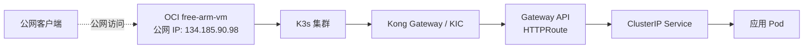
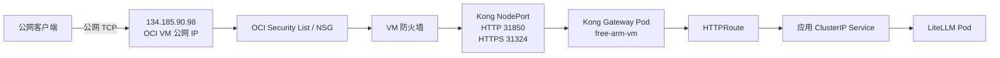
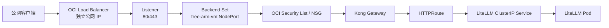
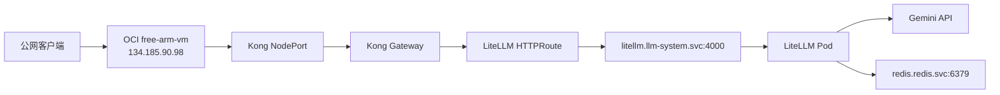

# K3s 中 Kong Gateway 公网访问的两种实现方式

当前 K3s 集群运行在 Tencent Cloud，K3s 的一个工作节点位于 OCI `free-arm-vm`。集群内已经部署 Kong Gateway Controller，并通过 Gateway API 管理路由。

本文只讨论一个问题：

> 集群外的客户端，如何通过公网访问 K3s 中的 Kong Gateway？

本文比较两种方式：

1. 使用 OCI `free-arm-vm` 自身的公网 IP，通过 Kong NodePort 接入；
2. 创建 OCI Load Balancer，由独立的公网入口转发到 Kong。

当前项目 Phase 1 采用第一种方式，先跑通公网 API；第二种方式作为后续正式对外服务的升级方案。

## 1. 当前集群结构

当前节点和网关关系可以简化为：



应用本身不需要公网 Service。应用使用 ClusterIP，公网入口由 Kong 提供：

```text
公网客户端
    ↓
Kong 公网入口
    ↓
Kong Gateway
    ↓
HTTPRoute
    ↓
应用 ClusterIP Service
    ↓
应用 Pod
```

这样可以把应用流量入口和应用运行实例分开管理。

## 2. Kubernetes 中几个容易混淆的地址

### 2.1 ClusterIP

ClusterIP 只在 Kubernetes 集群内部可访问：

```yaml
apiVersion: v1
kind: Service
metadata:
  name: litellm
  namespace: llm-system
spec:
  type: ClusterIP
  ports:
    - port: 4000
      targetPort: 4000
```

它适合 LiteLLM、FastAPI 等应用服务，不适合作为公网入口。

### 2.2 NodePort

NodePort 在每个 Kubernetes 节点上打开一个端口，将流量转发到 Service：

```text
节点 IP:NodePort
    ↓
Kubernetes Service
    ↓
Pod
```

例如 Kong Service 可能包含：

```text
HTTP  80  → NodePort 31850
HTTPS 443 → NodePort 31324
```

NodePort 不会自动申请公网 IP。它只是打开节点端口，能否从公网访问还取决于：

- 节点是否有公网 IP；
- 云安全组是否放行端口；
- 节点操作系统防火墙是否放行端口；
- 路由和 NAT 是否正确；
- Kong Pod 是否在该节点正常运行。

### 2.3 LoadBalancer Service

Kubernetes 中的：

```yaml
spec:
  type: LoadBalancer
```

只是声明“希望有一个外部负载均衡器”。它不会在所有环境中自动创建云负载均衡器。

在云厂商托管 Kubernetes 中，Cloud Controller Manager 通常会监听这个类型并调用云 API。在自建 K3s 中，如果没有对应的云集成、MetalLB 或其他 LoadBalancer 实现，Service 可能只有内部地址或外部地址不会按预期生成。

当前集群的 Kong Service 虽然是 `LoadBalancer`，但实际拿到的是 Tailscale 地址，而不是公网地址。这说明当前集群没有把 Kubernetes LoadBalancer 自动连接到一个公网云负载均衡器。

## 3. 方案 A：OCI VM 公网 IP + Kong NodePort

### 3.1 基本原理

方案 A 直接使用 OCI `free-arm-vm` 自身的公网 IP。公网请求访问该 VM 的 NodePort，再由 Kong Gateway 处理路由。



完整流量路径是：

```text
客户端
  ↓
134.185.90.98
  ↓
OCI Security List / NSG
  ↓
free-arm-vm 防火墙
  ↓
Kong NodePort
  ↓
Kong Gateway
  ↓
HTTPRoute
  ↓
LiteLLM ClusterIP Service
  ↓
LiteLLM Pod
```

### 3.2 方案 A 的地址组成

方案 A 至少涉及以下地址：

| 地址 | 作用 |
|---|---|
| `134.185.90.98` | OCI VM 公网入口，当前计划地址 |
| `100.105.130.0` | `free-arm-vm` 的集群/Tailscale 地址 |
| `31850` | Kong HTTP NodePort，实际值以集群查询结果为准 |
| `31324` | Kong HTTPS NodePort，实际值以集群查询结果为准 |
| `10.1.0.2` | 当前 Gateway API 报告的内部地址，不是公网地址 |
| `10.43.x.x` | Kubernetes Service ClusterIP，不是公网地址 |

测试前不能把 `10.1.0.2` 或 `100.105.130.0` 当成公网地址。公网客户端需要访问 OCI VM 的真实公网 IP。

### 3.3 Kubernetes Service 示例

Kong Service 需要有 HTTP 或 HTTPS NodePort。示例：

```yaml
apiVersion: v1
kind: Service
metadata:
  name: kong-ingress-controller-kong-proxy
  namespace: kong-system
spec:
  type: LoadBalancer
  externalTrafficPolicy: Local
  ports:
    - name: proxy
      port: 80
      targetPort: 8000
      nodePort: 31850
      protocol: TCP
    - name: proxy-tls
      port: 443
      targetPort: 8443
      nodePort: 31324
      protocol: TCP
  selector:
    app.kubernetes.io/name: kong
```

这里保留 `LoadBalancer` 类型并不代表 OCI 已经创建了云 LB。方案 A 实际依赖的是 NodePort：

```text
134.185.90.98:31850
134.185.90.98:31324
```

如果集群实际端口不同，应以以下查询结果为准：

```bash
kubectl get svc -n kong-system \
  kong-ingress-controller-kong-proxy -o wide
```

### 3.4 方案 A 的网络放行

方案 A 需要逐层放行：

#### OCI Security List 或 NSG

只允许开放 LiteLLM 所需的入口端口，例如：

```text
TCP 31850   # 临时 HTTP 测试
TCP 31324   # 如果使用 HTTPS
```

不应开放 Redis 的 NodePort。当前 Kong 配置曾经出现过：

```text
Redis 6379 → NodePort 30745
```

这个端口不能加入 OCI 公网放行规则。

#### VM 操作系统防火墙

如果 Ubuntu 使用 UFW，需要确认端口策略：

```bash
sudo ufw status
sudo ss -lntp
```

不要为了排障直接关闭整个防火墙。应只放行实际需要的 TCP 端口。

#### Kubernetes NodePort

确认 NodePort 存在且节点上的 Kong Pod 正常：

```bash
kubectl get svc -n kong-system
kubectl get pods -n kong-system -o wide
```

由于 Kong 使用 DaemonSet，`free-arm-vm` 上应存在 Kong Pod。若使用 `externalTrafficPolicy: Local`，流量到达没有本地 Kong Pod 的节点时，可能无法正常转发，因此公网入口应指向真正运行 Kong Pod 的节点。

### 3.5 方案 A 的测试方式

先从外部网络测试 TCP 端口：

```bash
nc -vz 134.185.90.98 31850
nc -vz 134.185.90.98 31324
```

再测试 HTTP：

```bash
curl -v \
  -H "Authorization: Bearer $LITELLM_MASTER_KEY" \
  http://134.185.90.98:31850/v1/models
```

调用聊天接口：

```bash
curl -v \
  http://134.185.90.98:31850/v1/chat/completions \
  -H "Authorization: Bearer $LITELLM_MASTER_KEY" \
  -H "Content-Type: application/json" \
  -d '{
    "model": "gemini-3.6-flash-freelayer",
    "messages": [
      {"role": "user", "content": "Reply with exactly: OK"}
    ],
    "max_tokens": 128
  }'
```

Phase 1 如果使用明文 HTTP，只能使用临时或受控的 Master Key。HTTP 会暴露 Authorization Header，不适合长期给同事使用。

### 3.6 方案 A 的优点

- 配置简单；
- 不需要创建 OCI Load Balancer；
- 不需要新增云资源；
- 适合当前先跑通公网 API 的目标；
- 排障路径短，问题容易定位；
- LiteLLM 应用不需要改成 NodePort。

### 3.7 方案 A 的缺点

- 依赖单台 VM；
- NodePort 直接成为公网攻击面；
- 没有独立的云负载均衡健康检查；
- VM 迁移、重建或公网 IP 变化会影响访问；
- 端口管理和安全组规则需要人工维护；
- 不能自然地实现多节点高可用。

## 4. 方案 B：OCI Load Balancer + Kong

### 4.1 基本原理

方案 B 创建一个 OCI Load Balancer，使用它自己的公网前端 IP。OCI Load Balancer 将流量转发到 `free-arm-vm` 的 NodePort 或后端端口，Kong 继续负责 HTTPRoute、鉴权和 API 网关逻辑。



完整流量路径：

```text
客户端
  ↓
OCI Load Balancer 公网 IP
  ↓
Load Balancer Listener
  ↓
Backend Set
  ↓
free-arm-vm NodePort 或后端端口
  ↓
Kong Gateway
  ↓
HTTPRoute
  ↓
LiteLLM ClusterIP Service
  ↓
LiteLLM Pod
```

### 4.2 OCI Always Free 额度

OCI 官方 Free Tier 当前列出的 Always Free 网络资源包括：

```text
普通 Load Balancer：1 个实例，10 Mbps
Flexible Network Load Balancer：1 个实例
```

这属于整个 Tenancy 的额度，不是每个 Compartment 各自拥有一份。超过免费实例数量或超出免费规格后，需要按照 OCI 价格计费。

普通 Load Balancer 和 Network Load Balancer 的区别：

| 项目 | Load Balancer | Network Load Balancer |
|---|---|---|
| 工作层级 | L7，支持 HTTP/HTTPS | L3/L4，主要是 TCP/UDP |
| TLS 终止 | 可以放在 LB | 通常做 TCP 转发或透传 |
| HTTP 路由 | 支持基础 HTTP 能力 | 不负责 HTTP 路由 |
| Kong 的作用 | 仍然负责 API Gateway | 仍然负责 API Gateway |
| 当前适用性 | 更适合正式 HTTPS | 更适合纯 TCP 转发 |

如果 OCI Load Balancer 只负责把 80/443 转发给 Kong，Kong 仍然可以继续处理 API 路由和鉴权。不要把 OCI Load Balancer 当作 Kong 的替代品。

### 4.3 Load Balancer 的前端 IP

OCI Load Balancer 的公网 IP 是独立资源：

```text
free-arm-vm 公网 IP：134.185.90.98
OCI Load Balancer 公网 IP：另一个地址
```

这不是重复，也不是浪费。VM 公网 IP 属于计算实例，Load Balancer 公网 IP 属于负载均衡器前端。

方案 B 的请求不会直接访问 VM 公网 IP，而是访问 Load Balancer 的公网 IP。后端可以使用 VM 的私网地址和 NodePort。

### 4.4 方案 B 的主要配置内容

创建 OCI Load Balancer 后，需要配置：

1. VCN 和子网；
2. 公网或私有前端；
3. Listener；
4. Backend Set；
5. 后端服务器地址；
6. 后端端口；
7. 健康检查；
8. Security List 或 NSG；
9. 可选的 TLS 证书；
10. Kong HTTP/HTTPS NodePort。

示意配置：

```text
Frontend:
  public IP

Listener:
  TCP/HTTP 80
  TCP/HTTPS 443

Backend:
  free-arm-vm private IP : 31850
  free-arm-vm private IP : 31324

Health check:
  TCP 31850
  或 HTTP /health
```

健康检查不能只检查端口是否打开。更可靠的做法是让检查路径返回稳定的成功状态，同时不能因为 LiteLLM API 鉴权而被错误判定为后端不可用。

### 4.5 方案 B 的安全边界

使用 OCI Load Balancer 后，公网安全边界变为：

```text
公网
  ↓
OCI Load Balancer
  ↓ 只允许必要后端端口
free-arm-vm
  ↓
Kong
  ↓
LiteLLM
```

可以只允许 Load Balancer 的后端子网访问 NodePort，减少 NodePort 直接暴露给整个公网的风险。

Redis 仍然不能作为 Load Balancer 的后端：

```text
错误：公网 → OCI LB → Redis
正确：LiteLLM Pod → redis.redis.svc.cluster.local:6379
```

### 4.6 方案 B 的优点

- 公网入口和计算节点解耦；
- 支持健康检查；
- 未来可以增加后端节点；
- 可以使用独立的稳定公网入口；
- 可以在 Load Balancer 层处理部分 TLS 和连接管理；
- 适合长期对外服务。

### 4.7 方案 B 的缺点

- 需要创建和配置额外 OCI 资源；
- 需要处理 VCN、子网、路由和安全规则；
- 需要维护 Listener、Backend Set 和健康检查；
- 免费带宽有限，普通 Load Balancer Always Free 为 10 Mbps；
- 排障链路比 NodePort 更长；
- Load Balancer 免费不代表所有关联资源和超额用量都免费。

## 5. 两种方案的对比

| 对比项 | 方案 A：VM 公网 IP + NodePort | 方案 B：OCI Load Balancer |
|---|---|---|
| 公网 IP | 使用 VM 自身公网 IP | 使用独立 LB 公网 IP |
| 是否新增 OCI LB | 不需要 | 需要 |
| 配置复杂度 | 低 | 中等 |
| Phase 1 适用性 | 最适合 | 可以，但偏重 |
| 正式生产适用性 | 一般 | 更适合 |
| 健康检查 | 依赖节点/Kong配置 | LB 原生支持 |
| 多节点扩展 | 不方便 | 更方便 |
| 故障隔离 | 较弱 | 较好 |
| NodePort 公网暴露 | 是 | 可限制为 LB 后端访问 |
| 免费额度 | 不额外创建 LB | 普通 LB 1 个、10 Mbps |
| 排障难度 | 较低 | 较高 |
| 当前项目选择 | Phase 1 | 后续升级 |

## 6. 当前项目的选择

当前目标是先让同事能够通过公网接口验证 LiteLLM，而不是立即建设完整的高可用公网入口。因此 Phase 1 采用方案 A：



Phase 1 的边界：

- 使用 `134.185.90.98` 作为公网入口；
- 使用 Kong NodePort；
- LiteLLM 继续使用 ClusterIP；
- 暂不创建 OCI Load Balancer；
- 暂不要求域名；
- 暂不要求正式 TLS；
- Redis 不开放公网；
- LiteLLM 管理接口不开放公网；
- 使用临时或受控的 Master Key 测试；
- 验证 `/v1/models` 和 `/v1/chat/completions`。

## 7. 方案 A 的实施检查清单

### OCI 网络

- [ ] `free-arm-vm` 的公网 IP 确认仍为 `134.185.90.98`。
- [ ] OCI Security List 或 NSG 放行 Kong HTTP 测试端口。
- [ ] 未放行 Redis NodePort `30745`。
- [ ] VM 防火墙允许 Kong NodePort。

### Kubernetes

- [ ] Kong Pod 在 `free-arm-vm` 上运行。
- [ ] Kong HTTP NodePort 已确认。
- [ ] Kong HTTPS NodePort 已确认，但 Phase 1 不强制使用。
- [ ] LiteLLM Service 是 ClusterIP。
- [ ] LiteLLM HTTPRoute 指向正确的 Service 和端口。

### 外部接口

- [ ] 从公网网络访问 NodePort 成功。
- [ ] `/v1/models` 返回正常结果或预期的认证错误。
- [ ] `/v1/chat/completions` 能完成一次受控测试调用。
- [ ] 缺少 Master Key 时返回认证错误。
- [ ] Redis 端口从公网不可达。
- [ ] LiteLLM 管理接口没有公网暴露。

## 8. 什么时候切换到方案 B

出现以下需求时，应从方案 A 切换到方案 B：

- 需要稳定、独立于 VM 的公网 IP；
- 需要多台节点或多个 Kong 后端；
- 需要 Load Balancer 健康检查；
- 需要把 NodePort 限制为只允许 LB 后端访问；
- 需要正式 HTTPS 和证书管理；
- 需要减少单台 `free-arm-vm` 故障对公网服务的影响；
- 需要把公网入口和计算节点生命周期分开。

切换时，LiteLLM 和 HTTPRoute 通常不需要改变，主要变化集中在公网入口：

```text
方案 A：VM 公网 IP → Kong NodePort
方案 B：OCI LB 公网 IP → Kong NodePort
```

这也是先采用方案 A 的原因：先验证应用链路，后续只替换入口层。
