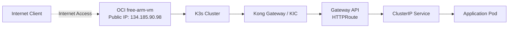
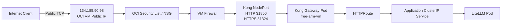
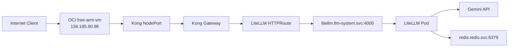

# Two Approaches for Kong Gateway Public Access in K3s

The current K3s cluster runs on Tencent Cloud, with one worker node running on an OCI `free-arm-vm`. Kong Gateway Controller is already deployed in the cluster, managing routing via the Kubernetes Gateway API.

This document focuses on a single core question:

> How can external internet clients access the Kong Gateway inside the K3s cluster?

We evaluate two distinct approaches:

1. Utilizing the OCI `free-arm-vm`'s public IP address via Kong NodePort;
2. Provisioning an OCI Load Balancer to act as an independent public ingress proxying traffic to Kong.

Phase 1 adopts Option A to quickly validate public API connectivity; Option B serves as the future production roadmap for production-grade public exposure.

## 1. Current Cluster Architecture

The relationship between nodes and gateways is simplified below:



Applications do not require public Services. Workloads expose ClusterIP services, while public ingress is managed centrally by Kong:

```text
Internet Client
    ↓
Kong Public Entrypoint
    ↓
Kong Gateway
    ↓
HTTPRoute
    ↓
Application ClusterIP Service
    ↓
Application Pod
```

This cleanly decouples ingress traffic management from application runtime instances.

## 2. Commonly Confused Kubernetes Network Concepts

### 2.1 ClusterIP

A ClusterIP is exclusively routable within the internal Kubernetes network:

```yaml
apiVersion: v1
kind: Service
metadata:
  name: litellm
  namespace: llm-system
spec:
  type: ClusterIP
  ports:
    - port: 4000
      targetPort: 4000
```

It is suitable for internal workloads like LiteLLM and FastAPI, but cannot serve as a public entrypoint.

### 2.2 NodePort

A NodePort opens a static port across all Kubernetes nodes, forwarding inbound traffic to the backing Service:

```text
Node IP:NodePort
    ↓
Kubernetes Service
    ↓
Pod
```

For instance, a Kong Service might expose:

```text
HTTP  80  → NodePort 31850
HTTPS 443 → NodePort 31324
```

A NodePort does not automatically provision a public IP. It merely opens a port on the host VM. Whether it is accessible from the internet depends on:

- Whether the host VM has an attached public IP;
- Cloud Security Lists / Network Security Groups allowing the port;
- Host OS firewalls (e.g., UFW/iptables) permitting inbound traffic;
- Proper routing and NAT rules;
- The Kong Pod running healthy on the target node.

### 2.3 LoadBalancer Service

In Kubernetes:

```yaml
spec:
  type: LoadBalancer
```

This merely declares the intent: "I request an external load balancer." It does not magically create a cloud load balancer in every environment.

In managed Kubernetes distributions, a Cloud Controller Manager watches for this type and calls cloud provider APIs. In self-managed K3s without cloud integrations, MetalLB, or custom LoadBalancer implementations, the Service may only receive an internal VIP or fail to allocate an external IP.

In the current cluster, Kong's `LoadBalancer` Service resolves to a Tailscale IP rather than a public cloud IP. This indicates that Kubernetes LoadBalancer resources are not automatically backed by an OCI public cloud load balancer.

## 3. Option A: OCI VM Public IP + Kong NodePort

### 3.1 Principle of Operation

Option A leverages the OCI `free-arm-vm`'s existing public IP. Public requests hit the VM's NodePort, which routes traffic to Kong Gateway.



The full packet path is:

```text
Client
  ↓
134.185.90.98
  ↓
OCI Security List / NSG
  ↓
free-arm-vm OS Firewall
  ↓
Kong NodePort
  ↓
Kong Gateway
  ↓
HTTPRoute
  ↓
LiteLLM ClusterIP Service
  ↓
LiteLLM Pod
```

### 3.2 Network Addressing Overview for Option A

Option A involves several distinct IP addresses:

| IP / Port | Description |
|---|---|
| `134.185.90.98` | OCI VM Public Entrypoint (Current planned IP) |
| `100.105.130.0` | `free-arm-vm` cluster / Tailscale address |
| `31850` | Kong HTTP NodePort (verify in-cluster) |
| `31324` | Kong HTTPS NodePort (verify in-cluster) |
| `10.1.0.2` | Gateway API internal reported address (non-routable publicly) |
| `10.43.x.x` | Kubernetes Service ClusterIP (internal only) |

Never confuse internal IPs (`10.1.0.2` or `100.105.130.0`) with public entrypoints. Internet clients must target the VM's actual public IP.

### 3.3 Kubernetes Service Example

The Kong Service must expose HTTP and HTTPS NodePorts:

```yaml
apiVersion: v1
kind: Service
metadata:
  name: kong-ingress-controller-kong-proxy
  namespace: kong-system
spec:
  type: LoadBalancer
  externalTrafficPolicy: Local
  ports:
    - name: proxy
      port: 80
      targetPort: 8000
      nodePort: 31850
      protocol: TCP
    - name: proxy-tls
      port: 443
      targetPort: 8443
      nodePort: 31324
      protocol: TCP
  selector:
    app.kubernetes.io/name: kong
```

Retaining the `LoadBalancer` type does not imply an OCI cloud load balancer has been provisioned. Option A fundamentally relies on the NodePort mappings:

```text
134.185.90.98:31850
134.185.90.98:31324
```

Always verify exact allocated ports with:

```bash
kubectl get svc -n kong-system kong-ingress-controller-kong-proxy -o wide
```

### 3.4 Firewall Configuration for Option A

Traffic must be permitted across every boundary:

#### OCI Security List / NSG
Only allow ports required for LiteLLM ingress:

```text
TCP 31850   # HTTP testing port
TCP 31324   # HTTPS port (if enabled)
```

Never expose Redis NodePorts. For example, if Redis was previously configured with:

```text
Redis 6379 → NodePort 30745
```

This port must strictly remain forbidden from OCI public ingress rules.

#### VM OS Firewall (UFW / iptables)
Verify the firewall rules:

```bash
sudo ufw status
sudo ss -lntp
```

Do not disable firewalls entirely during troubleshooting. Explicitly whitelist only required TCP ingress ports.

#### Kubernetes NodePort & Pod Placement
Verify the NodePort is active and Kong Pods are running healthy:

```bash
kubectl get svc -n kong-system
kubectl get pods -n kong-system -o wide
```

Because Kong runs as a DaemonSet, a Kong Pod must exist on `free-arm-vm`. When using `externalTrafficPolicy: Local`, traffic hitting a node lacking a Kong Pod will be dropped rather than routed across nodes. Ensure public traffic hits the node actually hosting the Kong Pod.

### 3.5 Testing Option A

Verify raw TCP connectivity first:

```bash
nc -vz 134.185.90.98 31850
nc -vz 134.185.90.98 31324
```

Test HTTP endpoint access:

```bash
curl -v \
  -H "Authorization: Bearer $LITELLM_MASTER_KEY" \
  http://134.185.90.98:31850/v1/models
```

Test chat completions:

```bash
curl -v \
  http://134.185.90.98:31850/v1/chat/completions \
  -H "Authorization: Bearer $LITELLM_MASTER_KEY" \
  -H "Content-Type: application/json" \
  -d '{
    "model": "gemini-3.6-flash-freelayer",
    "messages": [
      {"role": "user", "content": "Reply with exactly: OK"}
    ],
    "max_tokens": 128
  }'
```

If using plaintext HTTP during Phase 1, use restricted or temporary test keys. HTTP exposes the `Authorization` header across public networks and is unsuitable for long-term multi-user environments.

### 3.6 Pros of Option A

- Minimal configuration overhead;
- No need to provision OCI Load Balancers;
- Zero extra cloud resource costs;
- Ideal for fast Phase 1 public API validation;
- Short network troubleshooting path;
- Application pods remain isolated behind ClusterIP.

### 3.7 Cons of Option A

- Single point of failure (single host VM);
- NodePort directly increases public attack surface;
- Lacks dedicated cloud load balancer health checks;
- VM migration, rebuilding, or IP re-allocation breaks client connections;
- Manual security list and firewall port management;
- Cannot natively achieve multi-node load balancing.

---

## 4. Option B: OCI Load Balancer + Kong

### 4.1 Principle of Operation

Option B provisions a dedicated OCI Load Balancer with an independent public VIP. The Load Balancer forwards traffic to `free-arm-vm` backend ports / NodePorts, while Kong Gateway manages HTTPRoute matching, authentication, and API policies.

```mermaid
flowchart LR
    Client[Internet Client]
    LB[OCI Load Balancer\nDedicated Public VIP]
    Listener[Listener\n80/443]
    Backend[Backend Set\nfree-arm-vm:NodePort]
    SG[OCI Security List / NSG]
    Kong[Kong Gateway]
    Route[HTTPRoute]
    SVC[LiteLLM ClusterIP Service]
    Pod[LiteLLM Pod]

    Client --> LB
    LB --> Listener
    Listener --> Backend
    Backend --> SG
    SG --> Kong
    Kong --> Route
    Route --> SVC
    SVC --> Pod
```



The full packet path:

```text
Client
  ↓
OCI Load Balancer Public VIP
  ↓
Load Balancer Listener
  ↓
Backend Set
  ↓
free-arm-vm NodePort
  ↓
Kong Gateway
  ↓
HTTPRoute
  ↓
LiteLLM ClusterIP Service
  ↓
LiteLLM Pod
```

### 4.2 OCI Always Free Quotas

OCI Always Free tier currently allocates:

```text
Standard Load Balancer: 1 instance, 10 Mbps bandwidth
Flexible Network Load Balancer: 1 instance
```

These quotas apply per Tenancy, not per Compartment. Provisioning instances beyond these limits incurs standard OCI billing.

Differences between Standard Load Balancer and Network Load Balancer:

| Feature | Standard Load Balancer | Network Load Balancer |
|---|---|---|
| OSI Layer | Layer 7 (HTTP/HTTPS) | Layer 3/4 (TCP/UDP) |
| TLS Termination | Supported on LB | Pass-through / TCP proxy |
| HTTP Routing | Basic path/host routing | None (L4 only) |
| Role of Kong | Remains API Gateway | Remains API Gateway |
| Best Fit | Production HTTPS services | High-throughput raw TCP |

When the OCI Load Balancer proxies ports 80/443 to Kong, Kong continues executing API routing and authentication. The OCI Load Balancer does not replace Kong.

### 4.3 Load Balancer Frontend IP

The Load Balancer public IP is a distinct resource from the VM IP:

```text
free-arm-vm Public IP: 134.185.90.98
OCI Load Balancer Public VIP: <Dedicated LB IP>
```

This provides true decoupling: clients access the Load Balancer VIP, while backends use VM private IPs and NodePorts.

### 4.4 Option B Configuration Overview

Configuring an OCI Load Balancer involves:

1. VCN and subnet assignment;
2. Public vs. Private frontend selection;
3. Listeners (80/443);
4. Backend Sets;
5. Backend Server IPs (private VM IP);
6. Backend Ports (Kong NodePort);
7. Health checks;
8. Security Lists and NSG rules;
9. TLS certificates (optional at LB level);
10. Kong HTTP/HTTPS NodePort bindings.

Sample setup:

```text
Frontend:
  Public IPv4 VIP

Listener:
  TCP/HTTP 80
  TCP/HTTPS 443

Backend:
  free-arm-vm private IP : 31850
  free-arm-vm private IP : 31324

Health check:
  TCP 31850
  or HTTP /health
```

Health checks must be calibrated to avoid false negatives caused by LiteLLM authentication rejections on protected endpoints.

### 4.5 Security Boundaries for Option B

With OCI Load Balancer in place:

```text
Internet
  ↓
OCI Load Balancer
  ↓ Restricted to LB backend subnet
free-arm-vm
  ↓
Kong
  ↓
LiteLLM
```

NodePorts can be locked down so only the Load Balancer subnet can connect, mitigating direct internet scanning of host ports.

Redis must never be exposed as an LB backend:

```text
Incorrect: Internet → OCI LB → Redis
Correct:   LiteLLM Pod → redis.redis.svc.cluster.local:6379
```

### 4.6 Pros of Option B

- Decouples public ingress from compute VM lifecycles;
- Native cloud health checking and automatic failover;
- Multi-node scalability;
- Stable, dedicated public entrypoint;
- Centralized TLS termination and connection management;
- Production-ready architecture.

### 4.7 Cons of Option B

- Additional OCI cloud resource management;
- Requires configuring VCNs, subnets, and routing tables;
- Requires maintaining listeners, backend sets, and health probes;
- Bandwidth capped at 10 Mbps under Always Free;
- Longer network path for initial debugging;
- Additional quotas consumed.

---

## 5. Architectural Comparison

| Criteria | Option A: VM Public IP + NodePort | Option B: OCI Load Balancer |
|---|---|---|
| Public IP | VM Host Public IP | Dedicated Cloud LB VIP |
| Cloud LB Provisioned | No | Yes |
| Setup Complexity | Low | Medium |
| Phase 1 Suitability | Optimal | Over-engineered |
| Production Suitability | Moderate | Recommended |
| Health Checks | Relies on node/Kong status | Native Cloud Probing |
| Multi-Node Scaling | Cumbersome | Built-in |
| Fault Isolation | Moderate | High |
| NodePort Public Exposure | Exposed directly | Restrictable to LB subnet |
| Always Free Quota | Consumes 0 LB instances | Consumes 1 LB instance (10 Mbps) |
| Troubleshooting Complexity | Low | Medium-High |
| Current Project Roadmap | Phase 1 Standard | Phase 4+ Upgrade |

---

## 6. Architecture Selection for Current Project

The immediate Phase 1 milestone is validating LiteLLM API functionality via public endpoints without over-engineering ingress infrastructure. Option A is selected for Phase 1:



Phase 1 Scope & Boundaries:

- Use `134.185.90.98` as the public entrypoint;
- Route via Kong NodePort;
- LiteLLM remains isolated behind ClusterIP;
- OCI Load Balancer provisioning deferred;
- Custom domain not required for Phase 1;
- Production TLS not required for Phase 1;
- Redis strictly blocked from public access;
- LiteLLM Admin UI strictly blocked from public access;
- Access restricted via test Master Keys;
- Validate `/v1/models` and `/v1/chat/completions`.

---

## 7. Option A Implementation Checklist

### OCI Networking
- [ ] Verify `free-arm-vm` public IP is `134.185.90.98`.
- [ ] Whitelist Kong HTTP NodePort in OCI Security List / NSG.
- [ ] Confirm Redis NodePort `30745` is blocked from public access.
- [ ] Ensure host OS firewall permits inbound traffic on the Kong NodePort.

### Kubernetes
- [ ] Confirm Kong Pod is healthy on `free-arm-vm`.
- [ ] Confirm Kong HTTP NodePort assignment.
- [ ] Verify Kong HTTPS NodePort assignment (optional for Phase 1).
- [ ] Confirm LiteLLM Service is configured as `ClusterIP`.
- [ ] Verify LiteLLM HTTPRoute targets the correct Service and port.

### External Connectivity
- [ ] Test TCP handshake to NodePort from an external machine.
- [ ] Verify `/v1/models` returns model catalog or expected 401 Unauthorized.
- [ ] Execute a test completion request against `/v1/chat/completions`.
- [ ] Confirm missing Master Key triggers 401 Unauthorized.
- [ ] Confirm Redis port is unreachable from the internet.
- [ ] Confirm LiteLLM administrative routes are not publicly exposed.

---

## 8. Transitioning to Option B

Upgrade to Option B when the following requirements emerge:

- Stable, persistent public IP independent of VM lifecycle;
- Multi-node or multi-region Kong backends;
- Cloud-native load balancer health probes;
- Restricting NodePorts exclusively to LB subnets;
- Production TLS termination and managed SSL certificates;
- Minimizing single-VM downtime impact on public availability;
- Decoupling public ingress lifecycle from compute nodes.

During migration, LiteLLM and HTTPRoute definitions remain untouched, as changes are confined exclusively to the ingress layer:

```text
Option A: VM Public IP   → Kong NodePort
Option B: OCI LB VIP     → Kong NodePort
```

This clean boundary allows rapid validation in Phase 1 and seamless architectural upgrading later.
