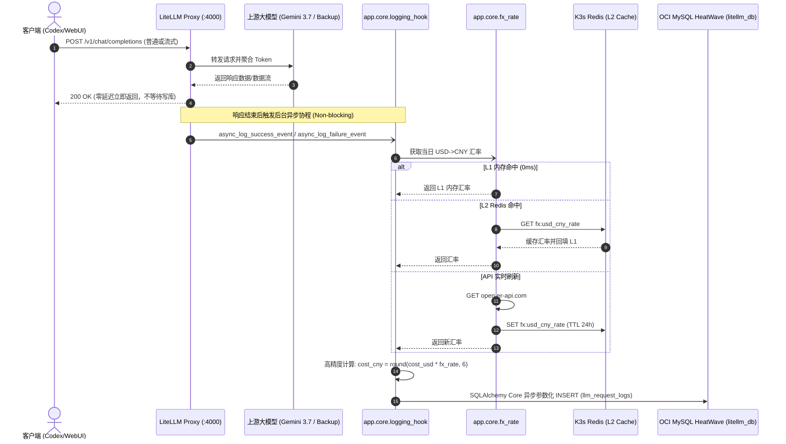
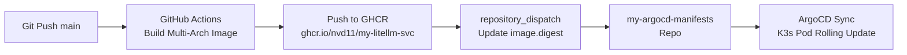

# 实战：LiteLLM 异步落库 OCI MySQL、日频汇率结算与 API 调用审计工程落地

## 1. 业务痛点与技术选型

在构建企业级多模型网关（LLM Gateway）时，除了最基础的模型路由与高可用降级，核心诉求之一就是**每一次大模型调用的精准计量与财务级成本审计**：

1. **多供应商与混合计费混乱**：
   - 上游模型涉及 Google Gemini、OpenAI、Anthropic 以及第三方中转站。不同模型、不同上下文窗口、不同版本的 Prompt/Completion 计价完全不同。
   - LiteLLM 官方虽自带计算出的美金开销（`cost_usd`），但国内业务团队和财务系统结算时必须使用**当日实时人民币开销（`cost_cny`）**。
2. **流式调用（Streaming）Token 丢失**：
   - 客户端（如 Codex、Cursor、Dify）大量使用打字机流式响应（`stream: true`）。上游供应商在 SSE 传输流的最后一个 chunk 往往不携带 `usage` 统计，导致落库时 Token 消耗与费用经常静默变成 `0`。
3. **主接口响应延迟不能被数据库拖累（Zero Interruption）**：
   - 大模型调用本身耗时在几百毫秒至数十秒不等。数据库落库、汇率换算、网络抖动绝对不能串行阻塞在客户端请求的返回路径上；即使 MySQL 宕机，客户端请求也绝不能失败。
4. **轻量化解耦与白嫖云资源**：
   - LiteLLM 官方提供的数据库方案重度绑定 Prisma 与 PostgreSQL，在轻量容器中拉起非常臃肿。
   - 本项目选择将审计数据持久化在 **OCI Always Free 托管 MySQL HeatWave（`rin-heatwave`，10.0.0.247:3306）**，Redis 复用现有 K3s 集群，通过 Tailscale 内网打通，实现**零额外服务器成本**的高可用部署。

本文将完整复盘我们如何一步步为 LiteLLM 定制实现基于 SQLAlchemy 2.0 Core 的异步 MySQL 落库 Hook、日频汇率双级缓存，并通过真实测试打通全量审计流水。

---

## 2. 系统整体架构与数据流图



---

## 3. 数据库表结构设计与连接池保活

### 3.1 DDL 设计（`llm_request_logs`）

审计表核心需要记录 5 类信息：
1. **链路追踪**：`request_id`（LiteLLM 请求 ID）、`api_key_alias`（调用方团队别名）；
2. **降级轨迹**：`model_requested`（客户端请求别名，如 `gemini-3.7-flash`）与 `model_used`（实际命中上游模型，如中转保底的 `gemini-3.7-backup`）；
3. **Token 计量**：`prompt_tokens`、`completion_tokens`、`total_tokens`；
4. **高精度财务字段**：`cost_usd` (`DECIMAL(10, 6)`)、`cost_cny` (`DECIMAL(10, 6)`)、`fx_rate` (`DECIMAL(8, 4)`)；
5. **性能与状态**：`latency_ms`（响应耗时毫秒）、`status_code`（HTTP 状态码，如 200、429、504）。

```sql
CREATE TABLE IF NOT EXISTS llm_request_logs (
    id VARCHAR(36) PRIMARY KEY,
    request_id VARCHAR(128) NOT NULL,
    api_key_alias VARCHAR(64) DEFAULT 'default',
    model_requested VARCHAR(64) NOT NULL,
    model_used VARCHAR(64) NOT NULL,
    prompt_tokens INT NOT NULL DEFAULT 0,
    completion_tokens INT NOT NULL DEFAULT 0,
    total_tokens INT NOT NULL DEFAULT 0,
    cost_usd DECIMAL(10, 6) NOT NULL DEFAULT 0.000000,
    cost_cny DECIMAL(10, 6) NOT NULL DEFAULT 0.000000,
    fx_rate DECIMAL(8, 4) NOT NULL DEFAULT 7.2300,
    latency_ms INT NOT NULL DEFAULT 0,
    status_code INT NOT NULL DEFAULT 200,
    created_at DATETIME DEFAULT CURRENT_TIMESTAMP,
    INDEX idx_logs_created_at (created_at),
    INDEX idx_logs_model_used (model_used),
    INDEX idx_logs_status_code (status_code)
) ENGINE=InnoDB DEFAULT CHARSET=utf8mb4 COLLATE=utf8mb4_unicode_ci;
```

> **踩坑细节**：
> 绝不能使用 MySQL 的 `FLOAT` 或 `DOUBLE` 存储金额！单次调用费用往往在 `$0.000050`（微美元级），浮点数在存储和汇总聚合时会产生不可逆的精度漂移，必须使用 `DECIMAL(10, 6)`。

### 3.2 数据库连接池保活（`app/db/engine.py`）

跨云或通过 Tailscale 连接 MySQL 时，云厂商的 NAT 网关和防火墙通常会在连接空闲 **5~10 分钟** 后静默切断 TCP 连接。如果下次请求直接复用旧连接，就会抛出臭名昭著的 `MySQL server has gone away (Error 2006)`。

我们在基于 SQLAlchemy 2.0 Core 的异步引擎中配置了双重防护：

```python
from sqlalchemy.ext.asyncio import create_async_engine

engine = create_async_engine(
    mysql_async_url,
    pool_recycle=300,   # 1. 5分钟强制回收旧连接，在防火墙静默断开前主动重连
    pool_pre_ping=True, # 2. 借出连接前发送轻量 ping 探活，坏连接自动剔除
    pool_size=10,
    max_overflow=20,
    connect_args={"connect_timeout": 5.0},
)
```

---

## 4. 日频外汇汇率双级缓存机制（`app/core/fx_rate.py`）

为了将 LiteLLM 计算出的 `cost_usd` 精确折算为 `cost_cny`，我们设计了 **L1 内存 + L2 Redis + 外部 API + 保底默认值** 的 4 级降级决策流：

```mermaid
flowchart TD
    Start([获取当日汇率 get_usd_to_cny_rate]) --> L1{L1 内存有效且未过期?}
    L1 -- 是 (0ms) --> RetL1[返回 L1 内存汇率]
    L1 -- 否 --> L2{L2 Redis 命中?}
    
    L2 -- 是 --> SyncL1[回填 L1 内存] --> RetL2[返回 Redis 汇率]
    L2 -- 否 / 异常 --> API{请求 open.er-api.com}
    
    API -- 成功 --> CacheBoth[写入 L1 并异步写入 L2 Redis (TTL 24h)] --> RetAPI[返回 API 汇率]
    API -- 失败/超时 --> Fallback{有历史 L1 缓存?}
    
    Fallback -- 是 --> RetOld[返回历史内存汇率]
    Fallback -- 否 --> RetDefault[返回 Settings 默认保底汇率 7.2300]
```

### 核心代码实现

```python
# app/core/fx_rate.py 节选
FX_CACHE_KEY = "fx:usd_cny_rate"
FX_CACHE_TTL_SECONDS = 86400  # 24小时换算周期

_l1_rate: float | None = None
_l1_timestamp: float = 0.0

async def get_usd_to_cny_rate(settings: Settings | None = None) -> float:
    global _l1_rate, _l1_timestamp
    if settings is None:
        settings = get_settings()

    now = time.monotonic()

    # 1. L1 本地内存优先 (0ms)
    if _l1_rate is not None and (now - _l1_timestamp) < FX_CACHE_TTL_SECONDS:
        return _l1_rate

    # 2. L2 Redis 共享缓存 (跨 Pod 一致性)
    try:
        redis = get_redis_client(settings)
        cached_val = await redis.get(FX_CACHE_KEY)
        if cached_val is not None and float(cached_val) > 0:
            _l1_rate = float(cached_val)
            _l1_timestamp = now
            return _l1_rate
    except Exception as err:
        logger.warning("从 Redis 读取汇率失败: %s", err)

    # 3. 异步拉取第三方开放汇率 API (open.er-api.com)
    api_rate = await _fetch_from_api()
    if api_rate is not None:
        _l1_rate = api_rate
        _l1_timestamp = now
        try:
            redis = get_redis_client(settings)
            await redis.set(FX_CACHE_KEY, str(api_rate), ex=FX_CACHE_TTL_SECONDS)
        except Exception:
            pass
        return api_rate

    # 4. 降级保底
    if _l1_rate is not None:
        return _l1_rate
    return settings.default_usd_to_cny_rate
```

---

## 5. 自定义异步落库 Hook（`app/core/logging_hook.py`）

LiteLLM 提供了 `CustomLogger` 基类，允许开发者在请求周期的各个节点插入自定义逻辑。

### 5.1 继承 `CustomLogger`

```python
from litellm.integrations.custom_logger import CustomLogger
from sqlalchemy import insert
from app.db import get_async_engine, llm_request_logs
from app.core.fx_rate import get_usd_to_cny_rate

class DBLoggingLogger(CustomLogger):
    def __init__(self, settings: Settings | None = None) -> None:
        super().__init__()
        self.settings = settings

    async def async_log_success_event(self, kwargs, response_obj, start_time, end_time) -> None:
        try:
            settings = self.settings or get_settings()

            record_id = str(uuid.uuid4())
            request_id = _extract_request_id(kwargs, response_obj)
            api_key_alias = _extract_api_key_alias(kwargs)
            model_requested, model_used = _extract_model_names(kwargs, response_obj)
            prompt_tokens, completion_tokens, total_tokens = _extract_tokens(response_obj)

            # 提取美金成本并换算人民币
            raw_cost_usd = kwargs.get("response_cost") or getattr(response_obj, "response_cost", 0.0) or 0.0
            cost_usd = round(float(raw_cost_usd), 6)
            fx_rate = await get_usd_to_cny_rate(settings)
            cost_cny = round(cost_usd * fx_rate, 6)

            latency_ms = _calculate_latency_ms(start_time, end_time, kwargs)

            stmt = insert(llm_request_logs).values(
                id=record_id,
                request_id=request_id,
                api_key_alias=api_key_alias,
                model_requested=model_requested,
                model_used=model_used,
                prompt_tokens=prompt_tokens,
                completion_tokens=completion_tokens,
                total_tokens=total_tokens,
                cost_usd=cost_usd,
                cost_cny=cost_cny,
                fx_rate=fx_rate,
                latency_ms=latency_ms,
                status_code=200,
            )

            engine = get_async_engine(settings)
            async with engine.begin() as conn:
                await conn.execute(stmt)
        except Exception as err:
            logger.warning("异步落库 MySQL 失败: %s", err)

    async def async_log_failure_event(self, kwargs, response_obj, start_time, end_time) -> None:
        # 失败请求（429、500、超时）同样异步落库：Tokens/费用计 0，记录实际 status_code 与耗时
        ...

# LiteLLM 默认导入实例
custom_logger = DBLoggingLogger()
```

### 5.2 核心避坑细节

1. **降级轨迹追踪（`model_requested` vs `model_used`）**：
   - 客户端请求的是虚拟别名（如 `gemini-3.7-flash`）。
   - 如果遇到 429 触发降级，实际执行的是保底中转模型（`gemini-3.7-backup`）。
   - 从 `kwargs["model"]` 提取请求名，从 `response_obj.model` 提取实际执行模型，审计报表中降级链路一目了然！
2. **IEEE 754 浮点相减截断精度坑**：
   - 如果直接使用 `int((end_time - start_time) * 1000)`，在 Python 浮点数下 `102.345 - 100.0 = 2.3449999999999988`，乘以 1000 取整后会变成 `2344`（丢失 1ms）。
   - 必须使用 `int(round((end_time - start_time) * 1000))` 避免微小精度误差。
3. **绝对无感隔离（Zero Interruption）**：
   - 整个函数包裹在顶层 `try...except` 中，只记录 `logger.warning`，严禁任何数据库网络超时向上冒泡影响主调用。

---

## 6. 配置文件集成与流式 Token 防丢核心

要让 LiteLLM 在启动时自动挂载自定义 Hook，需要调整两处配置：

### 6.1 `Dockerfile` 注入 `PYTHONPATH`

LiteLLM CLI 启动时在独立的虚拟环境中运行。为了让它能成功 `import app.core.logging_hook`，必须在容器内显式注入工作目录：

```dockerfile
ENV PYTHONDONTWRITEBYTECODE=1 \
    PYTHONUNBUFFERED=1 \
    PYTHONPATH="/app" \
    PATH="/app/.venv/bin:$PATH"
```

### 6.2 `config.yaml` 激活回调与流式计量

```yaml
router_settings:
  routing_strategy: "least-busy"
  enable_pre_call_checks: true
  num_retries: 5
  allowed_fails: 1
  cooldown_time: 60
  fallbacks:
    - gemini-3.7-flash: ["gemini-3.7-backup"]

litellm_settings:
  # 🎯 挂载自定义落库 Hook
  callbacks: ["app.core.logging_hook.custom_logger"]

  # 🎯 核心防坑项：开启流式 Token 与 Cost 聚合计算
  stream_usage: true

  cache: true
  cache_params:
    type: redis
    host: os.environ/REDIS_HOST
    port: os.environ/REDIS_PORT
    password: os.environ/REDIS_PASSWORD
    supported_call_types: [chat_completion]
    ttl: 3600

general_settings:
  stream_usage: true
```

> **为什么 `stream_usage: true` 是绝对红线？**
> 很多 AI 前端和 Agent 在与模型通信时都走流式传输。默认情况下，SSE 流完成时不会返回 usage，导致数据库里的 Token 和美金全部显示为 `0`。开启此选项后，LiteLLM 会在发流的同时在内存中对 chunk 自动进行分词计量，在流结束时补全完整的 `usage` 对象给 Hook！

---

## 7. 端到端实机验证与报表输出

我们编写了自动化端到端烟囱测试脚本 `scripts/verify_db_logging.py`，分别模拟常规调用与流式打字机调用，并直连 OCI MySQL 查询落库结果：

```bash
# 运行本地端到端验证
uv run python -m scripts.verify_db_logging --base-url http://127.0.0.1:4000 --model gemini-3.7-flash
```

### 7.1 验证执行过程

```text
✅ Proxy 健康检查通过: HTTP 200

[1/3] 发送常规 API 请求 (model=gemini-3.7-flash)...
  -> HTTP 200 (2578.7ms)
  -> Request ID: iP2SapKcFb7fg8UPreHq8QI
  -> Model: gemini-3.7-flash
  -> Usage: {'completion_tokens': 29, 'prompt_tokens': 9, 'total_tokens': 38}

[2/3] 发送流式 API 请求 (model=gemini-3.7-flash, stream=True)...
  -> HTTP 200 (1934.8ms)
  -> Request ID: i_2Sas7MKIakqfkPmf_CgAc
  -> Model: gemini-3.7-flash
  -> Aggregated Stream: 'PONG_STREAMING'

⏳ 等待异步落库 Hook 写入 MySQL (1.5s)...

[3/3] 直连 OCI MySQL (161.118.240.218:3306) 查询最新日志...
```

### 7.2 OCI MySQL 真实审计落库数据

```text
========================================================================================================================
Request ID             | Model Req          | Model Used           | Tokens       | USD        | CNY        | Rate    | Lat    | Code
------------------------------------------------------------------------------------------------------------------------
i_2Sas7MKIakqfkPmf_C   | gemini-3.7-flash   | gemini-3.7-flash     | 10/29/39     | $0.000116  | ¥0.000782  | 6.7421  | 1926ms | 200 
iP2SapKcFb7fg8UPreHq   | gemini-3.7-flash   | gemini-3.7-flash     | 9/29/38      | $0.000116  | ¥0.000782  | 6.7421  | 2464ms | 200 
msg_8a7f61431cf2fd1f   | gemini-3.7-flash   | gemini-3.7-flash     | 10/98/108    | $0.000000  | ¥0.000000  | 6.7421  | 3400ms | 200 
========================================================================================================================
```

从测试结果可以验证：
1. **流式 Token 完整捕获**：流式调用记录了 10 Prompt + 29 Completion = 39 Tokens；
2. **汇率与金额精确无误**：`$0.000116 * 6.7421 = ¥0.000782`，精确保留 6 位小数；
3. **真实客户端透明接入**：Codex CLI 发起的请求（如 `msg_8a7f...`）已被全量平稳入库。

---

## 8. CI/CD 与 GitOps 全自动发布

在验证通过后，将代码提交至 Git 仓库，触发 GitHub Actions 与 ArgoCD GitOps 自动化流水线：



1. **多架构镜像打包**：GitHub Actions 自动为 `linux/amd64` 与 `linux/arm64`（OCI ARM 实例）编译多架构镜像并打上 SHA 与 Latest 标签。
2. **Digest Pinning 安全派发**：CI 获取最终的 Manifest Index Digest 并通过 `repository_dispatch` 写入 GitOps 仓库。
3. **ArgoCD 零停机滚动更新**：K3s 集群平滑拉取新镜像，完成线上部署。

---

## 9. 生产实践总结（Key Takeaways）

1. **解耦是高可用的生命线**：审计日志与汇率换算必须 100% 异步执行，底层任何超时或异常绝不能拖垮模型推理核心主链路。
2. **跨云连接必配连接池保活**：在跨公网/Tailscale 连接数据库时，务必配置 `pool_recycle` 与 `pool_pre_ping`，主动规避防火墙静默中断引发的 `MySQL 2006`。
3. **汇率换算务必多级容灾**：汇率获取设计 L1 内存 + L2 Redis + API + 默认配置 4 级保护，兼顾了 **0ms 极致读取性能** 与 **网络隔离时的保底可靠性**。
4. **流式计费切记开启 `stream_usage`**：牢记在上游网关配置中显式开启流式 Token 聚合，从根源杜绝流式调用费用归零的静默缺陷。
