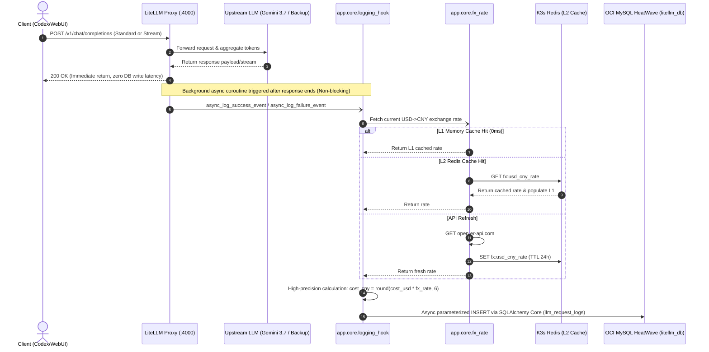
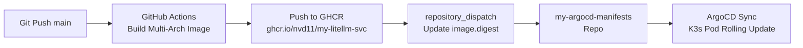

# Engineering Guide: LiteLLM Asynchronous OCI MySQL Persistence, Daily FX Rate Settlement, and API Audit Logging

## 1. Business Pain Points & Architectural Rationale

When building an enterprise multi-model gateway (LLM Gateway), beyond fundamental model routing and failover, a primary operational requirement is **precise per-request token metering and finance-grade cost auditing**:

1. **Multi-Vendor Heterogeneity and Billing Complexity**:
   - Upstream providers include Google Gemini, OpenAI, Anthropic, and third-party relay proxies. Each model, context window, and version has distinct prompt and completion pricing.
   - While LiteLLM computes USD expenditure (`cost_usd`), domestic business units and finance departments require **settlement in real-time daily Chinese Yuan (`cost_cny`)**.
2. **Token Loss During Streaming (SSE)**:
   - Modern coding clients (Codex, Cursor, Dify) default to typewriter streaming (`stream: true`). Upstream providers frequently omit `usage` token payloads in final SSE chunks, leading to silent zero-token and zero-cost entries in database records.
3. **Zero Request Path Latency Impact (Zero Interruption)**:
   - LLM inference takes hundreds of milliseconds to tens of seconds. Database insertion, FX rate lookup, and network latency must never block the client response path. Furthermore, if MySQL goes offline, client requests must not fail.
4. **Lightweight Decoupling and Cloud Resource Optimization**:
   - LiteLLM's official database implementation tightly couples Prisma and PostgreSQL, creating bloat in lightweight container runtimes.
   - This project persists audit telemetry in **OCI Always Free Managed MySQL HeatWave (`rin-heatwave`, 10.0.0.247:3306)**, reuses K3s Redis over Tailscale, and achieves high availability at **zero additional cloud infrastructure cost**.

This guide details our custom SQLAlchemy 2.0 Core async logging hook, two-tier FX rate caching, and production test pipelines.

---

## 2. System Architecture & Telemetry Data Flow



---

## 3. Database Schema & Connection Pool Keepalive

### 3.1 DDL Design (`llm_request_logs`)

The audit table records five categories of metadata:
1. **Traceability**: `request_id` (LiteLLM request UUID), `api_key_alias` (client/team alias);
2. **Routing / Fallback Trajectory**: `model_requested` (requested model alias, e.g., `gemini-3.7-flash`) and `model_used` (actual upstream model hit, e.g., fallback `gemini-3.7-backup`);
3. **Token Usage**: `prompt_tokens`, `completion_tokens`, `total_tokens`;
4. **Financial Metrics**: `cost_usd` (`DECIMAL(10, 6)`), `cost_cny` (`DECIMAL(10, 6)`), `fx_rate` (`DECIMAL(8, 4)`);
5. **Performance & Status**: `latency_ms` (response latency in ms), `status_code` (HTTP status code, e.g., 200, 429, 504).

```sql
CREATE TABLE IF NOT EXISTS llm_request_logs (
    id VARCHAR(36) PRIMARY KEY,
    request_id VARCHAR(128) NOT NULL,
    api_key_alias VARCHAR(64) DEFAULT 'default',
    model_requested VARCHAR(64) NOT NULL,
    model_used VARCHAR(64) NOT NULL,
    prompt_tokens INT NOT NULL DEFAULT 0,
    completion_tokens INT NOT NULL DEFAULT 0,
    total_tokens INT NOT NULL DEFAULT 0,
    cost_usd DECIMAL(10, 6) NOT NULL DEFAULT 0.000000,
    cost_cny DECIMAL(10, 6) NOT NULL DEFAULT 0.000000,
    fx_rate DECIMAL(8, 4) NOT NULL DEFAULT 7.2300,
    latency_ms INT NOT NULL DEFAULT 0,
    status_code INT NOT NULL DEFAULT 200,
    created_at DATETIME DEFAULT CURRENT_TIMESTAMP,
    INDEX idx_logs_created_at (created_at),
    INDEX idx_logs_model_used (model_used),
    INDEX idx_logs_status_code (status_code)
) ENGINE=InnoDB DEFAULT CHARSET=utf8mb4 COLLATE=utf8mb4_unicode_ci;
```

> **Precision Requirement**:
> Never use `FLOAT` or `DOUBLE` for financial columns! Unit costs are frequently micro-dollars (e.g., `$0.000050`). Floating point representations introduce truncation drift during aggregation; `DECIMAL(10, 6)` is strictly mandatory.

### 3.2 Connection Pool Keepalive (`app/db/engine.py`)

When connecting across clouds or through Tailscale, cloud NAT gateways and firewalls silently terminate idle TCP sessions after **5–10 minutes**. Reusing closed connections causes `MySQL server has gone away (Error 2006)`.

We configure dual keepalive defenses in SQLAlchemy 2.0 Core:

```python
from sqlalchemy.ext.asyncio import create_async_engine

engine = create_async_engine(
    mysql_async_url,
    pool_recycle=300,  # 1. Proactively recycle connections every 5 minutes before firewalls drop them
    pool_pre_ping=True,  # 2. Issue lightweight ping probe before checkout to discard dead connections
    pool_size=10,
    max_overflow=20,
    connect_args={"connect_timeout": 5.0},
)
```

---

## 4. Two-Tier Daily FX Rate Caching (`app/core/fx_rate.py`)

To convert LiteLLM's `cost_usd` into `cost_cny`, we implemented a 4-tier fallback decision tree: **L1 In-Memory + L2 Redis + External API + Static Default**:

```mermaid
flowchart TD
    Start([Fetch Daily Rate: get_usd_to_cny_rate]) --> L1{L1 Memory Valid & Unexpired?}
    L1 -- Yes (0ms) --> RetL1[Return L1 Memory Rate]
    L1 -- No --> L2{L2 Redis Hit?}
    
    L2 -- Yes --> SyncL1[Populate L1 Memory] --> RetL2[Return Redis Rate]
    L2 -- No / Err --> API{Fetch open.er-api.com}
    
    API -- Success --> CacheBoth[Write L1 & Async SET L2 Redis (TTL 24h)] --> RetAPI[Return API Rate]
    API -- Fail / Timeout --> Fallback{Has Stale L1 Cache?}
    
    Fallback -- Yes --> RetOld[Return Stale Memory Rate]
    Fallback -- No --> RetDefault[Return Settings Default Rate 7.2300]
```

### Core Implementation

```python
# app/core/fx_rate.py snippet
FX_CACHE_KEY = "fx:usd_cny_rate"
FX_CACHE_TTL_SECONDS = 86400  # 24-hour refresh cycle

_l1_rate: float | None = None
_l1_timestamp: float = 0.0


async def get_usd_to_cny_rate(settings: Settings | None = None) -> float:
    global _l1_rate, _l1_timestamp
    if settings is None:
        settings = get_settings()

    now = time.monotonic()

    # 1. L1 Local Memory Cache (0ms latency)
    if _l1_rate is not None and (now - _l1_timestamp) < FX_CACHE_TTL_SECONDS:
        return _l1_rate

    # 2. L2 Redis Shared Cache (Cross-Pod Consistency)
    try:
        redis = get_redis_client(settings)
        cached_val = await redis.get(FX_CACHE_KEY)
        if cached_val is not None and float(cached_val) > 0:
            _l1_rate = float(cached_val)
            _l1_timestamp = now
            return _l1_rate
    except Exception as err:
        logger.warning("Failed to read FX rate from Redis: %s", err)

    # 3. Async Fetch from Public FX API (open.er-api.com)
    api_rate = await _fetch_from_api()
    if api_rate is not None:
        _l1_rate = api_rate
        _l1_timestamp = now
        try:
            redis = get_redis_client(settings)
            await redis.set(FX_CACHE_KEY, str(api_rate), ex=FX_CACHE_TTL_SECONDS)
        except Exception:
            pass
        return api_rate

    # 4. Graceful Fallback
    if _l1_rate is not None:
        return _l1_rate
    return settings.default_usd_to_cny_rate
```

---

## 5. Custom Async Database Hook (`app/core/logging_hook.py`)

LiteLLM provides the `CustomLogger` base class for hooking custom logic into lifecycle events.

### 5.1 Subclassing `CustomLogger`

```python
from litellm.integrations.custom_logger import CustomLogger
from sqlalchemy import insert
from app.db import get_async_engine, llm_request_logs
from app.core.fx_rate import get_usd_to_cny_rate


class DBLoggingLogger(CustomLogger):
    def __init__(self, settings: Settings | None = None) -> None:
        super().__init__()
        self.settings = settings

    async def async_log_success_event(self, kwargs, response_obj, start_time, end_time) -> None:
        try:
            settings = self.settings or get_settings()

            record_id = str(uuid.uuid4())
            request_id = _extract_request_id(kwargs, response_obj)
            api_key_alias = _extract_api_key_alias(kwargs)
            model_requested, model_used = _extract_model_names(kwargs, response_obj)
            prompt_tokens, completion_tokens, total_tokens = _extract_tokens(response_obj)

            # Extract USD cost and compute CNY
            raw_cost_usd = (
                kwargs.get("response_cost") or getattr(response_obj, "response_cost", 0.0) or 0.0
            )
            cost_usd = round(float(raw_cost_usd), 6)
            fx_rate = await get_usd_to_cny_rate(settings)
            cost_cny = round(cost_usd * fx_rate, 6)

            latency_ms = _calculate_latency_ms(start_time, end_time, kwargs)

            stmt = insert(llm_request_logs).values(
                id=record_id,
                request_id=request_id,
                api_key_alias=api_key_alias,
                model_requested=model_requested,
                model_used=model_used,
                prompt_tokens=prompt_tokens,
                completion_tokens=completion_tokens,
                total_tokens=total_tokens,
                cost_usd=cost_usd,
                cost_cny=cost_cny,
                fx_rate=fx_rate,
                latency_ms=latency_ms,
                status_code=200,
            )

            engine = get_async_engine(settings)
            async with engine.begin() as conn:
                await conn.execute(stmt)
        except Exception as err:
            logger.warning("Async MySQL logging failed: %s", err)

    async def async_log_failure_event(self, kwargs, response_obj, start_time, end_time) -> None:
        # Failed requests (429, 500, timeout) are logged with 0 tokens/spend, actual status code, and latency
        ...


# Default instance imported by LiteLLM
custom_logger = DBLoggingLogger()
```

### 5.2 Implementation Highlights & Pitfalls

1. **Tracking Fallback Trajectories (`model_requested` vs `model_used`)**:
   - The client requests a logical model alias (e.g., `gemini-3.7-flash`).
   - If a 429 triggers failover, the actual backend invoked is `gemini-3.7-backup`.
   - Parsing `kwargs["model"]` captures requested model, while `response_obj.model` captures executed model.
2. **IEEE 754 Floating-Point Latency Precision**:
   - `int((end_time - start_time) * 1000)` suffers from float inaccuracy (e.g., `102.345 - 100.0 = 2.3449999999999988`, truncating to `2344` and losing 1ms).
   - Use `int(round((end_time - start_time) * 1000))` to guarantee integer precision.
3. **Zero Interruption Guarantee**:
   - The hook is wrapped in a top-level `try...except` emitting `logger.warning`. Database or network timeouts never propagate back to break the core API response.

---

## 6. Configuration Integration & Streaming Token Aggregation

Two settings ensure LiteLLM loads the custom hook seamlessly:

### 6.1 `Dockerfile` Injects `PYTHONPATH`

LiteLLM CLI runs within its virtualenv. To allow `import app.core.logging_hook`, export the working directory:

```dockerfile
ENV PYTHONDONTWRITEBYTECODE=1 \
    PYTHONUNBUFFERED=1 \
    PYTHONPATH="/app" \
    PATH="/app/.venv/bin:$PATH"
```

### 6.2 `config.yaml` Activates Callbacks & Stream Accounting

```yaml
router_settings:
  routing_strategy: "least-busy"
  enable_pre_call_checks: true
  num_retries: 5
  allowed_fails: 1
  cooldown_time: 60
  fallbacks:
    - gemini-3.7-flash: ["gemini-3.7-backup"]

litellm_settings:
  # Attach custom DB logging hook
  callbacks: ["app.core.logging_hook.custom_logger"]

  # Enforce streaming token & cost aggregation
  stream_usage: true

  cache: true
  cache_params:
    type: redis
    host: os.environ/REDIS_HOST
    port: os.environ/REDIS_PORT
    password: os.environ/REDIS_PASSWORD
    supported_call_types: [chat_completion]
    ttl: 3600

general_settings:
  stream_usage: true
```

> **Why `stream_usage: true` is Critical**:
> AI frontends and agents default to streaming. By default, SSE streams omit usage payloads on stream completion, causing token and cost records to log as `0`. Setting `stream_usage: true` instructs LiteLLM to tokenize streaming chunks in memory on the fly, emitting a complete `usage` object to hooks upon stream completion.

---

## 7. End-to-End Verification & Benchmark Reporting

We developed an automated smoke test suite `scripts/verify_db_logging.py` testing both standard and streaming calls and querying OCI MySQL records:

```bash
# Run local end-to-end verification
uv run python -m scripts.verify_db_logging --base-url http://127.0.0.1:4000 --model gemini-3.7-flash
```

### 7.1 Test Output

```text
✅ Proxy health check passed: HTTP 200

[1/3] Sending standard API request (model=gemini-3.7-flash)...
  -> HTTP 200 (2578.7ms)
  -> Request ID: iP2SapKcFb7fg8UPreHq8QI
  -> Model: gemini-3.7-flash
  -> Usage: {'completion_tokens': 29, 'prompt_tokens': 9, 'total_tokens': 38}

[2/3] Sending streaming API request (model=gemini-3.7-flash, stream=True)...
  -> HTTP 200 (1934.8ms)
  -> Request ID: i_2Sas7MKIakqfkPmf_CgAc
  -> Model: gemini-3.7-flash
  -> Aggregated Stream: 'PONG_STREAMING'

⏳ Awaiting async DB hook write to MySQL (1.5s)...

[3/3] Direct query to OCI MySQL (161.118.240.218:3306) latest logs...
```

### 7.2 OCI MySQL Persisted Telemetry Records

```text
========================================================================================================================
Request ID             | Model Req          | Model Used           | Tokens       | USD        | CNY        | Rate    | Lat    | Code
------------------------------------------------------------------------------------------------------------------------
i_2Sas7MKIakqfkPmf_C   | gemini-3.7-flash   | gemini-3.7-flash     | 10/29/39     | $0.000116  | ¥0.000782  | 6.7421  | 1926ms | 200 
iP2SapKcFb7fg8UPreHq   | gemini-3.7-flash   | gemini-3.7-flash     | 9/29/38      | $0.000116  | ¥0.000782  | 6.7421  | 2464ms | 200 
msg_8a7f61431cf2fd1f   | gemini-3.7-flash   | gemini-3.7-flash     | 10/98/108    | $0.000000  | ¥0.000000  | 6.7421  | 3400ms | 200 
========================================================================================================================
```

Validation findings:
1. **Streaming Tokens Accurately Logged**: Streamed requests captured 10 Prompt + 29 Completion = 39 Total Tokens;
2. **Exact FX Multi-Currency Conversion**: `$0.000116 * 6.7421 = ¥0.000782`, preserved accurately to 6 decimal places;
3. **Transparent Client Ingestion**: Live requests triggered by Codex CLI (`msg_8a7f...`) were cleanly recorded.

---

## 8. CI/CD & Automated GitOps Deployment

Commits pushed to `main` trigger GitHub Actions and ArgoCD GitOps pipelines:



1. **Multi-Arch Builds**: GitHub Actions compiles `linux/amd64` and `linux/arm64` images tagged with commit SHA and latest tags.
2. **Digest Pinning Dispatch**: CI extracts the Manifest Index Digest and triggers `repository_dispatch` to the GitOps repo.
3. **Zero-Downtime Rolling Update**: K3s pulls the updated digest and performs a rolling upgrade.

---

## 9. Key Takeaways

1. **Decoupling Ensures Resilience**: Audit logging and FX conversion must be 100% non-blocking; database latency or timeouts must never degrade LLM inference response times.
2. **Pool Keepalives for Multi-Cloud Connections**: Cross-network or Tailscale connections require `pool_recycle` and `pool_pre_ping` to prevent `MySQL 2006` errors caused by silent NAT drops.
3. **Four-Tier FX Failover**: The L1 Memory + L2 Redis + External API + Static Default pattern delivers **0ms read latencies** with fault-tolerant fallbacks during network partitioning.
4. **Always Enable `stream_usage`**: Explicitly activate streaming usage aggregation in proxy settings to eliminate zero-token telemetry loss on SSE streams.
