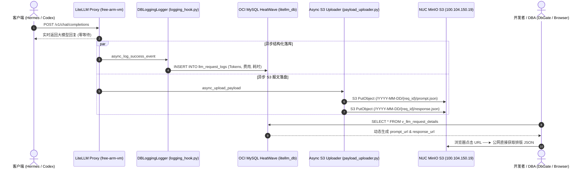

# LiteLLM API 请求与响应报文异步落盘与 MySQL 超链接视图实战

## 1. 架构背景与设计动机

在企业级 LLM 网关架构中，日志审计通常分为两类需求：
1. **轻量级结构化指标（热数据）**：请求耗时（`latency_ms`）、Token 消耗（`prompt_tokens`, `completion_tokens`）、调用费用（`cost_usd`, `cost_cny`）、状态码（`status_code`）以及模型降级路由轨迹。这些数据要求秒级聚合查询，写入关系型数据库（OCI MySQL HeatWave）。
2. **完整上下文 Payload（冷数据）**：包含数十万 Token 的多轮对话历史（`Prompt`）和模型长文本回复（`Response`）。

### 为什么必须冷热物理分离？
- **防止 InnoDB Buffer Pool 污染**：单条请求的上下文动辄数百 KB 至数 MB，频繁读写大字段（`LONGTEXT` / `JSON`）会挤占 MySQL 核心索引缓存；
- **防止单表体积膨胀失控**：数万次调用将产生数十 GB 的非结构化文本，导致数据库快照备份、迁移和灾备极其缓慢；
- **排错直达体验**：日常运维通过 MySQL 查看聚合指标，排查 Bad Case 时直接通过超链接一键在浏览器调取结构化高亮 JSON。

---

## 2. 系统拓扑与数据流图 (Mermaid)



---

## 3. 全流程分步实施与配置代码

### 3.1 步骤一：本地 NUC 物理宿主机存储准备

在物理机 `nuc`（Ubuntu 24.04 / Tailscale `100.104.150.19`）上勘察磁盘：
- 根目录 `/` 仅 27GB 可用；
- `/home` 分区挂载在 1TB NVMe SSD 上，拥有 **800GB+** 空闲空间。

在 NUC 执行初始化：
```bash
# 1. 在 800G 分区创建专用目录
sudo mkdir -p /home/data/litellm_payloads

# 2. 修改属主为 MinIO 容器标准 UID 1000
sudo chown -R 1000:1000 /home/data
sudo chmod -R 775 /home/data

# 3. 建立全局软链接
sudo ln -sfn /home/data /data
```

---

### 3.2 步骤二：ArgoCD GitOps 部署 MinIO 服务

在 GitOps 仓库 `my-argocd-manifests` 中定义 K8s 资源清单：

#### 1. MinIO 核心清单 (`infrastructure/minio/minio.yaml`)
```yaml
apiVersion: v1
kind: Namespace
metadata:
  name: minio
---
apiVersion: v1
kind: Secret
metadata:
  name: minio-secret
  namespace: minio
type: Opaque
stringData:
  MINIO_ROOT_USER: litellm_admin
  MINIO_ROOT_PASSWORD: CHANGE_ME
  MINIO_IDENTITY_OPENID_CLIENT_SECRET: "YOUR_LOGTO_OIDC_SECRET"
---
apiVersion: apps/v1
kind: Deployment
metadata:
  name: minio
  namespace: minio
  labels:
    app: minio
spec:
  replicas: 1
  strategy:
    type: Recreate
  selector:
    matchLabels:
      app: minio
  template:
    metadata:
      labels:
        app: minio
    spec:
      nodeSelector:
        kubernetes.io/hostname: nuc # 调度锁定 NUC 节点
      containers:
        - name: minio
          image: quay.io/minio/minio:RELEASE.2024-08-29T01-40-52Z
          command:
            - /bin/sh
            - -ce
            - minio server /data --console-address ":9001"
          env:
            - name: MINIO_ROOT_USER
              valueFrom:
                secretKeyRef:
                  name: minio-secret
                  key: MINIO_ROOT_USER
            - name: MINIO_ROOT_PASSWORD
              valueFrom:
                secretKeyRef:
                  name: minio-secret
                  key: MINIO_ROOT_PASSWORD
            - name: MINIO_BROWSER_REDIRECT_URL
              value: "https://minio.jppwl.asia"
            # Logto OIDC SSO 配置
            - name: MINIO_IDENTITY_OPENID_CONFIG_URL
              value: "https://sodaxw.logto.app/oidc/.well-known/openid-configuration"
            - name: MINIO_IDENTITY_OPENID_CLIENT_ID
              value: "inck8s2812o0gzfgzqvug"
            - name: MINIO_IDENTITY_OPENID_CLIENT_SECRET
              valueFrom:
                secretKeyRef:
                  name: minio-secret
                  key: MINIO_IDENTITY_OPENID_CLIENT_SECRET
            - name: MINIO_IDENTITY_OPENID_SCOPES
              value: "openid,profile,email"
            - name: MINIO_IDENTITY_OPENID_REDIRECT_URI
              value: "https://minio.jppwl.asia/oauth_callback"
            - name: MINIO_IDENTITY_OPENID_DISPLAY_NAME
              value: "Logto / GitHub SSO"
            - name: MINIO_IDENTITY_OPENID_ROLE_POLICY
              value: "consoleAdmin"
          ports:
            - name: s3-api
              containerPort: 9000
            - name: web-console
              containerPort: 9001
          volumeMounts:
            - name: minio-storage
              mountPath: /data
          resources:
            requests:
              cpu: 100m
              memory: 128Mi
            limits:
              cpu: "1"
              memory: 1Gi
          livenessProbe:
            httpGet:
              path: /minio/health/live
              port: 9000
            initialDelaySeconds: 15
            periodSeconds: 20
          readinessProbe:
            httpGet:
              path: /minio/health/ready
              port: 9000
            initialDelaySeconds: 10
            periodSeconds: 15
      volumes:
        - name: minio-storage
          hostPath:
            path: /data/litellm_payloads
            type: DirectoryOrCreate
---
apiVersion: v1
kind: Service
metadata:
  name: minio
  namespace: minio
  labels:
    app: minio
spec:
  type: ClusterIP
  selector:
    app: minio
  ports:
    - name: s3-api
      port: 9000
      targetPort: 9000
    - name: web-console
      port: 9001
      targetPort: 9001
```

#### 2. 网关分流路由 (`HTTPRoute`)
实现**数据直通免登录**与**控制台 SSO 登录**的精细化分流：

```yaml
---
# 规则 A：开放数据下载 (Port 9000)
apiVersion: gateway.networking.k8s.io/v1
kind: HTTPRoute
metadata:
  name: minio-payloads-route
  namespace: minio
  labels:
    app: minio
spec:
  parentRefs:
    - group: gateway.networking.k8s.io
      kind: Gateway
      name: kong-main-gateway
      namespace: default
  hostnames:
    - "payloads.jppwl.asia"
    - "minio.jppwl.asia"
  rules:
    - backendRefs:
        - group: ""
          kind: Service
          name: minio
          port: 9000
          weight: 1
      matches:
        - path:
            type: PathPrefix
            value: /litellm-payloads
---
# 规则 B：Web 管理控制台 (Port 9001)
apiVersion: gateway.networking.k8s.io/v1
kind: HTTPRoute
metadata:
  name: minio-console-route
  namespace: minio
  labels:
    app: minio
spec:
  parentRefs:
    - group: gateway.networking.k8s.io
      kind: Gateway
      name: kong-main-gateway
      namespace: default
  hostnames:
    - "minio.jppwl.asia"
  rules:
    - backendRefs:
        - group: ""
          kind: Service
          name: minio
          port: 9001
          weight: 1
      matches:
        - path:
            type: PathPrefix
            value: /
```

#### 3. 存储桶初始化与下载权限
进入 Pod 下发策略：
```bash
mc alias set local http://localhost:9000 litellm_admin CHANGE_ME
mc mb local/litellm-payloads
mc anonymous set download local/litellm-payloads
mc ilm rule add local/litellm-payloads --expire-days 90
```

---

### 3.3 步骤三：LiteLLM 异步 S3 上传模块开发

#### 1. 配置扩展 (`app/core/config.py`)
```python
class Settings(BaseSettings):
    # 基础配置...
    enable_payload_offload: bool = True
    payload_s3_endpoint: str = "http://minio.minio.svc.cluster.local:9000"
    payload_s3_access_key: str = "litellm_admin"
    payload_s3_secret_key: SecretStr = SecretStr("CHANGE_ME")
    payload_bucket_name: str = "litellm-payloads"
    payload_public_base_url: str = "https://payloads.jppwl.asia/litellm-payloads"
    payload_upload_timeout_seconds: float = 2.0
```

#### 2. 上传与结构化提炼模块 (`app/core/payload_uploader.py`)
提炼 `system_prompt` 与 `user_prompt`，并增加多层容错序列化：

```python
"""LiteLLM Asynchronous Payload Offloading Module via S3 API."""

import json
import logging
from datetime import UTC, datetime
from typing import Any
import aioboto3
from botocore.config import Config
from app.core.config import Settings, get_settings

logger = logging.getLogger(__name__)


def _to_serializable(obj: Any) -> Any:
    """递归清洗复杂对象"""
    if hasattr(obj, "model_dump"):
        try:
            return _to_serializable(obj.model_dump())
        except Exception:
            pass
    if hasattr(obj, "dict"):
        try:
            return _to_serializable(obj.dict())
        except Exception:
            pass
    if isinstance(obj, dict):
        return {str(k): _to_serializable(v) for k, v in obj.items()}
    if isinstance(obj, (list, tuple, set, frozenset)):
        return [_to_serializable(item) for item in obj]
    if isinstance(obj, datetime):
        return obj.isoformat()
    if isinstance(obj, (bytes, bytearray)):
        return obj.decode("utf-8", errors="replace")
    if isinstance(obj, Exception):
        return {"error_type": type(obj).__name__, "message": str(obj)}
    if hasattr(obj, "__str__") and not isinstance(obj, (int, float, bool, type(None))):
        return str(obj)
    return obj


def _json_default(obj: Any) -> Any:
    """最终 fallback 序列化器"""
    if isinstance(obj, datetime):
        return obj.isoformat()
    if isinstance(obj, (bytes, bytearray)):
        return obj.decode("utf-8", errors="replace")
    if hasattr(obj, "model_dump"):
        return obj.model_dump()
    if hasattr(obj, "dict"):
        return obj.dict()
    if isinstance(obj, Exception):
        return {"error_type": type(obj).__name__, "message": str(obj)}
    if isinstance(obj, (set, frozenset)):
        return list(obj)
    return str(obj)


def extract_prompt_payload(kwargs: dict[str, Any]) -> dict[str, Any]:
    raw_messages = kwargs.get("messages") or []
    cleaned_messages = _to_serializable(raw_messages)

    system_prompts, user_prompts = [], []
    if isinstance(cleaned_messages, list):
        for msg in cleaned_messages:
            if isinstance(msg, dict):
                role = str(msg.get("role", "")).lower()
                content = msg.get("content")
                if content is not None:
                    text_val = content if isinstance(content, str) else str(content)
                    if role == "system":
                        system_prompts.append(text_val)
                    elif role == "user":
                        user_prompts.append(text_val)

    opt_params = kwargs.get("optional_params") or {}
    clean_params = {
        k: v
        for k, v in {
            "temperature": opt_params.get("temperature") or kwargs.get("temperature"),
            "max_tokens": opt_params.get("max_tokens") or kwargs.get("max_tokens"),
            "stream": opt_params.get("stream", False),
            "top_p": opt_params.get("top_p"),
        }.items()
        if v is not None
    }

    return {
        "model": kwargs.get("model") or "unknown",
        "system_prompt": "\n\n".join(system_prompts) if system_prompts else None,
        "user_prompt": user_prompts[-1] if user_prompts else None,
        "messages": cleaned_messages,
        "parameters": clean_params,
        "tools": _to_serializable(kwargs.get("tools")),
    }


def extract_response_payload(response_obj: Any) -> dict[str, Any]:
    if response_obj is None:
        return {"reply": None, "error": "Response object is None"}
    if isinstance(response_obj, Exception):
        return {
            "reply": None,
            "error": {"type": type(response_obj).__name__, "message": str(response_obj)},
        }

    raw = _to_serializable(response_obj)
    if not isinstance(raw, dict):
        return {"reply": str(raw)}

    choices = raw.get("choices") or []
    first_choice = choices[0] if isinstance(choices, list) and choices else {}

    reply_content, reasoning_content, tool_calls, finish_reason = None, None, None, None
    if isinstance(first_choice, dict):
        finish_reason = first_choice.get("finish_reason")
        msg = first_choice.get("message")
        if isinstance(msg, dict):
            reply_content = msg.get("content")
            reasoning_content = msg.get("reasoning_content")
            tool_calls = msg.get("tool_calls")
        elif first_choice.get("text"):
            reply_content = first_choice.get("text")

    return {
        "model": raw.get("model"),
        "reply": reply_content,
        "reasoning_content": reasoning_content,
        "tool_calls": tool_calls,
        "finish_reason": finish_reason,
        "usage": raw.get("usage"),
    }


async def async_upload_payload(
    request_id: str,
    kwargs: dict[str, Any],
    response_obj: Any,
    start_time: datetime | None = None,
    settings: Settings | None = None,
) -> None:
    if not request_id or not str(request_id).strip():
        return

    try:
        resolved_settings = settings or get_settings()
        if not resolved_settings.enable_payload_offload:
            return

        date_ref = start_time or datetime.now(UTC)
        if date_ref.tzinfo is None:
            date_ref = date_ref.replace(tzinfo=UTC)
        date_str = date_ref.strftime("%Y-%m-%d")
        key_prefix = f"{date_str}/{request_id}"

        prompt_bytes = json.dumps(
            extract_prompt_payload(kwargs),
            ensure_ascii=False,
            indent=2,
            default=_json_default,
        ).encode("utf-8")

        response_bytes = json.dumps(
            extract_response_payload(response_obj),
            ensure_ascii=False,
            indent=2,
            default=_json_default,
        ).encode("utf-8")

        session = aioboto3.Session()
        boto_config = Config(
            connect_timeout=resolved_settings.payload_upload_timeout_seconds,
            read_timeout=resolved_settings.payload_upload_timeout_seconds,
            retries={"max_attempts": 2},
        )

        async with session.client(
            "s3",
            endpoint_url=resolved_settings.payload_s3_endpoint,
            aws_access_key_id=resolved_settings.payload_s3_access_key,
            aws_secret_access_key=resolved_settings.payload_s3_secret_key.get_secret_value(),
            config=boto_config,
        ) as s3_client:
            await s3_client.put_object(
                Bucket=resolved_settings.payload_bucket_name,
                Key=f"{key_prefix}/prompt.json",
                Body=prompt_bytes,
                ContentType="application/json; charset=utf-8",
            )
            await s3_client.put_object(
                Bucket=resolved_settings.payload_bucket_name,
                Key=f"{key_prefix}/response.json",
                Body=response_bytes,
                ContentType="application/json; charset=utf-8",
            )
        logger.debug("Successfully uploaded payload for %s", request_id)
    except Exception as exc:
        logger.warning("Failed to async upload payload for %s: %s", request_id, exc)
```

#### 3. 日志 Hook 挂载 (`app/core/logging_hook.py`)
在 `async_log_success_event` 与 `async_log_failure_event` 中并发派发：

```python
asyncio.create_task(
    async_upload_payload(
        request_id=request_id,
        kwargs=kwargs,
        response_obj=response_obj,
        start_time=start_time if isinstance(start_time, datetime.datetime) else None,
        settings=settings,
    )
)
```

---

### 3.4 步骤四：MySQL 动态超链接视图 (`v_llm_request_details`)

在 OCI MySQL 中执行 DDL：

```sql
USE litellm_db;

CREATE OR REPLACE VIEW v_llm_request_details AS
SELECT 
    l.id,
    l.request_id,
    l.api_key_alias,
    l.model_requested,
    l.model_used,
    l.provider,
    l.provider_key_alias,
    l.prompt_tokens,
    l.completion_tokens,
    l.total_tokens,
    l.cost_usd,
    l.cost_cny,
    l.fx_rate,
    l.latency_ms,
    l.status_code,
    l.created_at,
    -- 动态拼接公开 Prompt JSON 下载超链接
    CONCAT(
        'https://payloads.jppwl.asia/litellm-payloads/',
        DATE_FORMAT(l.created_at, '%Y-%m-%d'), '/',
        l.request_id, '/prompt.json'
    ) AS prompt_url,
    -- 动态拼接公开 Response JSON 下载超链接
    CONCAT(
        'https://payloads.jppwl.asia/litellm-payloads/',
        DATE_FORMAT(l.created_at, '%Y-%m-%d'), '/',
        l.request_id, '/response.json'
    ) AS response_url
FROM llm_request_logs l;
```

---

## 4. 生产查询与排查工作流

### 4.1 在 DbGate / DBeaver 中排查 Bad Case
执行标准 SQL 查询：
```sql
SELECT 
    created_at,
    api_key_alias,
    model_used,
    total_tokens,
    cost_cny,
    prompt_url,
    response_url
FROM v_llm_request_details
ORDER BY created_at DESC
LIMIT 5;
```

点击单元格中的 `prompt_url`，浏览器直接秒出格式化高亮 JSON：
```json
{
  "model": "gemini-3.7-flash",
  "system_prompt": "你叫 Cindy，是主人的贴身秘书。",
  "user_prompt": "太好了，那我们今晚去吃什么？",
  "messages": [
    { "role": "system", "content": "你叫 Cindy，是主人的贴身秘书。" },
    { "role": "user", "content": "Cindy，广州今天天气怎么样？" },
    { "role": "assistant", "content": "主人，广州今天天气晴朗，微风舒适呢～" },
    { "role": "user", "content": "太好了，那我们今晚去吃什么？" }
  ],
  "parameters": {
    "max_tokens": 100,
    "stream": false
  },
  "tools": null
}
```

---

### 4.2 通过 DbGate 内置 DuckDB 引擎穿透 S3 关键字搜索
在 DbGate 的 SQL Console 中执行 DuckDB SQL：

```sql
INSTALL httpfs;
LOAD httpfs;
SET s3_endpoint='minio.minio.svc.cluster.local:9000';
SET s3_use_ssl=false;

-- 🔍 搜索 9 月份所有包含 "广州" 关键字的 Prompt 及 Request ID
SELECT 
    regexp_extract(filename, '([0-9a-zA-Z_-]+)/prompt\.json', 1) AS request_id,
    system_prompt,
    user_prompt,
    model
FROM read_json_auto('s3://litellm-payloads/2026-09-*/*/prompt.json', filename=true)
WHERE lower(user_prompt) LIKE '%广州%';
```

搜出 `request_id` 后，直接回查 MySQL 关联精确费用、耗时及状态。

---

## 5. 总结

本方案在保持 **MySQL 零膨胀、高查询性能** 的同时，达成了以下核心指标：
1. **完全非阻塞**：S3 上传运行在独立后台 Task，发生任何网络抖动均不影响 API 正常响应；
2. **数据主权在本地**：所有长文本报文沉淀在家庭 Homelab NUC 的 800GB NVMe SSD 中，免去公有云存储计费与数据出境顾虑；
3. **极佳的可观测性**：`system_prompt` 与 `user_prompt` 快速摘要 + 完整上下文时序还原 + DbGate 毫秒级穿透全文检索。
