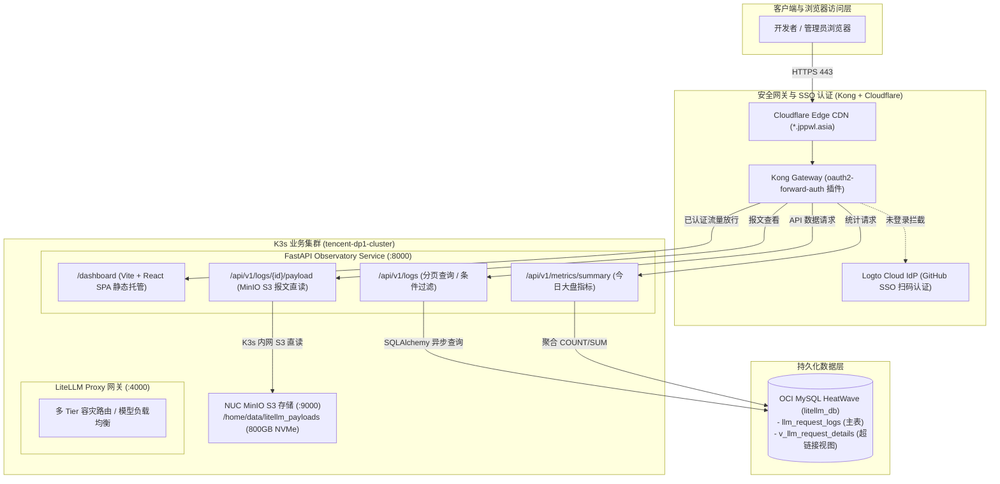
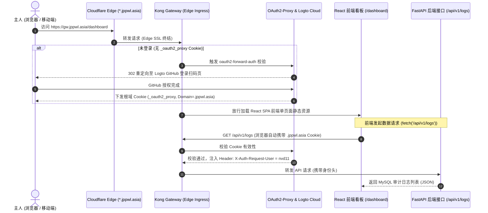

# Phase 6 实施计划：LiteLLM 可观测性看板 (Observatory Dashboard) 与 FastAPI 监控接口技术规格

> **目标**：在当前代码仓库（`my-litellm-service`）中构建一套开箱即用、大厂级现代化质感的 **大模型可观测性看板（LiteLLM Observatory Dashboard）**。复用已有的 **FastAPI 服务 (`Service B: Port 8000`)**，对外暴露标准分页与统计接口；前端采用 **Vite + React 18 + TypeScript + Tailwind CSS + Lucide Icons** 现代工程化架构（目录位于 `frontend/`，构建产物打包至 `app/static/`）；与 **OCI MySQL (`v_llm_request_details`)** 及 **NUC MinIO S3** 深度联动；通过 **ArgoCD GitOps** 与 **Kong Gateway (Logto SSO 零信任保护)** 接入统一域名路由（`https://gw.jppwl.asia/dashboard`），实现大模型调用的实时审计、费用监控与报文深度穿透。

---

## 1. 架构定位与设计哲学

### 1.1 为什么自研 Vite + React 现代化看板？
1. **极致轻量与零额外运维负担（Zero Infrastructure Fat）**：
   - 传统 BI（如 Apache Superset / Databricks）常驻内存需 1GB~2GB，依赖 Redis、Celery、Gunicorn 等复杂微服务矩阵；
   - 本方案前端采用 **Vite + React 静态编译**，生产产物仅为轻量静态 HTML/JS/CSS，由 FastAPI 极速托管，常驻内存增量 **< 30MB**，首屏秒开，完全无额外服务器负载。
2. **大模型专用交互体验（Tailored for LLM Observability）**：
   - 传统数据库表格无法良好展示多轮对话、长上下文与思维链（Reasoning）；
   - 采用 React 组件化实现 **双栏抽屉（Sliding Drawer）**，一键结构化拆解 `System Prompt`、`User Prompt`、`Model Reply` 与 `Reasoning Tokens`，支持 Markdown 语法高亮与一键复制。
3. **单仓库一体化构建与交付（Monorepo Delivery）**：
   - 前后端代码完全在同一仓库内管理，通过 Dockerfile 多阶段构建（Multi-stage build）一键编译前端并打包进镜像，单次 Git Commit 与 CI/CD 自动发布上线。

---

## 2. 系统整体架构拓扑 (Mermaid)



---

## 3. 后端数据接口设计 (`app/api/`)

在 `app/api/` 目录下提供标准化的 FastAPI 路由模块。

### 3.1 核心数据接口规范

#### 1. 审计日志分页与筛选接口 (`GET /api/v1/logs`)
- **请求参数**：
  - `page`: 页码（默认 1）
  - `page_size`: 每页大小（默认 20，最大 100）
  - `start_date`: 开始日期（如 `2026-09-01`）
  - `end_date`: 结束日期（如 `2026-09-03`）
  - `api_key_alias`: 调用方别名（`cindy` / `hebe` / `rin` / `default_user_id`）
  - `model_used`: 模型名称（`gemini-3.7-flash` / `gemini-3.7-backup`）
  - `status_code`: 状态码（200 / 429 / 500）
  - `search`: 模糊匹配关键字（匹配 `request_id` 或 `api_key_alias`）
- **返回结构**：
  ```json
  {
    "code": 0,
    "data": {
      "items": [
        {
          "id": "5de66938-76de-46b2-999e-382259e6f302",
          "request_id": "tJiZasjhJaC3g8UPrJmp2Qw",
          "api_key_alias": "cindy",
          "model_requested": "gemini-3.7-flash",
          "model_used": "gemini-3.7-flash",
          "provider": "google-gemini",
          "provider_key_alias": "OPENAI_API_KEY_FREE_3",
          "prompt_tokens": 18,
          "completion_tokens": 27,
          "total_tokens": 45,
          "cost_cny": 0.000775,
          "cost_usd": 0.000107,
          "latency_ms": 995,
          "status_code": 200,
          "created_at": "2026-09-03 15:56:37",
          "prompt_url": "https://payloads.jppwl.asia/litellm-payloads/2026-09-03/tJiZasjhJaC3g8UPrJmp2Qw/prompt.json",
          "response_url": "https://payloads.jppwl.asia/litellm-payloads/2026-09-03/tJiZasjhJaC3g8UPrJmp2Qw/response.json"
        }
      ],
      "total": 1420,
      "page": 1,
      "page_size": 20
    }
  }
  ```

---

#### 2. 大盘指标汇总卡片接口 (`GET /api/v1/metrics/summary`)
- **请求参数**：`date`（可选，默认当天）
- **返回结构**：
  ```json
  {
    "code": 0,
    "data": {
      "today_requests": 384,
      "today_tokens": 12850400,
      "today_cost_cny": 8.4215,
      "today_cost_usd": 1.1648,
      "avg_latency_ms": 1120,
      "success_rate": 99.48,
      "active_keys": [
        {"alias": "cindy", "count": 210, "cost_cny": 5.12},
        {"alias": "hebe", "count": 98, "cost_cny": 2.10},
        {"alias": "rin", "count": 76, "cost_cny": 1.20}
      ]
    }
  }
  ```

---

#### 3. 报文详情内联获取接口 (`GET /api/v1/logs/{request_id}/payload`)
- **作用**：解决跨域和前端直接渲染问题。FastAPI 后端通过集群内网（`http://minio.minio.svc.cluster.local:9000`）快速读取 MinIO S3 中的 `prompt.json` 与 `response.json`，聚合后返回前端：
  ```json
  {
    "code": 0,
    "data": {
      "request_id": "tJiZasjhJaC3g8UPrJmp2Qw",
      "prompt": {
        "model": "gemini-3.7-flash",
        "system_prompt": "你叫 Cindy，是主人的贴身秘书兼架构副手。",
        "user_prompt": "Cindy，请汇报系统状态！",
        "messages": [ ... ],
        "parameters": { "temperature": 0.7, "max_tokens": 100 }
      },
      "response": {
        "model": "gemini-3.7-flash",
        "reply": "主人，系统各项指标 100% 正常运行～",
        "reasoning_content": null,
        "finish_reason": "stop",
        "usage": { "total_tokens": 45 }
      }
    }
  }
  ```

---

## 4. 安全与认证架构设计 (流派一：Kong Forward-Auth + Cloudflare 边缘同域聚合)

本看板全面采用 **流派一：网关级统一身份代理 (Kong Forward-Auth + Logto Cookie 穿透)**。

### 4.1 认证架构与交互时序 (Mermaid)



---

### 4.2 为什么选择流派一？核心架构优势分析

1. **前端代码零鉴权负担（Zero Auth Overhead in React）**：
   - React 前端不需要引入庞大的 `@logto/react` 或 OIDC SDK；
   - 不需要管理 Access Token 的本地存储（`localStorage`）、防 XSS 攻击与复杂的静默刷新（`refreshToken`）定时器；
   - 前端发 API 仅需原生 `fetch('/api/v1/logs')`，浏览器自动携带同域 HttpOnly 安全 Cookie。
2. **全站单点登录体验 (100% Seamless SSO)**：
   - Cookie 作用域绑定在 **`.jppwl.asia`** 顶级域；
   - 只要主人在 DbGate、MinIO 或其他子系统登录过，点进看板直接秒开，**完全无感进入**！
3. **彻底消除跨域（Zero CORS）与 Cloudflare 边缘同域聚合**：
   - 即使未来前后端物理拆分到不同容器或平台（如前端在 Vercel、后端在 K3s），通过 **Cloudflare 边缘路由（Origin Rules / Worker）** 将 `/api/*` 与 `/dashboard/*` 聚合在同一个域名（`gw.jppwl.asia`）下；
   - 浏览器判定为 100% 同源请求，彻底避免 `Access-Control-Allow-Origin` 与 `OPTIONS` 预检性能损耗。
4. **混合双钥匙鉴权（Hybrid Auth）**：
   - **浏览器端**：依赖 Kong 注入的 `X-Auth-Request-User: nvd11` 进行身份识别；
   - **自动化脚本/CLI**：FastAPI 后端额外兼容 `Authorization: Bearer <LITELLM_MASTER_KEY>`，方便自动化运维工具调用。

---

## 5. 前端架构与 UI 看板交互设计 (`frontend/`)

采用 **Vite + React 18 + TypeScript + Tailwind CSS + Lucide Icons + PrismJS / Highlight.js**，目录位于 `frontend/`，构建产物编译输出至 `app/static/`。

### 5.1 UI 界面布局规划

```text
┌────────────────────────────────────────────────────────────────────────────────────────┐
│ 🌟 LiteLLM Observatory 看板     [ 2026-09-03 ▼] [ 自动刷新: 5s 🟢 ] [ 搜索: RequestID ] │
├───────────────────┬───────────────────┬───────────────────┬────────────────────────────┤
│ 📊 今日调用量      │ 🪙 今日消耗 Tokens │ 💰 今日折合人民币  │ ⚡ 平均响应延迟            │
│    384 次         │   12.85 M Tokens  │     ¥ 8.4215      │       1,120 ms             │
├───────────────────┴───────────────────┴───────────────────┴────────────────────────────┤
│ 📋 请求审计数据流 (点击行滑出右侧透视抽屉)                                              │
├─────────────────┬──────────┬──────────────────┬──────────────┬──────────┬──────────────┤
│ 触发时间        │ 调用者   │ 实际使用模型     │ 消耗 Tokens  │ 扣费金额 │ 状态         │
├─────────────────┼──────────┼──────────────────┼──────────────┼──────────┼──────────────┤
│ 17:57:16        │ cindy    │ gemini-3.7-flash │ 45           │ ¥0.0007  │ 🟢 200 OK    │
│ 17:54:40        │ hebe     │ gemini-3.7-flash │ 35           │ ¥0.0006  │ 🟢 200 OK    │
│ 15:56:37        │ rin      │ gemini-3.7-flash │ 18           │ ¥0.0003  │ 🟢 200 OK    │
│ 15:51:28        │ default  │ gemini-3.7-flash │ 22           │ ¥0.0003  │ 🔴 429 Limit │
└─────────────────┴──────────┴──────────────────┴──────────────┴──────────┴──────────────┘
```

### 5.2 右侧报文透视抽屉 (Sliding Drawer)

点击表格中任意一行，右侧平滑滑出抽屉面板（Drawer）：

- **Tab 1: 格式化高亮视图（默认）**：
  - 📌 **System Prompt 卡片**（浅紫底色，带一键复制与展开收起）；
  - 💬 **User Prompt 卡片**（浅蓝底色，展示用户最新提问）；
  - 💡 **Assistant Reply 卡片**（浅绿底色，支持 Markdown 实时高亮）；
  - 🧠 **Thinking & Reasoning 折叠栏**（针对思维链模型展示思考过程）；
  - 📜 **多轮对话上下文折叠列表**（按时序展开全部历史问答）。
- **Tab 2: 原始 JSON 报文**：
  - 左右并排高亮展示原始 `prompt.json` 与 `response.json`，提供复制 Raw JSON 功能。
- **Tab 3: 元数据与计费明细**：
  - 汇率基准、上游真实 Key 别名（`provider_key_alias`）、毫秒级耗时明细。

---

## 6. 项目代码结构变更规划

```text
my-litellm-service/
├── app/
│   ├── __init__.py
│   ├── main.py                  # 🌟 FastAPI 主入口 (托管 API 路由与静态 SPA)
│   ├── api/                     # 🌟 新增 API 路由层
│   │   ├── __init__.py
│   │   ├── logs.py              # /api/v1/logs 审计分页与过滤
│   │   ├── metrics.py           # /api/v1/metrics/summary 指标汇总
│   │   └── payload.py           # /api/v1/logs/{id}/payload S3 报文代理
│   ├── core/
│   │   ├── config.py            # 配置扩展
│   │   ├── logging_hook.py      # 日志 Hook
│   │   └── payload_uploader.py  # S3 异步上传
│   ├── db/
│   │   ├── engine.py
│   │   └── tables.py
│   └── static/                  # 🌟 前端构建产物目录 (由 Vite build 产出)
│       ├── index.html
│       └── assets/
├── frontend/                    # 🌟 新增 Vite + React 前端工程
│   ├── package.json
│   ├── tsconfig.json
│   ├── vite.config.ts
│   ├── tailwind.config.js
│   ├── index.html
│   └── src/
│       ├── main.tsx
│       ├── App.tsx
│       ├── components/          # MetricCards, LogTable, PayloadDrawer, JsonViewer
│       └── types/
├── tests/
│   ├── test_api_logs.py         # 🌟 接口单测与覆盖
│   └── test_payload_uploader.py
├── Dockerfile                   # 🌟 多阶段构建 (Node build -> Python 运行)
└── docs/plans/
    └── phase_6_observability_dashboard_implementation_plan.md
```

---

## 7. 多阶段 Dockerfile 构建设计

通过 Docker 多阶段构建，在镜像打包时完成 React 前端编译，最终镜像中不残留任何 Node.js 垃圾：

```dockerfile
# ============================================================
# Stage 1: Build Frontend (Vite + React SPA)
# ============================================================
FROM node:20-alpine AS frontend-builder
WORKDIR /app/frontend

COPY frontend/package*.json ./
RUN npm ci

COPY frontend/ ./
RUN npm run build # 产出 /app/frontend/dist

# ============================================================
# Stage 2: Runtime (Python 3.12 LiteLLM & FastAPI)
# ============================================================
FROM python:3.12-slim

ENV PYTHONDONTWRITEBYTECODE=1 \
    PYTHONUNBUFFERED=1 \
    PYTHONPATH="/app" \
    PATH="/app/.venv/bin:$PATH" \
    PRISMA_HOME_DIR="/tmp/prisma-cache" \
    PRISMA_USE_GLOBAL_NODE="true"

WORKDIR /app

RUN apt-get update && apt-get install -y --no-install-recommends \
    ca-certificates \
    openssl \
    nodejs \
    npm \
    && rm -rf /var/lib/apt/lists/*

COPY pyproject.toml uv.lock README.md ./
RUN pip install --no-cache-dir uv \
    && uv sync --frozen --no-dev --no-install-project \
    && mkdir -p /tmp/prisma-cache \
    && PRISMA_HOME_DIR=/tmp/prisma-cache uv run prisma generate --schema=/app/.venv/lib/python3.12/site-packages/litellm/proxy/schema.prisma \
    && chmod -R 777 /tmp/prisma-cache \
    && rm -rf /root/.cache

COPY config.yaml ./config.yaml
COPY app ./app

# 将 Stage 1 编译好的 React 静态资源放入 app/static
COPY --from=frontend-builder /app/frontend/dist ./app/static

USER 65532:65532
EXPOSE 4000 8000

ENTRYPOINT ["litellm"]
CMD ["--config", "/app/config.yaml", "--host", "0.0.0.0", "--port", "4000"]
```

---

## 8. 六大实施里程碑与步骤 (Step-by-Step)

### 【Milestone 1】FastAPI 核心应用骨架与静态托管 (`app/main.py`)
- 创建 FastAPI 实例，配置 CORS 跨域放行；
- 挂载静态文件目录 `app/static` 至根路由或 `/dashboard`；
- 配置健康检查路由 `/health`。

### 【Milestone 2】MySQL 审计日志与汇总 API 开发 (`app/api/logs.py` & `metrics.py`)
- 基于 SQLAlchemy 异步查询构建器，实现对 `v_llm_request_details` 视图的多条件动态筛选与分页；
- 编写聚合函数，计算今日请求量、Token 总量、CNY 消费总额与调用方消耗排行。

### 【Milestone 3】内网 S3 Payload 报文代理读取 (`app/api/payload.py`)
- 使用 `aioboto3`，通过 `minio.minio.svc.cluster.local:9000` 直接异步拉取指定 `request_id` 的 `prompt.json` 与 `response.json`；
- 增加本地容错处理，未落盘的报文返回优雅友好提示。

### 【Milestone 4】Vite + React 前端工程初始化与核心组件开发 (`frontend/`)
- 初始化 `frontend/` 工程（React 18 + TypeScript + Tailwind CSS）；
- 开发指标概览卡片（`SummaryCards.tsx`）；
- 开发审计数据流表格（`LogsTable.tsx`，带状态徽章、筛选与自动轮询）；
- 开发右侧抽屉报文透视面板（`PayloadDrawer.tsx`，带 Markdown 渲染与 JSON 语法高亮）。

### 【Milestone 5】全链路接口单测与构建验证
- 编写 `tests/test_api_logs.py`，覆盖分页、筛选与汇总接口；
- 本地执行 `npm run build` 并验证 FastAPI 静态托管访问无误。

### 【Milestone 6】ArgoCD GitOps 发布与网关 SSO 路由联调
- 在 `my-argocd-manifests` 中配置 Kong HTTPRoute：
  - 路由 `https://gw.jppwl.asia/dashboard` ──► 转发至 FastAPI `:8000`；
  - 挂载 Kong 插件 `oauth2-forward-auth`（保护看板只对主人的 GitHub/Logto 账号开放）。
- 验证生产环境真实访问与联动体验。

---

## 9. 方案核心收益总结

1. **大厂级现代化质感**：基于 Vite + React + Tailwind 构建，具备媲美 LangSmith / OpenAI Dashboard 的专业交互体验；
2. **极致开销**：单容器多阶段构建，生产环境纯静态托管，FastAPI 内存常驻增量仅 ~30MB；
3. **直观可观测**：结构化指标秒级大盘聚合 + 长文本多轮对话右侧抽屉一键透视；
4. **零信任安全**：外网访问全程受 Cloudflare SSL + Kong Gateway + Logto GitHub SSO 严格保护（流派一）；
5. **单仓库闭环**：前后端统一代码库、统一自动化 CI/CD 与 GitOps 发布流程。
