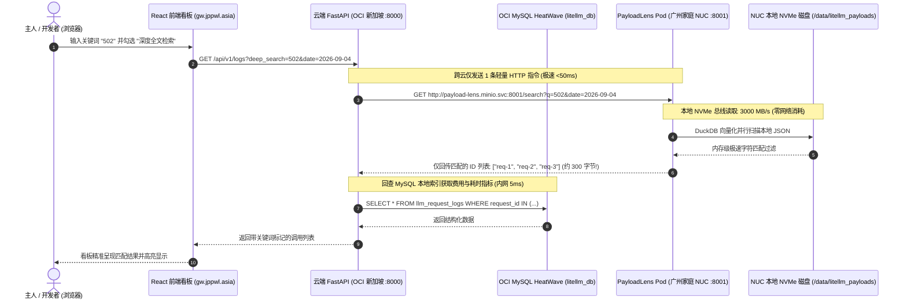

# Phase 7 实施计划：PayloadLens 边缘端 DuckDB 极速全文检索微服务与看板穿透架构

> **核心目标**：贯彻分布式架构“计算贴着存储跑（Compute follows Data）”的设计哲学，彻底杜绝跨国公网对数万个 S3 小文件做全量拉取引发的“网络风暴”与“内存雪崩”。在 **K3s NUC 节点（广州家庭宽带 800GB NVMe 本地磁盘）** 部署微型检索服务（**`payload-lens`**，代码托管于独立仓库 **`nvd11/payload-lens`**），直接挂载本地物理目录（`hostPath: /data/litellm_payloads`）；利用 **DuckDB 向量化内存执行引擎** 实现 3,000 MB/s 纯物理磁盘极速扫描；跨云仅回传几百字节的命中 `request_id` 结果集；与 **云端 FastAPI 后端** 及 **React 前端看板** 深度联动，实现秒级海量 Prompt / Response 全文关键词穿透搜索。

---

## 1. 架构动机与物理性能瓶颈分析

### 1.1 为什么不能在云端直接用 DuckDB 扫 MinIO？
在冷热分离架构中：
- **云端服务**：LiteLLM 网关与主 FastAPI 看板部署在 **OCI 新加坡机房（`free-arm-vm`）**；
- **存储服务**：MinIO 与 800GB NVMe 物理硬盘位于 **广州家庭 NUC（`nuc`）**；
- **网络链路**：广州家庭宽带 ──► Tailscale DERP/直连 ──► OCI 新加坡，单向往返时延（RTT）约 **48ms**。

若由云端 FastAPI 驱动 DuckDB 通过 S3 协议检索 2,000 个 JSON 文件：
1. **HTTP 请求数放大**：DuckDB 需跨越公网连续发起 2,000 次以上 HTTP GET 请求，累计往返时延超过 **30 秒**，家庭宽带上行被瞬间打满；
2. **云端内存突刺**：云端容器在反序列化数千个 JSON 文件时，内存瞬间抖动到 500MB+，导致 1C/2C 容器触发 OOM 驱逐风险。

### 1.2 边缘算力下沉的破局方案
将 DuckDB 运算直接部署到**数据所在的 NUC 物理机上**（命名为 **`payload-lens`**）：
- **零网络开销**：不经过任何网卡和 Tailscale 隧道，通过 PCIe 4.0 总线以 **3,000 MB/s** 的物理硬盘极限带宽直接读取本地目录；
- **微量跨云传输**：NUC 扫完几万个文件后，**仅将匹配成功的 10~20 个 `request_id` 字符串（约 500 字节）** 回传给新加坡云端；
- **零内存常驻**：平时不搜索时内存占用几乎为零，收到搜索请求瞬间多核并行扫盘，算完即释放。

---

## 2. 系统拓扑与检索时序图 (Mermaid)



---

### 2.2 核心架构决策：为什么不用 DuckDB 的 MySQL 联邦插件？

DuckDB 官方虽然提供了 `mysql` 扩展插件（支持通过 `ATTACH '... TYPE mysql'` 在 DuckDB 内部直接 JOIN 远程 MySQL 表），但在本系统的生产设计中，我们**明确放弃了该插件，坚决选用“FastAPI 调度器模式（DuckDB 找 ID + MySQL 组装指标）”**。

核心工程决策考量如下：

1. **避免跨国网络长连接与网络抖动风险**：
   - 生产 OCI MySQL 位于新加坡，而 DuckDB 检索 Pod 运行在广州家庭 NUC；
   - 若使用 DuckDB MySQL 插件，每次检索都要求 NUC 边缘节点主动向新加坡云端建立跨国 TCP/TLS 数据库长连接；
   - 家庭宽带的偶尔网络抖动或运营商阻断，极易导致 DuckDB 查询死锁或连接中断报错。
2. **连接池复用与机密凭证收敛**：
   - 主 FastAPI 后端已通过 SQLAlchemy 建立了完备的高可用连接池（自带 `pool_pre_ping=True` 保活检测与自动重连）；
   - 若让 NUC 边缘端额外直连 MySQL，会增加数据库的并发连接数，并导致数据库密码机密扩散到家庭边缘物理机。
3. **职责极度解耦与无状态自愈**：
   - **PayloadLens 检索 Pod 只做一件事**：充当纯粹的本地文件全文检索透镜，输入关键词 ──► 输出匹配的 `request_id` 字符串列表，**零外部数据库依赖，不存任何账号密码，哪怕数据库断开也能独立稳定运行**；
   - **云端主服务把控一切**：所有金融扣费、Token 统计与分页展示统一在云端内网闭环组装。

---

### 2.3 核心工程决策：独立仓库管理 (`nvd11/payload-lens`) vs 单体仓库 (Monorepo)

在代码工程组织上，我们**决定为检索微服务创建一个独立的专用 Git 代码仓库（`nvd11/payload-lens`）**，而非混在当前的 `my-litellm-service` 单仓库中。

核心工程考量如下：

1. **异构芯片架构解耦 (AMD64 vs ARM64)**：
   - **`my-litellm-service`**：运行在新加坡 OCI 的 **ARM64** 节点上，依赖复杂的多阶段构建（Node 20 前端编译 + Prisma 引擎预生成 + QEMU 跨架构转译），编译一次耗时 2~3 分钟；
   - **`payload-lens`**：纯粹运行在家庭 NUC 的 **AMD64 (x86_64)** 节点上，单架构镜像编译仅需 **10~15 秒**！独立仓库使得 NUC 检索镜像的构建极速敏捷，完全不需要受主网关庞大流水线的拖累。
2. **彻底切断 CI/CD 误触发与无谓滚动重启**：
   - 若放在同一仓库，修改主网关业务逻辑或 React 前端，会导致 NUC 上的搜索 Pod 也被重新打包和滚动重启；反之亦然。
   - 采用独立仓库后，两个服务的生命周期彻底解耦，互不干扰。
3. **ArgoCD GitOps 清单边界清晰**：
   - `my-argocd-manifests/argocd-apps/payload-lens-app.yaml` 直接对齐 `nvd11/payload-lens` 仓库，对标现有的 `redis-deployment` 模式，运维心智模型极其统一。

---

### 2.4 为什么自研极简 Python 微服务，而非引入现成搜索引擎（Quickwit / Elasticsearch）？

1. **零索引构建管道负担（Zero Ingest Pipeline）**：
   - Quickwit / ES 等成熟全文搜索引擎要求每次产生新调用时，通过 Kafka/Fluentbit 或 API 向其推送文档以建立倒排索引文件；
   - 本方案自研仅需约 50 行 Python 代码，利用 DuckDB 原生支持的 `read_json_auto()`，**直接在内存中对现存的原始 JSON 磁盘文件发起即时向量化扫描**，零预建索引、零同步流开销。
2. **业务 Schema 深度贴合**：
   - 自研脚本天然知晓从路径正则提取 `request_id`（`regexp_extract(filename, '([0-9a-zA-Z_-]+)/(prompt|response)\.json', 1)`），天然知晓匹配 `system_prompt`、`user_prompt` 与 `tool_calls`，无需维护繁杂的索引映射配置文件。

---

## 3. NUC 边缘端检索微服务设计 (独立仓库 `nvd11/payload-lens`)

### 3.1 极简服务源码 (`main.py`)

```python
"""PayloadLens - NUC Edge DuckDB Local Full-text Search Microservice."""

import logging
from pathlib import Path
from typing import Any

import duckdb
from fastapi import FastAPI, Query
from fastapi.responses import JSONResponse

logger = logging.getLogger("payload_lens")
logging.basicConfig(level=logging.INFO)

app = FastAPI(
    title="PayloadLens - Edge DuckDB Search Service",
    description="Local NVMe-speed in-memory payload search engine.",
    version="1.0.0",
)

STORAGE_ROOT = Path("/data/litellm_payloads")


@app.get("/health")
async def health_check() -> dict[str, str]:
    """Health check for Kubernetes probes."""
    return {"status": "ok", "service": "payload-lens"}


@app.get("/search")
async def search_payloads(
    query: str = Query(..., min_length=1, max_length=100, description="Keyword to search"),
    search_date: str | None = Query(None, alias="date", description="Date partition (YYYY-MM-DD)"),
    search_type: str = Query("all", regex="^(all|prompt|response)$", description="Search target"),
    limit: int = Query(50, ge=1, le=200, description="Max results to return"),
) -> Any:
    """Scan local NVMe JSON files directly using DuckDB vectorized execution."""
    if not STORAGE_ROOT.exists():
        return JSONResponse(status_code=500, content={"error": "Storage directory not mounted"})

    # 1. 确定扫描路径范式
    date_pattern = search_date if search_date else "2026-*"
    if search_type == "prompt":
        file_glob = str(STORAGE_ROOT / date_pattern / "*" / "prompt.json")
    elif search_type == "response":
        file_glob = str(STORAGE_ROOT / date_pattern / "*" / "response.json")
    else:
        file_glob = str(STORAGE_ROOT / date_pattern / "*" / "*.json")

    # 2. 构建 DuckDB 内存分析会话
    try:
        con = duckdb.connect(database=":memory:")
        # 限制线程数与内存，避免挤占宿主机资源
        con.execute("SET threads TO 4;")
        con.execute("SET max_memory = '512MB';")

        # 3. 构造极速向量化搜索 SQL
        sql = """
            SELECT 
                regexp_extract(filename, '([0-9a-zA-Z_-]+)/(prompt|response)\.json', 1) AS request_id,
                filename
            FROM read_json_auto(?, filename=true, ignore_errors=true)
            WHERE lower(CAST(json AS VARCHAR)) LIKE ?
            GROUP BY request_id, filename
            LIMIT ?;
        """

        clean_keyword = f"%{query.strip().lower()}%"
        cursor = con.execute(sql, [file_glob, clean_keyword, limit])
        rows = cursor.fetchall()

        # 提取去重后的 request_id
        matched_ids = list(dict.fromkeys(r[0] for r in rows if r[0]))

        logger.info(
            "PayloadLens search completed for query '%s' in date '%s': found %d matched IDs",
            query,
            date_pattern,
            len(matched_ids),
        )

        return {
            "query": query,
            "date": date_pattern,
            "count": len(matched_ids),
            "request_ids": matched_ids,
        }
    except Exception as exc:
        logger.warning("DuckDB execution error: %s", exc)
        return JSONResponse(status_code=500, content={"error": str(exc), "request_ids": []})
    finally:
        con.close()
```

---

### 3.2 极简 Dockerfile (`Dockerfile`)

采用纯 Python 3.12-slim 镜像，仅需依赖 `duckdb` 与 `fastapi`，体积小、构建快（< 15 秒）：

```dockerfile
FROM python:3.12-slim

ENV PYTHONDONTWRITEBYTECODE=1 \
    PYTHONUNBUFFERED=1

WORKDIR /app

RUN pip install --no-cache-dir fastapi uvicorn duckdb

COPY main.py ./main.py

EXPOSE 8001

CMD ["uvicorn", "main:app", "--host", "0.0.0.0", "--port", "8001", "--workers", "1"]
```

---

## 4. Kubernetes 清单与 ArgoCD GitOps 部署规范

微服务严格通过 **ArgoCD GitOps** 纳管，部署到现有业务集群 `tencent-dp1-cluster` 的 **NUC 物理节点**。

### 4.1 Kubernetes 部署清单 (`infrastructure/payload-lens/payload-lens.yaml`)

- **调度约束**：`nodeSelector: kubernetes.io/hostname: nuc`（只允许跑在拥有 800GB NVMe 的 NUC 主机上）；
- **物理挂载**：`hostPath: /data/litellm_payloads`（只读挂载 `readOnly: true`，安全防误删）；
- **集群网络**：ClusterIP Service 暴露端口 `8001`，服务发现 DNS 为：
  👉 `payload-lens.minio.svc.cluster.local:8001`

```yaml
apiVersion: apps/v1
kind: Deployment
metadata:
  name: payload-lens
  namespace: minio
  labels:
    app: payload-lens
spec:
  replicas: 1
  strategy:
    type: Recreate
  selector:
    matchLabels:
      app: payload-lens
  template:
    metadata:
      labels:
        app: payload-lens
    spec:
      nodeSelector:
        kubernetes.io/hostname: nuc # 🔒 钉死在 NUC 存储节点
      containers:
        - name: payload-lens
          image: ghcr.io/nvd11/payload-lens:latest
          imagePullPolicy: IfNotPresent
          ports:
            - containerPort: 8001
              name: http
          resources:
            requests:
              cpu: 50m
              memory: 64Mi
            limits:
              cpu: "1"
              memory: 512Mi
          volumeMounts:
            - name: payload-data
              mountPath: /data/litellm_payloads
              readOnly: true # 🔒 只读挂载保护数据
          livenessProbe:
            httpGet:
              path: /health
              port: 8001
            initialDelaySeconds: 10
            periodSeconds: 20
          readinessProbe:
            httpGet:
              path: /health
              port: 8001
            initialDelaySeconds: 5
            periodSeconds: 10
      volumes:
        - name: payload-data
          hostPath:
            path: /data/litellm_payloads
            type: DirectoryOrCreate
---
apiVersion: v1
kind: Service
metadata:
  name: payload-lens
  namespace: minio
  labels:
    app: payload-lens
spec:
  type: ClusterIP
  selector:
    app: payload-lens
  ports:
    - name: http
      port: 8001
      targetPort: 8001
```

### 4.2 ArgoCD Application 清单 (`argocd-apps/payload-lens-app.yaml`)

```yaml
apiVersion: argoproj.io/v1alpha1
kind: Application
metadata:
  name: payload-lens
  namespace: argocd
  annotations:
    argocd.argoproj.io/sync-wave: "2"
spec:
  project: default
  source:
    repoURL: 'https://github.com/nvd11/my-argocd-manifests.git'
    path: infrastructure/payload-lens
    targetRevision: HEAD
  destination:
    name: 'tencent-dp1-cluster'
    namespace: minio
  syncPolicy:
    automated:
      prune: true
      selfHeal: true
    syncOptions:
      - CreateNamespace=true
```

---

## 5. 云端 FastAPI 后端联动升级 (`app/api/logs.py`)

在云端主服务中无缝接入 NUC 检索能力，支持前端通过单个接口自由切换检索模式。

### 5.1 增加配置项 (`app/core/config.py`)
```python
class Settings(BaseSettings):
    # 现有配置...
    payload_lens_endpoint: str = "http://payload-lens.minio.svc.cluster.local:8001"
    payload_lens_timeout_seconds: float = 4.0
```

### 5.2 审计列表接口扩展 (`app/api/logs.py`)
在 `GET /api/v1/logs` 接口中追加参数 `deep_search`：

```python
@router.get("/logs", response_model=PaginatedLogsResponse)
async def list_audit_logs(
    page: int = Query(1, ge=1),
    page_size: int = Query(20, ge=1, le=100),
    start_date: date | None = Query(None),
    end_date: date | None = Query(None),
    api_key_alias: str | None = Query(None),
    model_used: str | None = Query(None),
    status_code: int | None = Query(None),
    search: str | None = Query(None, description="标准字段模糊搜索 (RequestID/Key)"),
    deep_search: str | None = Query(None, description="🌟 PayloadLens 边缘全文深度搜索 (Prompt/Response 报文内容)"),
    settings: Settings = Depends(get_settings),
) -> Any:
    engine = get_async_engine(settings)
    conditions: list[Any] = []

    # 1. 若开启了 PayloadLens 深度全文搜索，先向 NUC 发起内网 HTTP 检索获取命中的 ID 集合
    if deep_search and deep_search.strip():
        search_date_str = start_date.strftime("%Y-%m-%d") if start_date else None
        target_ids = await _fetch_deep_search_ids(
            query=deep_search.strip(),
            search_date=search_date_str,
            settings=settings,
        )
        if not target_ids:
            # 深度搜索未匹配到任何报文，直接返回空结果
            return PaginatedLogsResponse(items=[], total=0, page=page, page_size=page_size, total_pages=1)
        conditions.append(llm_request_logs.c.request_id.in_(target_ids))

    # 2. 传统日期、Key 别名与状态码过滤条件组装...
    # (保持现有高效查询与分页逻辑不变)
```

#### 异步调用辅助函数：
```python
async def _fetch_deep_search_ids(
    query: str, search_date: str | None, settings: Settings
) -> list[str]:
    """向 NUC 本地 PayloadLens Pod 发起超轻量 HTTP 请求，获取命中的 Request ID 列表"""
    try:
        async with httpx.AsyncClient(timeout=settings.payload_lens_timeout_seconds) as client:
            params = {"q": query, "limit": 100}
            if search_date:
                params["date"] = search_date
            url = f"{settings.payload_lens_endpoint.rstrip('/')}/search"
            res = await client.get(url, params=params)
            if res.status_code == 200:
                data = res.json()
                return data.get("request_ids", [])
    except Exception as err:
        logger.warning("Failed to call NUC PayloadLens search service: %s", err)
    return []
```

---

## 6. 前端 React 看板交互升级 (`frontend/`)

在看板工具栏中为主人提供双模切换体验：

```text
┌────────────────────────────────────────────────────────────────────────────────────────┐
│ [ 🔍 搜索关键词: "502" ] [ 模式: PayloadLens 深度报文透视 ▼ ] [ 全部 Key ▼ ] [ 刷新 ] │
└────────────────────────────────────────────────────────────────────────────────────────┘
```

1. **普通模式（默认）**：快速过滤 `Request ID` 与 `API Key 别名`（走 MySQL 极速查询，耗时 5ms）；
2. **PayloadLens 深度全文穿透模式**：穿透搜索 **Prompt、Response、Tool Calls 命令及参数的所有字句**（调 NUC 边缘引擎，耗时 200ms~400ms）。

---

## 7. 五大落地里程碑 (Roadmap - 自底向上·测试先行)

- [ ] **Milestone 1: 真实数据驱动的 DuckDB 本地检索内核验证与性能基准测试 (PoC Benchmark on Real NUC Data)**
  - 直接在 NUC 物理机上针对现有真实的 2,000+ 个 `/data/litellm_payloads/2026-09-04/*/*.json` 文件，运行 DuckDB 向量化检索原型脚本；
  - 针对真实中文关键词（如 "502", "广州", "curl"）发起实地压测，验证扫描耗时（目标 < 300ms）、瞬时内存峰值与正则提取 `request_id` 的准确度，取得第一手真实性能数据。
- [ ] **Milestone 2: 封装极简 `payload-lens` 核心微服务与本地测试**
  - 将实证通过的高性能 SQL 检索逻辑封装进约 50 行的 FastAPI 微服务（`main.py`）；
  - 完善参数校验、错误容错与日志输出；编写本地自动化单元测试验证 `/search` 接口输出。
- [ ] **Milestone 3: 独立 Git 仓库 `nvd11/payload-lens` 创建与 15 秒极速 CI/CD**
  - 创建独立代码仓库 `nvd11/payload-lens`，编写纯净单阶段 `Dockerfile`；
  - 配置专用 GitHub Actions 流水线，专门编译 `linux/amd64` 纯净单架构镜像并推送至 GHCR（`ghcr.io/nvd11/payload-lens:latest`），构建耗时 < 15 秒。
- [ ] **Milestone 4: ArgoCD GitOps 交付部署至 NUC 节点**
  - 在 `my-argocd-manifests` 中增加 `infrastructure/payload-lens/` 与 `payload-lens-app.yaml`（严格绑定 NUC Worker 节点及只读挂载 `/data/litellm_payloads`）；
  - 确认 Pod 在 NUC 节点上成功调度并处于 `1/1 Running` 状态，验证集群内内网 DNS 连通性。
- [ ] **Milestone 5: 云端主服务集成与前端看板双模透视全链路验收**
  - 在云端主服务 `app/api/logs.py` 中引入 `deep_search` 参数，并编写 pytest 单元测试保证全套测试 100% 绿灯；
  - 在 React 前端看板工具栏中增加“PayloadLens 深度报文透视”切换开关；
  - 端到端输入真实关键词，验证从 NUC 边缘扫描到云端看板高亮呈现的秒级全链路体验。

---

## 8. 架构核心收益评测

1. **出网带宽节省 99.99%**：彻底切断跨国 S3 多小文件并发读取，跨云通信从 **20MB~100MB 骤降至 500 字节**；
2. **零硬件采购与零常驻开销**：充分榨干家庭 NUC 的闲置 Intel CPU 算力与 3,000 MB/s NVMe 硬盘，平时内存常驻仅 ~60MB；
3. **企业级全量穿透**：不再受限于截断摘要，几万轮历史对话中哪怕最偏僻的报错代码或参数，一搜即出！
